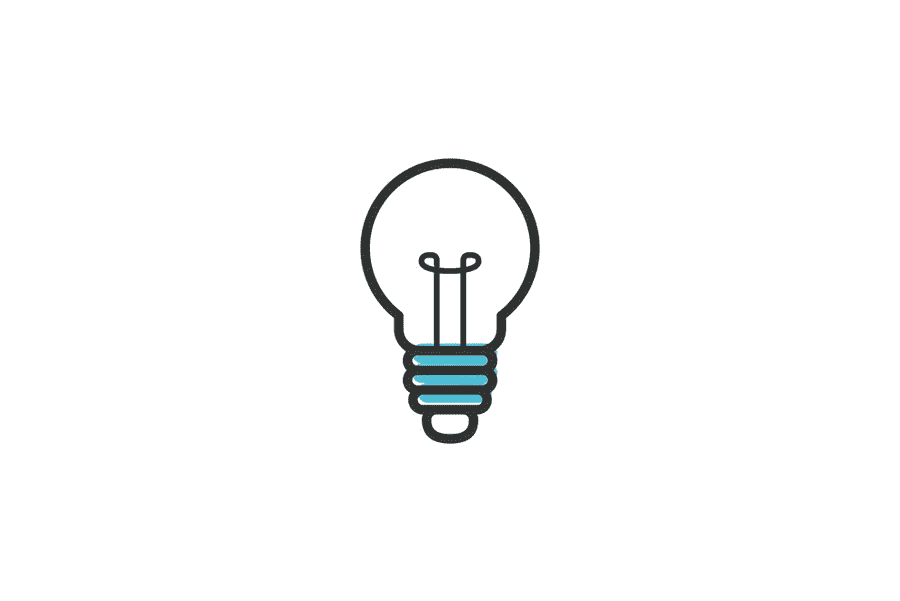

# Favicon 的目的是什么？它有任何 SEO 价值吗？

> 原文：<https://medium.com/visualmodo/what-is-the-purpose-of-a-favicon-and-does-it-hold-any-seo-value-3e7dd107ea8d?source=collection_archive---------0----------------------->

你肯定在你的浏览器顶栏，网站名称附近看到过那些小图标。他们被称为 favicons，这个术语来源于众所周知的“最喜爱的图标”。Favicon 最初的目的是在你收藏某样东西时出现，帮助你更快地找到它，因为人脑处理图像的速度往往比处理文本的速度更快。此外，favicon 增加了 SEO 价值。

但是最初的计划很快改变了，图标服务于更广泛的目的。当然，那些没有花太多心思的人可能会完全忽视这种情绪。但现实却大相径庭。如果你相信 favicons 只不过是一些小图片，这篇文章会改变你的想法。

# Favicon 目的 SEO 值

# 创建一个

在我们深入更复杂的问题之前，值得一提的是，几乎任何人都可以创建一个网站图标，即使他们没有平面设计的经验。你只需要一台发电机。

这是正确的。你可以看看 Oberlo 的指南，选择一个你认为最好的 favicon 生成器。当然，你总是可以走不同的路线，自己创造一切。或者，如果你想得到最好的结果，甚至可以聘请专业设计师。

同样值得一提的是，大多数 favicons 只是一个普通徽标的缩小版。毕竟，为什么要修复已经可以工作的东西，对吗？缩小尺寸几乎是所有需要做的事情，所以如果你有一个 logo，你可能想把它作为一个 favicon。

# 品牌识别 Favicon 目的

在这个时代，每个企业都把品牌认知度看得比什么都重要。只要人们注意到他们，一切都会好的。因此，看到如此多的企业家与有影响力的人合作，接触尽可能多的人，就不足为奇了。

当然，如果没有它的符号，品牌本身就无法识别。Favicon 就是这些符号中的一个，它有着重要的价值。为什么？

嗯，每当人们访问一个网站，他们一定会注意到一个图标，尤其是一个设计良好的图标。此外，现在你也可以在[搜索引擎](https://visualmodo.com/11-free-seo-tools-everyone-can-use/)比如谷歌的网站 URL 旁边看到图标。总而言之，他们在传播品牌意识方面创造了奇迹。

# 使用 Favicon 的可信度目的

虽然这一点对某些人来说似乎有点牵强，但永远不要低估互联网上普通人的智慧。即使一些互联网用户看起来不是最聪明的，他们也一直在学习。

在浏览了无数网站后，他们习惯了总是看到一个图标。因此，丢失一个可能对他们来说是一个负面的惊喜，这意味着关于你的网站的意见可能会在一个阴沟里结束。

这将会发生，不仅仅是一个人。随着这些事情越积越多，你的整体可信度将会直线下降。

# 回头客

每当有人第一次访问您的网站时，可能会有不可预见的情况使他们退出浏览器。但是那个人把这个页面加了书签，打算将来某个时候再回来。

问题是，如果他们已经有很多书签，可能很难只通过名字记住网站。另一方面，如果你的网站图标令人难忘，那么记住这个网站是什么就容易多了。

# 搜索引擎优化的目的

那些有一些搜索引擎优化知识的人知道这是多么困难，多么小的细节可以成就或破坏整个活动。

一个 favicon 没有直接的反响，但是从更大的角度来看，它仍然有一定的价值。采取所有提到的优势，你会意识到它会导致人们在网站上花费更多的时间，经常标记它，在使用搜索引擎时点击它并获得结果，等等。这些事情与搜索引擎优化排名相关。

# 没有时间浪费

当有多个标签打开时，人们会在它们之间切换，看着图标，即使这是下意识的行为。在这种情况下，他们潜意识里的东西，也就是最受欢迎的图标，将会存在很长一段时间。

读完这篇文章后，你应该知道一个设计良好的 favicon 对搜索引擎优化有多大的影响，即使乍一看它似乎微不足道。因此，如果你的网站没有，你应该立即登录并解决这个问题。你等待的时间越长，你的网站就越糟糕。