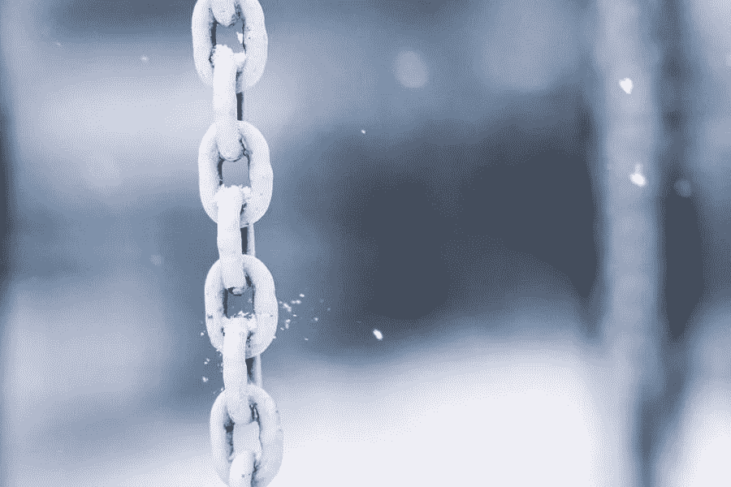

# 什么是白标链接建设？

> 原文：<https://medium.com/visualmodo/what-is-white-label-link-building-ae9c2ee7ab27?source=collection_archive---------0----------------------->

白标链接建设是一种流行的搜索引擎优化服务，专业机构提供给搜索引擎优化机构或更大的数字营销机构。由于链接建设是困难的和极其耗时的，许多营销机构已经聘请专门从事这项服务的公司。

这可以节省营销机构的时间和金钱。如果由专注于这个领域的专业人士来设计，链接建设策略可能会更有效。重要的是要注意，白标链接建设是不一样的垃圾链接。请继续阅读，了解关于这项重要营销服务的更多信息。

# 白标链接建设如何工作

链接建设是任何数字营销或搜索引擎优化活动的重要组成部分。对于 SEO 来说至关重要。然而，建立一个数百甚至数千个链接的网络对许多营销和 SEO 机构来说太多了，所以他们转向链接建设服务。

这些服务拥有一个由知名网站组成的庞大网络，这些网站很乐意提供反向链接，以换取博客帖子或其他内容。事实上，许多网站几乎完全通过这些帖子获得内容。链接建设服务员工将通过经验知道这些网站中哪些是值得信赖的，哪些是与客户网站相关的。

# 它可以节省机构的时间

数字营销机构雇用链接建设服务的主要原因是为了节省时间。如果代理机构自己做链接建设，他们必须找到有信誉的网站，联系这些网站以获得客座博文的许可，并在每个网站上发布带有反向链接的内容。

这占用了广告活动创意部分的宝贵时间。总之，客户会看到。

# 链接建设对于非专家来说是复杂和困难的

另一个原因，许多数字营销公司租用链接建设服务，这些天是越来越困难和复杂的链接建设。谷歌继续以不可预测的方式调整其搜索算法，这极大地影响了链接建设策略。

对于专注于页面搜索引擎优化的搜索引擎优化机构来说，保持链接建设的领先地位是很困难的。假设他们试图追求自己的链接建设策略。最后，对于一个专门从事链接建设的服务来说，这种策略可能没有那么有效。

# 白标链接建设与低质量链接建设

当许多客户听到“链接建设”这个术语时他们会想到第三世界国家的机器人或工人在随机博客的评论区发送垃圾链接。这种做法仍然很普遍，即使谷歌继续调整算法来阻止它。

然而，这种做法实际上是垃圾链接，而不是正确的链接建设。这就是为什么著名的链接建设服务使用术语“白标链接建设”。低质量的垃圾链接不会像以前那样提高网站的搜索引擎优化。事实上，它可能会损害网站的排名。相反，白标链接建设会将链接放在声誉好的网站上，对网站的 SEO 有积极的影响。

# 入门指南

营销机构很容易开始建立白标链接。他们所要做的就是找到一个专门从事这个领域的服务。最好是选择一家已经在这个行业呆了很长时间的知名公司。此外，有许多不可靠的链接建设服务会进行垃圾链接。

公司有兴趣聘请一个链接建设机构应该得到一个链接建设服务的建议。所以，这是一个合理的链接建设策略。