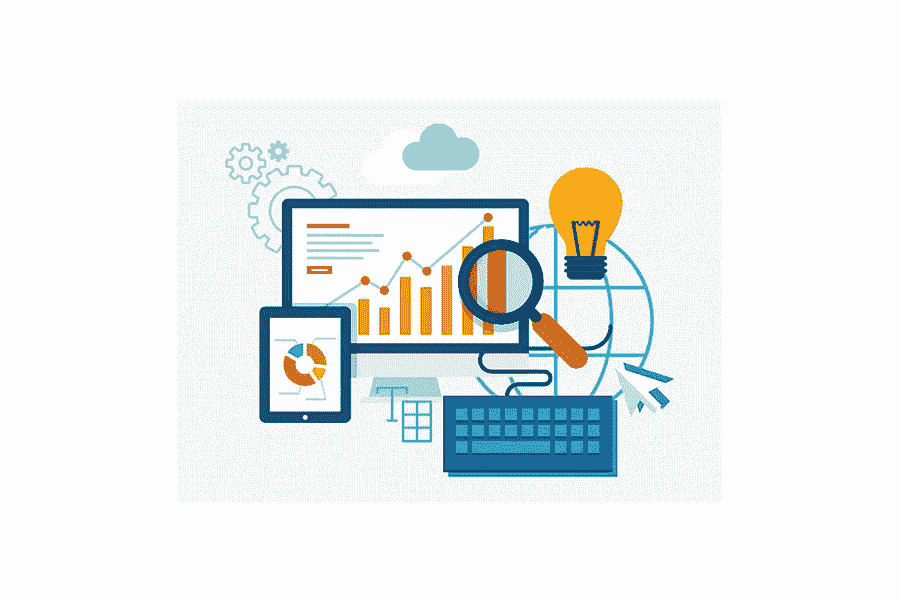

# 你能从数字营销代理那里得到什么服务？

> 原文：<https://medium.com/visualmodo/what-services-can-you-expect-from-a-digital-marketing-agency-39326d0d248?source=collection_archive---------0----------------------->

互联网已经在许多方面影响了我们的生活，比如允许企业进行数字营销。它现在是营销的主要手段，在任何营销预算中都有最好的投资回报率。在这篇文章中，你将看到你能从数字营销代理那里得到什么服务。

达拉斯是最棒的城市之一，不仅仅是在德克萨斯州，而是整个美国。它拥有 1，343，573 人口(2019 年 7 月)和 5，120 多亿美元的国内生产总值，为任何企业的发展提供了良好的机会。达拉斯的数字营销机构可以帮助您的企业实现增长潜力。

# 为了大声的数字呼喊

世界上一半以上的人使用互联网。企业必须通过最佳的数字营销策略来利用这一潜力。一个有经验的机构可以通过大量的服务和补充策略来提供这样的帮助。因此，数字营销机构提供的优质服务。

# 搜索引擎优化

在网上搜索结果中名列前茅很重要，它能成就或毁掉一家企业。此外，SEO 是一套技术来确保你的企业网站或应用程序出现在顶部或接近它。

它是关键字选择、位置、内容类型和网站其他属性共同作用的结果，让搜索引擎的搜索算法选择你的网站。您的营销机构可以帮助您实现正确的组合，并提供额外的服务来提高投资回报率。比如流量分析。

# 数字营销代理的网站和应用程序火化服务

网站是公司在虚拟空间中的形象。你是谁，你做什么，你为什么要这样做，这些都可以让你的潜在客户阅读。因此，获得正确的网站非常重要。你的营销人员会根据你的输入，添加正确的文本、布局、代码、图像、链接、颜色和其他一切东西，为你的公司建立最好的网站。此外，应用程序或应用程序也将如此。所以，数字营销机构提供了很好的服务。

# 内容写作和点击付费(PPC)

就在线营销本身而言，内容是决定一个企业成败的关键。只有语言和策略的正确组合才能让你赢得客户。你的营销人员会在你公司的网站、应用程序和营销宣传材料的页面上写满文字，这些文字会让你公司的底线变得更好。因此，他们甚至可以为您的 AV 营销工作提供脚本。

有了 PPC，每当客户在另一个应用程序或平台上点击广告时，你都要为广告付费。把他们带到你家。[营销人员将战略性地投放](https://visualmodo.com/how-does-education-affect-the-kind-of-marketing-strategy-that-a-marketer-utilizes/)这些广告，借助好的内容，充分利用其他平台的客户群。

# 数字营销机构的社交媒体营销(SMM)服务

当今数字营销的最大组成部分，你的企业的社交媒体存在是其成功的关键。因此，你的营销人员可以通过代表你在不同网站上创建和维护账户来获得所有的好处。

他们将创建和运行在线活动，创建和运行广告，响应客户反馈，并执行许多其他相关活动。因此，他们可以分析您公司的表现，并与您合作改善表现不佳的领域。

总之，达拉斯的企业正不断朝着更美好的未来努力，在达拉斯一家数字营销机构的帮助下，您的企业也将如此。