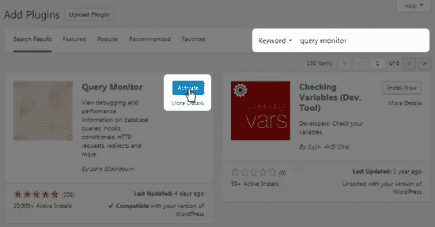

# 当你的 WordPress 站点崩溃时该怎么办

> 原文：<https://medium.com/visualmodo/what-to-do-when-your-wordpress-site-breaks-51d5d767eb4a?source=collection_archive---------0----------------------->

因为一些插件

当你的 WordPress 站点因为一些插件而崩溃时，知道该怎么做。WordPress 插件故障排除和解决当你的网站崩溃时该做什么不是一般 WordPress 用户想要处理的事情，但是当你经常使用这个平台时，它们是不可避免的。

# 当你的 WordPress 站点崩溃时该怎么办？

首先，一些 WordPress 插件的编码很差，一旦你安装它们就会产生问题，导致网站崩溃。其他插件在开发人员发布更新之前不会编码很差，这就是为什么你有时会在执行更新后遇到问题。

不管是什么情况，你安装了一个新的插件或者更新了一个现有的插件，现在你的网站不能正常运行了。让我们一步一步地来纠正这个问题。

# 如果你知道哪个 WordPress 插件是罪魁祸首

如果你知道是哪个 WordPress 插件导致了这个问题，你的故障诊断工作就简单多了。你可能需要做的就是关闭插件。

不进行故障诊断，如何确定哪个插件导致了问题？有几种不同的方法可以辨别。

*   你安装了一个插件，然后很快就遇到了网站的问题。
*   你更新了一个插件，然后你的网站立即出现了问题。
*   有一个错误消息告诉你是哪个文件导致了这个问题，它是一个插件文件。
*   例如，如果 WP 超级缓存插件出现错误，错误消息可能包含这段文本:*/public _ html/WP-content/plugins/WP-Super-Cache/WP-Cache . PHP*。从这段文字向后看，这告诉我问题出在 WP 超级缓存插件文件夹中的 wp-cache.php 文件。总而言之，WP 超级缓存插件导致了这个问题。

这个错误信息可能写在网站的某个地方或者 WordPress 的后端。你也可以使用一个叫做[查询监视器](https://wordpress.org/plugins/query-monitor/)的插件来发现来自插件的 PHP 警告。

如果您不知道是哪个插件导致了问题，请在您的站点上安装并激活该插件。

每当出现 PHP 错误时，这个插件的下拉菜单中就会出现一个“警告”选项。

这将告诉你错误到底是从哪里来的，如果适用的话，还会告诉你是哪个插件导致了错误。

# 如果你能访问你的网站

如果你可以访问你的站点的管理区域，请遵循以下步骤:

1.  进入**插件页面**。
2.  单击与导致问题的插件相关联的**停用链接**。
3.  检查你的网站。
4.  如果问题解决了，插件*就是*的罪魁祸首。
5.  如果问题仍然存在，请按照“如果您不知道哪个插件是罪魁祸首”一节中的步骤操作。

# 如果你不能访问你的网站

一些插件可能会给你的网站带来很多问题，以至于你甚至无法访问它。这可能是由于显示的错误信息而不是您的登录页面，或者可能是由臭名昭著的白屏死亡引起的。无论是哪种情况，结果都是您无法像往常一样访问您的网站。

如果你是一个开发者或者一个有经验的 WordPress 用户，你可能能够自己快速解决这个问题。然而，如果你是一个博客写手或经营自己网站的企业主，此时你可能会像一只被砍掉了头的鸡一样跑来跑去，但不要惊慌。有一种方法可以不需要访问 WordPress 的后端就可以停用插件。

**如果您的主机使用 cPanel，请遵循以下步骤:**

1.  登录 cPanel。
2.  点击文件下的**文件管理器**。

1.  选择 **Web Root (public_html/www)** 作为目录，点击 Go。
2.  双击 **wp-content 文件夹**将其打开。
3.  双击**插件文件夹**将其打开。
4.  单击导致问题的插件的文件夹将其选中。
5.  点击页面顶部的**重命名**按钮。
6.  将文件夹重命名为您想要的任何名称。我只是喜欢在名字后面加一个“z”来加快这个过程。完成后点击**重命名文件**。

重命名插件文件夹会停用该插件。检查你的网站。类似于前面概述的步骤，如果问题消失了，那么它是由那个插件引起的。如果它持续存在，罪魁祸首就在别处。

**如果您的主机不使用 cPanel 或者您无法访问 cPanel，请遵循以下步骤:**

首先，并不是所有的主机都使用 cPanel。像 DreamHost 和 Media Temple 这样的主机使用它们自己的控制面板，所以你可能需要遵循类似于上面概述的步骤来使用它们控制面板的文件管理器。如果你不能解决这个问题，继续使用下面的步骤。

我们将学习如何通过 FTP 访问您的站点，特别是使用 FileZilla。

1.  下载并安装 FileZilla。使用[此链接](https://filezilla-project.org/download.php?type=client)访问下载页面。
2.  运行 FileZilla。
3.  转到**文件→站点管理器→新站点**。
4.  给网站起一个合适的名字，比如你的网站名称。
5.  输入这些详细信息:

*   **主持:** com
*   **端口:**留空。
*   **协议:** FTP —文件传输协议
*   **加密:**只使用普通 FTP(不安全)
*   **登录类型:**正常

使用您用来访问主机控制面板的**用户名和密码**。例如，如果您的主机使用 cPanel，请使用您用来登录 cPanel 的用户名和密码。

最后，点击**传输设置**选项卡，选择**限制同时连接数**，将**最大连接数**设置为 8。

点击**连接**，按照以下步骤操作:

1.  FileZilla 有四个细胞。关注左下角的单元格。
2.  双击 **public_html** 打开你站点的根目录。
3.  双击 **wp-content** 文件夹将其打开。
4.  双击**插件**文件夹将其打开。
5.  右键单击或按住 Control 键单击导致问题的插件的文件夹，然后单击**重命名**。
6.  将插件重命名为您想要的任何名称。我就把它改成 z。

这将停用您站点上的插件。检查你的网站。如果一切似乎运行顺利，插件确实是罪魁祸首。跳到我有什么选择？部分看看您能做些什么。

# 如果你不知道哪个插件是罪魁祸首

这是事情开始变得有点复杂的地方，但它仍然没有你想象的那么可怕。如果你不知道哪个插件是罪魁祸首，但你知道某个插件*是罪魁祸首*，你需要做的就是停用所有插件，然后一个接一个地激活它们，直到你找到导致问题的那个插件。

同样，如果你不知道哪个插件导致了问题，使用前面提到的[查询监视器](https://wordpress.org/plugins/query-monitor/)插件来查看你的插件是否有 PHP 错误。

# 如果你能访问你的网站

如果你能访问你的网站，你的工作会更容易。请遵循以下步骤:

1.  进入**插件页面**。
2.  勾选插件列表顶部的复选框**选择所有插件**。
3.  点击**批量动作**，选择**停用**。
4.  点击**应用**。
5.  这将会关闭你网站上的所有插件。检查一下，看看它是否真的修好了。如果是，则是插件有问题。如果是这种情况，请遵循剩余的步骤。如果仍然有问题，问题出在别处，可能是主题或 WordPress 核心文件损坏。
6.  激活列表中的第一个插件。
7.  检查你的网站，看看它是否崩溃。如果是的话，你激活的插件就是罪魁祸首。如果一切顺利，继续。
8.  重复步骤 6 和 7，直到找到导致问题的插件。

# 如果你不能访问你的网站

如果您遵循“如果您知道哪个插件是罪魁祸首”部分，您就会知道我们使用 cPanel 和 FileZilla 来访问我们站点的文件系统。我们将在这里做同样的事情。

**如果您的主机使用 cPanel，请遵循以下步骤:**

1.  登录 cPanel。
2.  点击文件下的**文件管理器**。
3.  选择 **Web Root (public_html/www)** 作为目录，点击 Go。
4.  双击 **wp-content** **文件夹**将其打开。
5.  单击**插件文件夹**将其选中。
6.  点击页面顶部的**重命名**。
7.  将文件夹重命名为您想要的任何名称。我要在末尾加一个“z”。完成后点击**重命名文件**。

这将停用您站点上的所有插件。检查一下是否一切正常。如果是这样，这个问题是由一个有缺陷的插件引起的。登录 WordPress 管理区，逐个激活每个插件。每次激活后检查您的网站。如果它坏了，是你最后激活的插件导致了这个问题。

如果停用所有插件不能修复你的网站，你可能有一个损坏的主题或 WordPress 核心文件。

**如果您的主机不使用 cPanel 或者您无法访问它，请遵循以下步骤:**

1.  下载并安装 FileZilla。使用[此链接](https://filezilla-project.org/download.php?type=client)访问下载页面。
2.  运行 FileZilla。
3.  转到**文件→站点管理器→新站点**。
4.  给网站起一个合适的名字，比如你的网站名称。
5.  输入这些详细信息:

*   **主持人:** com
*   **港口:**留空。
*   **协议:** FTP —文件传输协议
*   **加密:**仅使用普通 FTP(不安全)
*   **登录类型:**正常

使用您用来访问主机控制面板的**用户名和密码**。例如，如果您的主机使用 cPanel，请使用您用来登录 cPanel 的用户名和密码。

最后，点击**传输设置**选项卡，选择**限制同时连接数**，将**最大连接数**设置为 8。

点击**连接**，按照以下步骤操作:

1.  FileZilla 有四个细胞。关注左下角的单元格。
2.  双击 **public_html** 打开你站点的根目录。
3.  双击 **wp-content** 文件夹将其打开。
4.  右键单击或者按住 Control 键单击**插件**文件夹，选择**重命名**。
5.  将插件文件夹重命名为您想要的任何名称，例如“插件-旧的”。
6.  检查您的网站，看看问题是否仍然存在。如果不是，罪魁祸首确实是插件。继续剩余的步骤。如果是，你遇到了不同的问题，比如主题或 WordPress 核心文件损坏。
7.  登录到你网站的 WordPress 管理区域。
8.  转到**插件**页面。
9.  激活列表中的第一个插件。
10.  检查你的网站，看看它是否崩溃。如果是的话，你激活的插件有问题。如果没有，继续。
11.  重复第 9 步和第 10 步，直到找到有问题的插件。

如果您发现了一个有问题的插件，请继续我的选项是什么？一节来了解如何修复它。

# 我有什么选择？

好吧，你找到了一个有问题的插件。下一步是什么？有几种不同的方法可以解决这个问题:

1.  联系开发商
2.  从社区获得帮助
3.  替换插件

# 选项#1 —联系开发商

一个网站崩溃是由一些插件引起的，如果它编码很差或者与一个主题、另一个插件或者 WordPress 本身冲突，这是意料之中的。如果你浏览了这个教程，并且发现了是哪个插件导致了这个问题，请联系开发者。

如果你从 WordPress 插件库下载了插件，在支持部分创建一个新的主题。首先，你需要在 WordPress.org 创建一个新账户并登录。

进入你需要帮助的插件页面，点击**支持**。

滚动到底部，发布一个新主题，告诉开发人员您遇到了什么问题。不要简单地说“这个插件坏了我的网站。”确切地解释它是如何破坏你的网站的，并解释你所经历的步骤，以确定这确实是插件破坏了你的网站。如果需要，可以链接到这篇文章。

让开发者知道你用的是什么主机，确切的主机计划，你用的是什么主题，你用的是什么插件。提前向他们提供这些信息可以减少您和开发人员为解决问题而需要交换的所有来回帖子。

如果您购买了高级插件，您可能有资格通过开发者网站获得高级支持。浏览开发人员的网站，看看是否有联系或支持部分。如果你在 CodeCanyon 上购买了插件，请使用那里的支持论坛。

# 选项 2——从 WordPress 社区获得帮助

这个类似于选项一，除了你将使用 WordPress.org 上的一般支持论坛，而不是单个插件的支持论坛。如果开发者不能解决这个问题，并且你绝对*需要*这个插件在你的网站上，使用这个选项。

在 WordPress.org 主导航菜单中点击**支持**。

选择**固定** [**部分。**](https://visualmodo.com/)

在此论坛创建一个新主题。从技术上来说，你不应该在这里发布主题和插件的问题，但解释一下，你已经试图从开发者那里得到支持，但没有这样的运气。如果开发人员试图解决您遇到的问题，请解释开发人员试图做什么。

# 选项#3 —替换插件

这是最后的手段。归根结底，插件的功能才是最重要的，而不是插件本身。如果你不能解决插件带来的问题，你需要找到一种方法来替换它添加到你网站的功能。

研究类似的插件，看看它们是否能满足你的需求。如果你找不到合适的替代品，也找不到解决插件问题的方法，可以考虑雇佣一个开发者来修复插件，或者为你创建一个自定义插件来为你的网站添加功能。

# 轮到你了

当您的站点崩溃时，压力会很大，尤其是当您无法访问您的站点来尝试解决问题时。

但是通过这些步骤，您将能够将问题缩小到导致问题的确切插件。然后你就知道应该联系谁来解决问题。