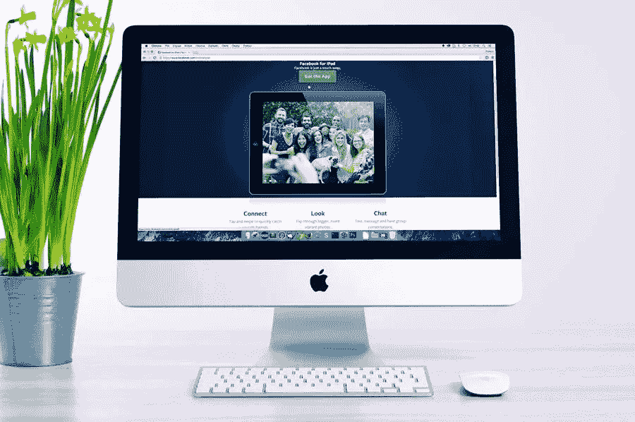

# 何时需要重新设计电商商店

> 原文：<https://medium.com/visualmodo/when-is-redesigning-an-ecommerce-store-necessary-ef4976ff6e9e?source=collection_archive---------0----------------------->

神秘主义作家莱斯特·富勒和埃德温·罗尔夫在他们的小说《玻璃房》(The Glass Room)中说:“不能以貌取人。”这是过去一百年中被引用最多的比喻之一，也是最少被遵守的比喻之一。不幸的是，人们评价书籍和其他人，产品，甚至网站的方式，他们看。虽然这可能看起来不公平，但你不希望人们因为一个草率的网页设计而放弃你出色的产品。在本文中，我们将了解何时需要重新设计电商商店。

# 必要时重新设计电子商务商店:

如果你有一个电子商务商店，这是至关重要的，让它看起来像样和现代。如果设计不是最新的和方便的，人们可能会犹豫，光顾你的业务。在一些情况下，更新和重新设计电子商务商店势在必行。

# 无法更新自己的内容时

大约十年前，网络设计师是唯一可以修改公司网站的人，这并不罕见。公司所有者通常无法进入网站修改内容。

如今，能够登录以更新内容已是当务之急。你应该可以随时更新你的产品的价格和描述，你想。你雇佣来设计和管理你的网站的公司应该提供你自己的内容管理选项。

# 你的网站没有吸引到合适的消费者:重新设计电商商店

网页设计和内容管理公司已经变得相当复杂。他们可以决定你的客户想要什么，以及他们的购买模式和行为。

科技公司可以用 cookies 来了解一个人的政治观点和情感需求。如果两个人搜索同一个主题，他们很可能会得到完全不同的结果。

例如，如果你销售 t 恤衫和服装，你可以瞄准确切的客户有兴趣购买的种类 t 恤衫和类型的服装你出售。

你们生产的讽刺 t 恤会吸引大学生吗？还是说你们销售的励志 t 恤能激励中年女性更有精神？你的球衣是面向那些有着特定政治观点的人，那些更喜欢某个城市的运动队而不是另一个城市的人，还是像邪教一样追随某个电视节目的人？你创造的任何东西都有受众，如果你更新设计，你可以找到他们。

# 你的网站难以使用:重新设计电商商店的原因

客户希望能够在短时间内得到他们想要的东西。他们没有时间等待你的产品加载或处理混乱的订购说明。客户订购产品越容易，您销售的产品就越多。

如果你目前的设计非常巧妙，最好让它[简单明了](https://visualmodo.com/using-effective-seo-techniques-in-website-designing/)。你应该包括一个最新的搜索功能和一个简单的结帐过程。如果你卖的是不同尺寸或颜色的产品，你应该有一个快速的下拉菜单，并且易于使用和理解。所以，你不希望有太多的弹出广告，这只会让你的用户感到困惑。

# 你的网站设计是为电脑而不是手机设计的

还记得你得到第一台电脑的时候吗？大概是很久以前的事了。现在许多人用手机做任何事情，包括购物。他们在工作时的休息室购物，当他们遇到交通堵塞时，重新设计你的电子商务商店。

你的网站必须适合小屏幕，同时兼容苹果和安卓系统。网页设计师可以帮助你决定一个网站在手机上的外观。

你也可以考虑创建一个应用程序。应用程序是一种只能用于特定服务的软件。除非你的目标客户非常富有，否则你可能希望应用程序技术保持简单。

如果你的应用程序只能在最新的手机型号上运行，许多客户将无法加载它。不能使用应用程序可能会给人留下不好的印象。此外，他们可能决定不使用你的网站。

最后，你有一个伟大的产品需要关注。通过重新设计你的电子商务商店，更新你的网站会让你的公司得到应有的关注。