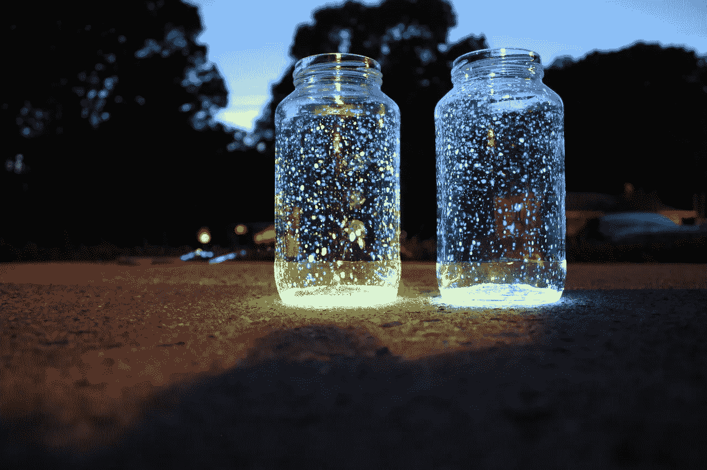

# 灵感从何而来？

> 原文：<https://medium.com/visualmodo/where-does-inspiration-come-from-464ebd2b0476?source=collection_archive---------0----------------------->

最近我一直在思考有创造力的人是如何被激发的。同时，我有意识地在自己的生活中寻找灵感。我可能自称是超级极客，但实际上我更愿意把自己描述成一个多面手。WordPress 咨询公司只是这些“交易”中的一个

# 灵感从何而来？

我的其他兴趣大多是创意和艺术，所以 Visualmodo 博客允许我涉足创意和技术极客的交集。

你一直在看网飞系列[摘要](https://www.netflix.com/title/80057883)？我喜欢一个接一个地深入各种类型的艺术家的生活，了解他们如何在世界上开拓自己的创作空间。我一直喜欢看工作中的创意过程，这就是我喜欢天桥骄子的原因。比起勾心斗角，我总是对设计师的设计过程更感兴趣。

《抽象》中的艺术家们似乎一直在说的一件事是，当有限制时，他们的创造力会蓬勃发展。也许你只有一支记号笔可以用来画画。或者你唯一的画布是一个图片窗口。或者你的 logo 设计受到公司名称的限制。

同样，我喜欢对我的工作有一些限制。在一些想法浮出水面之前，最好能够立即拒绝它们，而不是有太多的选择和太多的选项来创造什么。

作为一个整天在电脑上工作的人，很容易沉迷于工作，以至于你几乎不起床吃饭，更不用说离开家了。但是对我和其他有创造力的人来说，重要的是要记住创造力不是在真空中产生的。你需要去外面的世界看看大自然的颜色，或者当地标牌上的字体，或者黄昏时灯光照在建筑物上的样子。

我经常做的最鼓舞人心的事情之一是参观美术馆。我是现代艺术博物馆的会员，我喜欢逛一个小时，把自己限制在一个区域。有时候我会找个地方坐下来写点东西，或者涂鸦。成为会员意味着我可以从容不迫，真正沉浸在创作氛围中。

如果时间和金钱允许，我也喜欢旅行。走出我的舒适区是鼓舞人心的，我发现我对新的和经常令人惊讶的情况的反应方式，这使我受到鼓舞。同样，我喜欢回家，把我学到的东西应用到我的工作和日常生活中。

对我来说，灵感来自于学习新事物。我有永不满足的继续学习的需求，所以我热衷于注册在线课程。我可能实际上没有完成(甚至没有开始！)我报名参加的许多课程，但当我报名参加时，我会立即进入我正在学习的世界:

*   我完成了一门关于绘画的课程，通过动笔和尝试，我获得了如此多的自信。
*   我参加了一个关于品牌的课程，学到了一些在早期概念阶段将品牌形象化的伟大技巧。
*   我参加了一个关于 MailChimp 的课程，学习了如何设置一个自动回复器，以及对列表进行分段意味着什么。

所有这些课程可能有一些我已经知道的元素，但是老师把他们自己的个人旋转放在他们身上，这使他们成为新的东西。对我来说，总是有足够多的新内容来激发一些新型的创造力。

最后，我通过分享我脆弱的故事和我创作的作品来获得灵感。在人们读过我的作品或看过我的初步涂鸦后，我与他们的对话是最具启发性的。通常，他们甚至会与我已经成为朋友一段时间的人进行令人惊讶的讨论，但以前从未像这样与他们交谈过。

我好好奇！请说说你的灵感是怎么来的？它对你来说是轻而易举的，还是真的需要把自己放在特定的状态中才能发现？留下评论让我知道！