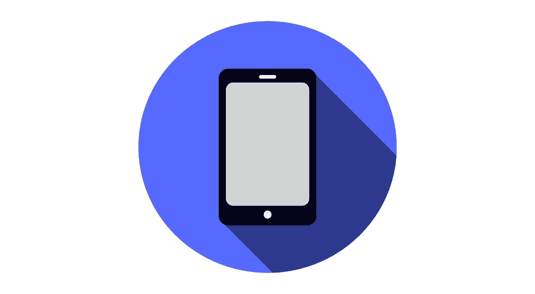

# 手机 App 开发哪个平台更受欢迎？

> 原文：<https://medium.com/visualmodo/which-platform-is-more-popular-for-mobile-app-development-8bc17422195a?source=collection_archive---------0----------------------->

iOS 和 Android 是最广泛使用的两个移动平台，已经统治市场相当长一段时间了。这就是为什么企业和开发者更喜欢为这两个平台构建移动应用，以获取最大的用户并获得更高的利润。然而，Android 以巨大的市场份额领先，而苹果科技巨头苹果公司的 iOS 目前占据第二位。Android 的这种无可争议的受欢迎程度已经说服了大多数开发人员接受 Android 移动应用程序开发，而不是 iOS 应用程序。

# IOs 与 Android 移动应用程序开发

以下是 Android 在移动开发中比 iOS 更受欢迎的 5 大原因。

# 被大多数智能手机制造商使用

Android 的开源代码使其非常受所有智能手机制造商的欢迎。这为消费者提供了多种多样的设备选择，他们可以购买适合自己口味和预算的设备。另一方面，拥有封闭源代码的 iOS 只能在苹果设备上运行，而苹果设备的价格通常高于安卓设备。

# IOs x Android 开发:价格优势

有各种各样的 Android 设备适合各种不同预算范围的客户。用户在 Android 上获得的众多选择增加了他们的快乐，并使 Android 成为大众的最爱。相比之下，苹果产品定价较高，因此吸引了特定类别的人群，减少了潜在客户的数量。

# 设备兼容性

Android 拥有大量的外围设备和可穿戴设备，标志着一个包容性的生态系统。它有助于轻松实现设备间的数据传输和同步。只有少数第三方设备与 iOS 设备兼容，限制了苹果设备与非苹果产品配对的灵活性。

# IOs x Android 开发:定制

虽然用户定制 iOS 应用程序的范围有限，但 Android 一直鼓励其客户以他们想要的方式选择自己的应用程序定制级别。这加强了企业和应用程序开发者的信念，即 Android 移动应用程序开发是迎合最大部分手机用户的一种很好的方式。

# 多窗口支持

Android 7 牛轧糖和 Android 8 奥利奥通过内置的多窗口模式促进了多窗口任务处理。增加了用户的便利和能力。iOS 也提供了分屏视图，可以在标签页上使用，但不能在 iPhones 上使用。

# 昂贵的零件和维修

就像 iOS 产品的价格一样，维修它们的成本也相当高。手机充电器和耳机等部件的价格也足够高。因此，让预算紧张的人望而却步。相比之下，Android 设备的服务成本更低。作为计划购买中档设备的人的诱饵。比如手机、平板电脑等。

Android 设备相对于 iOS 设备的其他优势包括小工具、启动器、免费应用和游戏等。这些使得 Android 移动应用开发成为移动应用开发者的首选。Android 应用程序开发提供了提供更多功能的选项。此外，对亚洲和非洲等全球新兴市场而言，利润尤为丰厚。开发平台随后定义了受众。项目的时间表、期望和预算，Android 在这些方面的得分都高于 iOS。