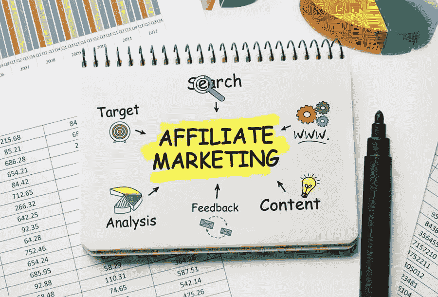

# 为什么联盟营销计划为您的业务销售工作

> 原文：<https://medium.com/visualmodo/why-affiliate-marketing-programs-work-for-your-business-sales-21b6af8bc19f?source=collection_archive---------0----------------------->

经营自己的企业可能会有回报，但同时也可能非常具有挑战性。如果你还在业内初出茅庐，这一点尤其正确。幸运的是，注册任何联盟营销计划可以让你很容易从竞争中脱颖而出，获得客户，并赚取利润。

商业巨头，如亚马逊和易贝，现在提供联盟营销计划。一旦你注册了他们的联盟营销计划，你就可以在他们的网站上销售产品。

以下是联盟营销计划为你的企业销售服务的一些方法:

# 联盟营销计划提供了一个低入门价格

如果你想让你的生意尽可能长久地兴旺发达，你应该一直节俭。你应该只购买那些可以成为你企业投资的东西。花钱买不必要的东西会导致你的企业负债甚至破产。联盟营销计划是一项成本效益高的投资，因为它不需要你的企业在开始之前伸出手臂和腿。

不同于其他创业营销平台，联属营销项目需要更少的成本，但提供了大量的好处。随着今天可用的联盟营销计划的数量，你甚至可以免费测试平台，并检查哪一个适合你的业务和你的财务目标的要求。

# 这将为你节省支付销售人员的费用

如上所述，金钱是任何企业的重要资源。你的财务资源可以决定你企业的寿命。除了帮你省下支付高额入场费的钱之外，[联盟营销](https://visualmodo.com/affiliate-marketing-nz-strategies/)项目不需要你支付任何销售人员的费用。

一旦你注册成为任何联盟营销计划的商家，你就可以在网上为你的产品做广告，而不需要雇佣员工。当你注册一个联盟营销计划时，你也可以自己管理你的客户的订单和他们的投诉。

# 从属节目让你获得更广泛的观众

在你赢得任何顾客并从你的生意中获利之前，你需要确保你的生意确实是公众可以接触到的。你需要确保公众确实知道你的企业的存在。越多人知道你的存在，你就越容易说服他们和你做生意。

如果你正在寻找一个简单的方法来获得更广泛和更新的受众，注册一个联盟营销计划。除了能够在网上销售之外，这个项目还能让你很容易地与全球不同类型的人联系。

当你注册了商业领袖旗下的联盟计划，比如亚马逊或易贝，你不必从头开始为你的产品寻找受众。一旦你把你的生意和大公司联系在一起，获得强大的网上业务会变得更容易。

越多的人知道你的生意，你就能有越多的顾客和销售。

# 营销程序可以汇编相关的统计数据

审计是任何业务的重要组成部分。当你进行审计的时候。你将能够确定你的企业是否在做正确或错误的事情。有了这些信息，你就可以恰当地将你的资源分配给那些真正为你的企业带来客户和利润的渠道。当你注册一个联盟营销计划，你将能够享受这一好处。

联盟营销计划实际上跟踪你的在线客户的活动，让你更好地了解他们的购买行为。通过适当的审计，你会知道在线访问者离开你的网站的原因。此外，为什么他们选择竞争对手的产品而不是你的。你可以利用这些信息来创造改进的空间。

# 联盟营销可以提供灵活性

灵活性是很多人选择经营自己企业的原因之一。而不是作为雇员工作。有了自己的事业，你将能够随时随地工作——基本上你将成为自己的老板！

当你注册一个联盟营销计划。您将能够更好地享受这一优势，而不会影响您为客户提供的服务质量。通过联盟营销计划，你仍然可以销售产品和处理客户查询。即使你要去另一个国家旅行几周。

# 做出正确的决定

如果你想充分利用这些联盟营销计划。检查您的选项，并决定这些平台中哪一个最适合您的目标、业务和兴趣。评估每个联盟营销计划的利弊。花时间了解你选择的平台的诀窍。