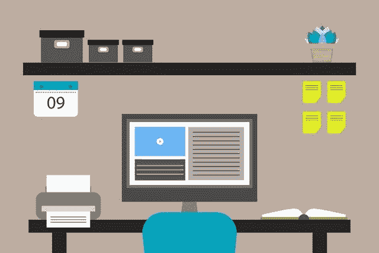

# 为什么小型企业需要专业的网站设计

> 原文：<https://medium.com/visualmodo/why-do-you-need-professional-website-design-for-a-small-business-ee09cfa0ed0a?source=collection_archive---------0----------------------->

在当今世界，每个人都被最具视觉吸引力的网站所吸引。专业设计的网站使用吸引人的内容和视觉效果来吸引更多的业务。在这篇文章中，我们将分享为什么你的小企业需要一个专业的网站设计。

如果你还没有推出你的小企业网站，现在是投资的最佳时机。由于社会距离规范和其他限制，大多数消费者已经求助于网上购物。在这种模式转变中，专业网站在你的业务发展中扮演着重要的角色。它可能会给你一个小小的推动，让你在本地域达到下一个层次。

**为什么小型企业需要专业的网站设计**

如果你能找到一个兼容的网站设计服务，它可以真正传达你的信息。以下是小型企业中专业网站设计的不同角色:

**第一印象**

一个网站是你公司的第一印象。所以，这个第一印象是在几秒钟内形成的。不同的颜色、形式、形状和大小在专业外观的设计中产生视觉吸引力。你只有一次机会通过以最佳方式融合这些特征来给人留下好印象。此外，记住，每一秒钟都是给人留下好印象的关键。

如果你的网站死板、乏味或者没有条理，你的第一印象就彻底毁了。如果访问者不觉得你的网站有吸引力，你就会失去潜在客户，因为他们会放弃你的页面而选择竞争对手的。

网页设计会影响访问者对你的业务的看法。你的第一印象可以让他们留在你的页面上，也可以把他们赶走，尤其是在小企业的情况下。通过在一个吸引人的设置中提供他们需要的内容，你可以让他们在你的页面上停留更长时间。

**内容控制:商务专业网站设计需求**

允许脸书、谷歌、推特和 Instagram 这样的网站和平台。所以，定义你的商业形象可能是个糟糕的主意。

拥有自己的网站设计可以让你控制你的内容，同时通过响亮清晰地传达你的信息来吸引潜在的商业机会。使用真实图像和视频创建信息丰富、引人入胜的内容，以吸引更多潜在客户访问您的页面。