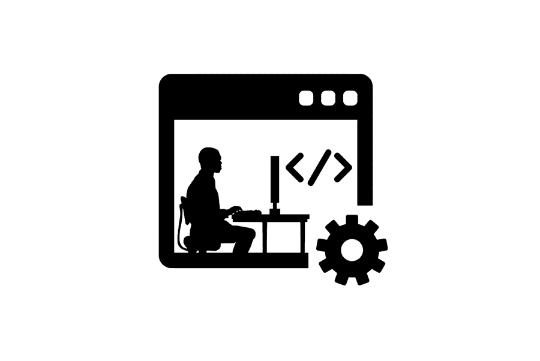

# 为什么每个 SaaS 企业都应该有一个知识库

> 原文：<https://medium.com/visualmodo/why-every-saas-business-should-have-a-knowledge-base-9dd05f38404f?source=collection_archive---------0----------------------->

客户满意度是 SaaS 企业的重中之重。多达 86%的买家愿意为出色的客户体验支付更多费用。因此，公司试图让他们的[顾客感到](https://visualmodo.com/compete-in-the-global-arena-using-multilingual-marketing/)特别，被倾听，被理解。考虑到这一点，很容易理解为什么每个人都优先考虑客户满意度。在这篇文章中，你会看到为什么每个 SaaS 企业都应该有一个[知识库](https://helpjuice.com/blog/knowledge-base)。

说到客户支持，客户可以通过多种方式从您的企业获取信息。但是最流行的方法之一是自己找出信息。这只是知识库如此受欢迎的原因之一。

有了 SaaS 知识库，你可以建立客户忠诚度，节省资金，提高搜索引擎优化，等等。一句话，这是你的 SaaS 业务的一个基本要素。继续阅读，了解更多。

# 建立客户忠诚度

客户忠诚度是通过大量的辛勤工作赢得的。但是如果你能够为你的客户提供大量有用的信息，你可以依靠这种忠诚度。

有多种类型的内容可以放入您的知识库，以建立忠诚度:

*   **产品基本信息。**即使是最小的细节也很重要，但是关注这些小细节的人不会联系你的客户支持。所以，如果他们在你的网站上找不到他们想要的信息。他们会对知识库感到高兴，他们对你的产品和公司的兴趣也会增加。
*   **可视化教程**。视觉效果比纯文本更有价值。如果客户不知道如何正确设置您的产品。你可以为他们提供一个易于理解和遵循的可视化教程。因此，比同一教程的书面版本更吸引人。
*   **解题视频**。如果有人的软件有问题。他们更愿意在网站上找到问题的解决方案。也不愿意花几个小时听别人讲解整个过程。如果该解决方案以视频格式呈现，那就更好了。
*   **有价值的信息和文件**。不是每个购买你的软件的人都是技术型的，能够跟上你的其他有用内容。对于这些客户，确保提供尽可能多的文档和分步信息，帮助他们了解 SaaS。