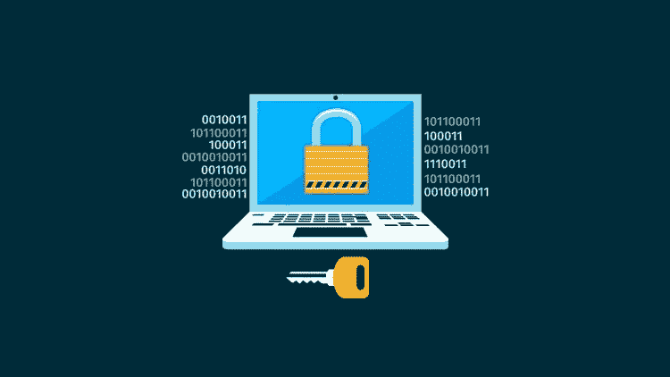

# 为什么在线安全从未如此重要

> 原文：<https://medium.com/visualmodo/why-has-online-security-never-been-more-essential-1a684726f8a5?source=collection_archive---------1----------------------->

在线安全从未像今天这样重要。几乎每个人、企业和政府机构都在网上。他们将数据数字化，放在云上，将个人信息和照片上传给全世界。今天的数据比人类历史上任何时候都多，而且数据量只会越来越大。

这非常有用。当大规模理解模式时，大数据是有利可图的，而且非常重要。然而，这并不安全。如果没有适当的安全措施，在某些情况下，即使有这些安全措施，黑客也可以访问敏感数据，然后出售和利用这些数据。

# 为什么在线安全至关重要？

# 我们的生活被安排在网上

从我们的银行业务到我们的投票登记，到我们的购物习惯和我们的家庭住址，一切都是在线的。如果你在“我的朋友”之类的应用上有位置共享功能，那么即使你的精确位置也是可用的，如果这些数据被黑客入侵，你就有危险了。

无论是你的财务处于危险之中，还是你的人身安全，都有可能造成损害。当涉及到保护您的个人数据和在线使用时，您需要竭尽所能，以便最大限度地减少网络罪犯的威胁。

# 公共社交媒体的危险

把我们的个人信息放在社交媒体上太容易了，但是一定要小心。确切知道谁可以看到你的个人资料，并对你分享的内容和时间提出批评。例如，泄露你正在度假可能看起来是无辜的，但这可能会让潜在的窃贼知道你的家没有保护，是时候下手了。锁定你的社交媒体账户，删除旧信息，并尝试了解你在线的位置。旧帐户是一个巨大的风险，因为他们所在的网站可能已经被放弃，这意味着新的黑客方法可以利用他们的安全屏障。

# 袭击变得更加肆无忌惮

近年来攻击变得越来越无耻和[有效](https://visualmodo.com/)。在美国，黑客获得了对公用事业控制的访问权，甚至通过网络钓鱼诈骗闯入了几所知名大学。然后有报道称投票过程中有人蓄意破坏，最近又有报道称有人使用旧的登录密码侵入用户的脸书账户。

人们开始意识到他们所处的危险，更重要的是意识到他们被窃取的信息意味着什么。从访问银行记录到窃取电话号码到长途电话诈骗中的目标用户，缺乏数据安全性的后果是普遍的和众所周知的。

对于企业来说，如果黑客通过勒索软件获取了你的数据，你的声誉甚至整个公司都将面临风险，除非你满足他们的要求，否则勒索软件将删除所有数据。为了保护自己免受这些威胁，您需要加倍加强安全性。从 VPN 到杀毒软件，从[sonicwallonline.co.uk](https://www.sonicwallonline.co.uk/)到网络安全设备(NSA)。安全总比后悔好，因为如果你不小心，你的公司可能在几天内就不复存在了。

黑客和网络犯罪是对企业、个人和政府的严重威胁。如果每个人都改进他们的安全方法和协议，我们都可以尽自己的一份力量来最大限度地减少黑客造成的损害。