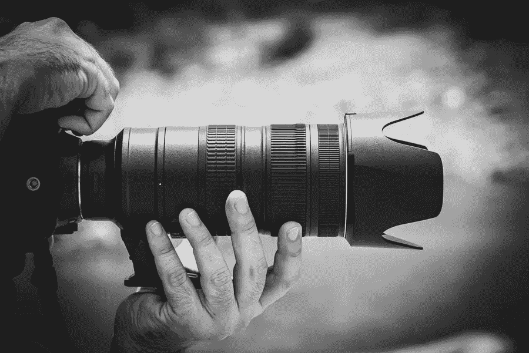

# 为什么破解摄影是网站设计的关键？

> 原文：<https://medium.com/visualmodo/why-is-cracking-photography-key-to-website-design-e5a628a228c7?source=collection_archive---------0----------------------->

人类总是被视觉所吸引，但在无处不在的互联时代，它获得了全新的重要性。根据 Optimind Technology 的研究，带有图片的在线文章比没有图片的文章多获得 94%的浏览量。大约 60%的在线购买者更喜欢与提供图片的企业打交道，同样比例的人认为产品图片在网上购物时非常重要。无论你的业务是以产品还是服务为中心，创建一个有惊人照片的[视觉吸引力的网站](https://shots.visualmodo.com/)是关键。它不仅会让你的企业成为所在行业的领导者，还会表达你的品牌精神——并帮助登陆你正在寻求吸引的市场。现在看看为什么破解摄影是你的网站设计的关键，以及这些良好的视觉效果的重要性。

# 布局是关键

图像和文字相辅相成。 [Visualmodo 的摄影网站构建器](https://theme.visualmodo.com/photography/)将帮助你呈现一个干净的设计，自动调整和设置你的图像，并提供不同的屏幕分辨率，结果是优雅和简单的完美融合。如果你的内容是杂志风格的文章或博客文章，你一定要确保没有任何没有图像的大段文字。继续用吸引眼球的图片和向下滚动的图片让读者眼花缭乱，让他们留在你的网站上。

# 好的视觉效果包括什么？

在形象展示方面，你需要掌握一些基本的东西[。无论你选择](https://www.forbes.com/sites/forbesagencycouncil/2018/04/27/visuals-are-the-key-to-creating-great-customer-brand-connections/#5635f47e4163)[多彩的照片拼贴风格](https://www.canvaspop.com/products/photo-collages/)展示还是更简约的风格，你都需要确保你的照片被适当地调整大小、裁剪和编辑。理想情况下，你的大部分照片应该由专业人士或对光线、色彩和透视有独到眼光的人来拍摄。智能手机照片偶尔上传到你的社交媒体渠道是没问题的，但你网站上的内容会和页面一样持久，所以你应该额外注意分辨率、颜色质量、取景、照明等方面。质量最好的库存照片涵盖了过多的类别——包括旅游、时尚、美容、健康、名人——没有限制。

# 引领潮流

你的网站应该随着新技术和趋势而发展。如果你需要一点灵感，看看 Adobe 的视觉趋势预测，它强调了一些趋势，比如对令人惊叹的自然摄影的爱好。随着我们的生活变得越来越以技术为中心，我们的思想渴望逃离——没有比白沙的水晶般的水域更适合逃离的地方了。其他趋势包括创造性的平等主义(向你的客户索要他们最好的 Instagram 照片，并上传到你网站的社交/活动/新闻部分——如上所述，这种类型的内容与业余摄影很好地配合)；破坏性表达(表达反叛、多样性、包容性和‘人民的力量’的图像在里面)；以及基于价值的摄影(通过你的视觉表现，表明你的品牌代表了某些东西——你客户的权利、包容性和接受度)。从所有这些趋势中可以清楚地看出，千禧一代是一个以意义为中心的群体，他们寻求从精神上和情感上参与他们在最喜爱的品牌网站上看到的视觉效果。

# 最后的想法

研究表明，浏览者在点击其他内容之前只需在网站上停留几秒钟，视觉效果可以帮助“抓住”你的浏览者，让他们想留下来。好的视觉效果始于质量，所以要掌握基本的东西，比如调整大小、分辨率和质量。不要害怕玩业余摄影，但要确保它符合标准，不会让你的品牌失望。最后，通过[提供的视觉效果](https://visualmodo.com/blog/)与你的观众联系起来，这些视觉效果用精彩的摄影作品捕捉他们的价值观、愿望，当然还有他们的梦想。