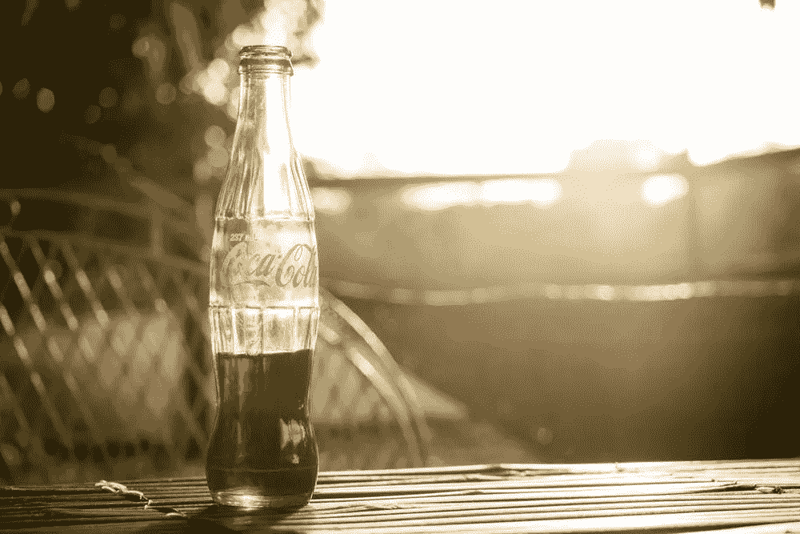
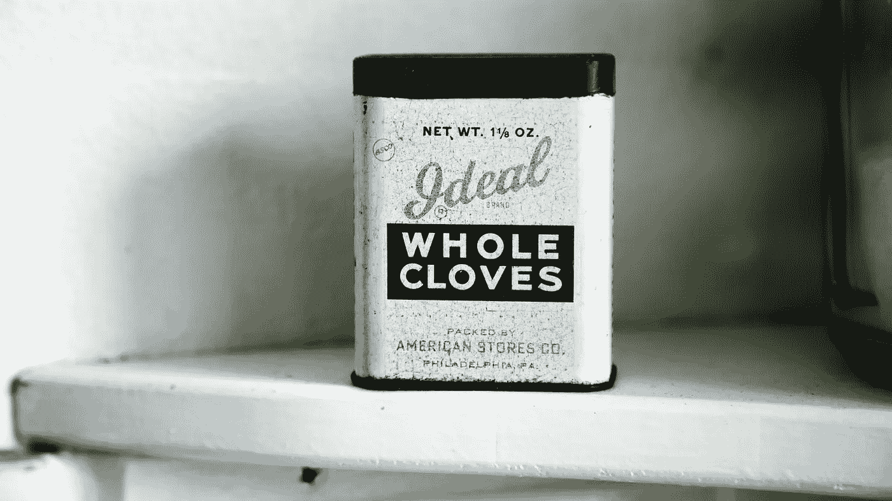
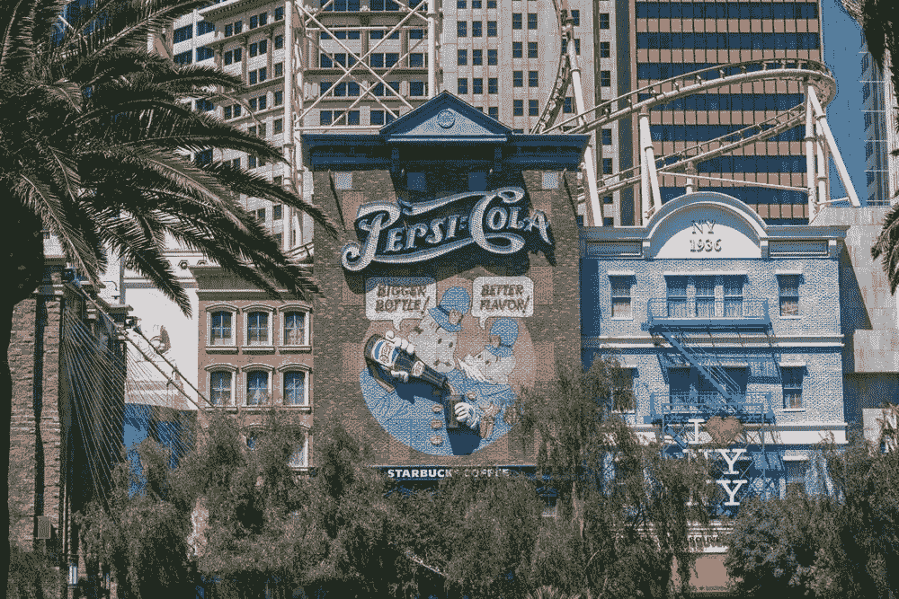

# 为什么怀旧驱动的营销策略有效

> 原文：<https://medium.com/visualmodo/why-nostalgia-driven-marketing-strategy-works-cedb4e7db2ee?source=collection_archive---------0----------------------->

## 用科学解释

怀旧驱动的营销可以用在与你的观众建立联系的活动中。人们会对触发特定时间和感觉的记忆做出反应。

“美好的旧时光”的故事已经存在了很长一段时间——基本上，自从我们所知道的文明开始发展以来。这似乎不是一种文化特有的感觉，而是一种普遍的观念，可以在许多民族和时代中找到。我们总是渴望过去的时光，有时甚至渴望那些我们没有真正见证的时光。这种叙事已经走得很远，几个世纪以来，人们一直认为他们目前生活的时代是如此腐败，以至于世界末日就在拐角处，来惩罚人类的罪恶。

# 为什么怀旧营销策略有效？

这也是一个反复出现的哲学主题。最著名的是，卢梭启发了一代又一代的思想家，让他们认为[人类](https://visualmodo.com/)的肮脏是由于文化和经济因素造成的，我们应该向往一个原始的、廉洁的人类状态。

从表面上看，怀旧似乎常常是由我们安全、粗心和天真的时代的简单联想引起的。我们小时候喜爱的大多数电影、音乐甚至运动员可能都没有我们记忆中的那么好了。但是我们牢牢地抓住它们，好像这样我们就抓住了一段我们觉得简单而愉快的时光。

我们在过去美好时光消费的产品看起来也是如此。我们已经看到[许多公司](https://blog.hubspot.com/marketing/examples-nostalgia-marketing-ads)重塑他们的旧产品、广告、吉祥物和包装，或者只是提醒人们某个特定时代的主旋律，试图吸引特定一代的消费者。这行得通吗，为什么？人类意识中的哪些过程对这种商业努力的成功负责？如何在你的营销工作中最大限度地利用怀旧情绪？让我们更详细地研究一下这个问题。

# 怀旧是如何运作的？

通常，我们将怀旧与对逝去已久的事物的悲伤感联系起来，但研究人员声称它还有另一面。怀旧可能是由这种感觉引起的，但它的最终效果有点不同。如果经常使用，这是对抗孤独和焦虑的好方法。

这也能让人觉得他们的生命没有虚度。美好的回忆确实会引发一种苦乐参半的感觉，因为那些时光一去不复返，但在一天结束时，它们是让我们的生活值得过下去的东西。我们也倾向于将这些记忆过于浪漫化，理想化。

这与认知科学家兼哲学家丹尼尔·丹尼特关于人们对自身认知方式的说法是一致的。在他的书《T2》*中，意识解释了* ，他指出，我们是我们过去的创造者，我们根据自己的情感需求重塑它。这是一种防御机制，对抗创伤或无意义的危险。为了给我们的生活找到一个点，并且不失去控制，我们通过一个镜片来看待我们的过去，这个镜片通常使它比实际情况更美好。最后，我们设法说服自己，这是我们早期生活的真实版本。

# 谁受影响最大？

在我们生活中某些重要的转变时期尤其如此，这就是为什么年轻人通常受怀旧情绪影响最大。当我们所知的整个世界都在动摇和变化时，我们需要一些东西来坚持。回忆一个无忧无虑的童年比寻找第一份工作的经历要愉快得多。

这意味着，目前，如果你想把你的营销策略建立在怀旧的基础上，千禧一代是最好的目标群体。这还有另外两个原因。首先，正如指数公司的高级洞察分析师卡珊德拉·麦金托什所说，由于经济危机导致的就业市场崩溃，现在的年轻人特别容易受到创伤。

其次，千禧一代是出生于数字时代的第一批“数字原住民”，这意味着他们的记忆不断被记录下来，并通过各种设备和社交媒体呈现在他们面前。此外，所有这些都导致了信息过载，压缩了他们的时间感，让他们渴望上周的时间。

# 营销优势

最后，除了千禧一代是怀旧营销活动的完美目标群体之外，还有哪些因素对你的营销工作有重要意义？许多品牌和设计机构以及营销公司和知名企业充分利用了怀旧情绪。在正确的时间唤起正确的记忆可以为你社交网络的发展创造奇迹。试图唤起怀旧情绪的帖子有很大的传播潜力，因为它们可以激发整整一代人分享和谈论它。最近我们被“只有 90 后的孩子会理解这个”的帖子淹没是有原因的。他们只是工作。

然而，基于怀旧的营销也有一些更直接的影响，因为它可以影响人们的消费习惯。即[根据一项研究](https://www.entrepreneur.com/article/241716)，怀旧唤起了社会联系的感觉，这使得人们不那么看重金钱。这反过来又让他们更容易花钱，不会太在意。因此，你的产品或营销活动的任何怀旧方面都可以通过利用人们在怀旧环境中停止理性和经济思考的倾向来增加你的销售。

# 如何正确地做它

然而，怀旧能在营销中奏效的事实并不意味着[它将*永远*奏效](http://www.chiefmarketer.com/4-pitfalls-when-capitalizing-on-nostalgia-marketing/)。非常重要的一点是，你不能只是简单、原始地利用过去的事件或集体记忆，而不提供任何新的价值。如果你再次使用复古产品或活动，你必须重新发明它们，使它们与今天相关。否则，你会看起来很绝望，与现实脱节，看起来你这样做只是因为你没有主意，所以你决定诉诸最基本的人类情感，并利用它们。这根本不是做这件事的方法。

成功改造旧产品的一个很好的例子是百事可乐的[水晶百事](http://www.pepsico.com/live/pressrelease/celebrate-the-90s-with-crystal-pepsi----iconic-clear-cola-to-hit-shelves-this-su06292016)的复兴。这是一种在 90 年代很受欢迎的饮料，百事可乐决定在 2016 年将其带回八周。与此同时，该公司发布了一款名为“水晶百事轨迹”的视频游戏，以此向“俄勒冈轨迹”致敬。“俄勒冈小径”是一款常青的视频游戏，开发于 70 年代，对成长于 80 年代和 90 年代的孩子们产生了巨大的影响。

百事可乐在这里所做的是使用多种媒体和多种感官来触及许多人的弱点，并以多种不同的方式激发他们的兴趣。其次，对于今天的孩子来说，这个游戏仍然有趣是非常重要的。这意味着百事不仅计划吸引怀旧的老顾客，同时也试图吸引新一代。在这里，他们试图通过不仅在公司和顾客之间，而且在两代不同的顾客(尤其是父母和他们的孩子)之间建立情感纽带来提升他们的品牌。

这是怀旧驱动营销的关键一课。它唤起人们强烈的情感，让他们更倾向于喜欢、分享或花钱，这一事实并不意味着你在这里的工作很容易或简单。对于一次成功的宣传活动来说，仅仅诱导人们产生某种感觉，然后高枕无忧是不够的。你需要一个建立在这些情感基础上的谨慎策略，但是[也包括一些新鲜的](https://www.wix.com/blog/2017/04/how-3-brands-use-the-power-of-nostalgia-to-reinvent-themselves/)，有价值的，与我们生活的时代和新一代相关的东西。