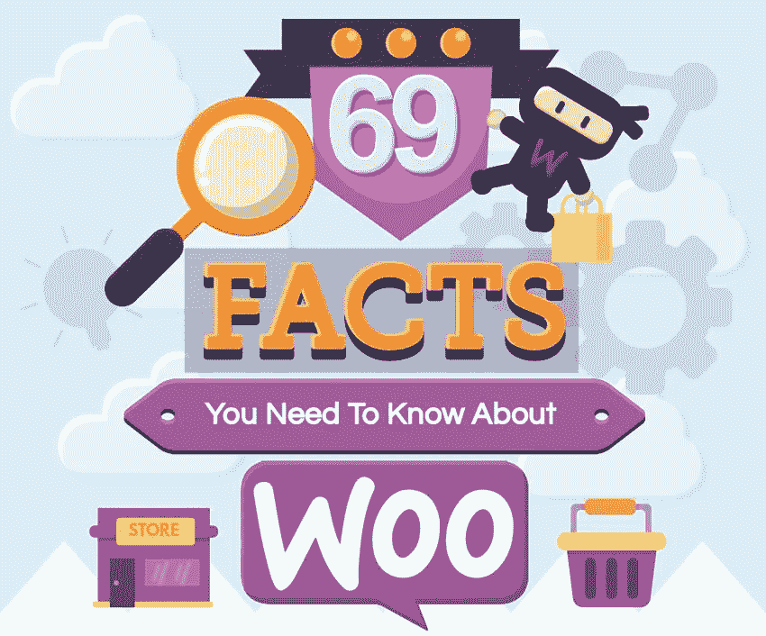

# 为什么要用 WooCommerce？

> 原文：<https://medium.com/visualmodo/why-use-woocommerce-ff8bde933414?source=collection_archive---------0----------------------->

## 信息图表

WooCommerce 是一个插件，它彻底改变了 WordPress，使其成为今天广泛使用的平台，请看一个令人惊叹的信息图来解释它。

如果没有 WooCommerce，WordPress 将是一个基本的博客平台。然而，有了这个插件，它为世界上大量的电子商务网站提供了动力，而且几乎每个人都在使用它。除了 Woo-Commerce 和 WordPress，你真正需要的是建立一个响应迅速、安全的网站，一些合适的 WordPress 主机，你就可以开始了。仅仅因为这个原因，这也是你应该使用 Woo 电子商务的原因。

# 为什么要用 WooCommerce？

然而，这并不是唯一的原因。Woo-Commerce 的本质——开源和易于使用——意味着寻找 WooCommerce 的开发者是一个简单的过程，今天，许多人都有丰富的经验。只要看一下 Upwork，你就可以很容易地找到那些已经花了 100 多个小时开发电子商务解决方案的人。

WooCommerce 也明白，并不是所有的[电子商务](https://visualmodo.com/)网站都是一样的；他们不都是卖 t 恤的。一些网站出售订阅服务，一些出售实物产品，而另一些出售无形产品。Woo-Commerce 支持所有这些不同类型的商店，这是其他电子商务解决方案所不具备的。

WooCommerce 也充满了功能和集成潜力；几乎所有人和所有东西都与它融为一体。例如，有大量的支付网关和附加软件可以和某些第三方一起销售。这就是使用 Woo-Commerce 的好处，Woo-Commerce 是市场上最大的玩家之一。

如果你想了解更多关于 [Woo-Commerce](https://visualmodo.com/) 的信息，请查看我们下面的信息图。

 [## 信息图:为什么要用 WooCommerce？- Visualmodo WordPress 主题

### WooCommerce 是一个插件，它彻底改变了 WordPress，使其成为广泛使用的 it 平台

visualmodo.com](https://visualmodo.com/why-use-woocommerce/) 

所有的 Visualmodo WordPress 主题都支持，并且为 Woo WordPress 插件添加了特殊的功能，这样你就可以向你的 WordPress 站点出售任何漂亮的东西，并且是一种简单易行的方式。