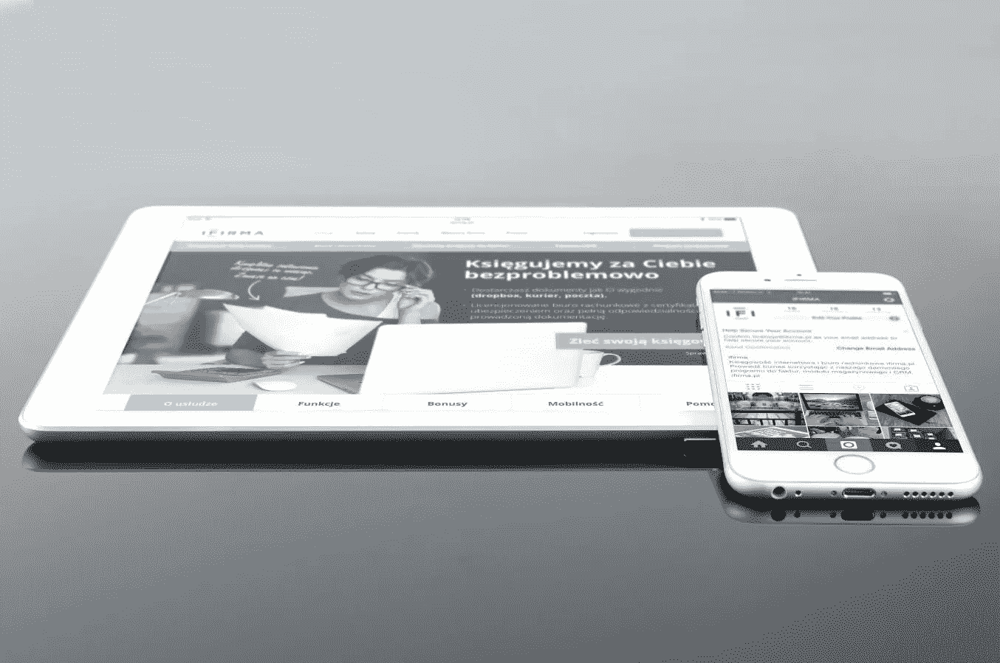

# 为什么使用响应式 WordPress 主题

> 原文：<https://medium.com/visualmodo/why-using-a-responsive-wordpress-theme-1351dc67e90a?source=collection_archive---------0----------------------->

## 对你的网站至关重要。

自从 WordPress 在 2003 年推出以来，这个平台得到了最多的使用，并且已经成为网站所有者最喜欢的选择。相应地，网站主题的选项数量也在急剧增长。不管你是已经有了一个网站，还是正准备创建一个，你需要注意的最重要的事情是让主题可以根据不同的设备进行调整。为什么这么问？以下几点将澄清这一点。

# 对你的网站至关重要

# 移动使用增加

考虑到人们花在手机上的时间，我们必须努力使网站对手机友好。

[响应式主题](https://visualmodo.com/wordpress-themes/)是以适应屏幕大小的方式构建的。它们可以很好地适应不同的屏幕尺寸和方向，从而保持可读性和预期的外观。

新的智能手机实际上已经准备好在日常使用中完全取代电脑，这就是为什么响应主题应该是你的优先事项之一。

# 搜索引擎优化青睐响应式设计

谷歌开始鼓励网站所有者和设计者通过在搜索结果中对响应网站应用手机友好的标签来优化手机。它试图以这种微妙的方式传达一个信息，即一个有响应的网站是多么重要。

响应式网站只有一个 URL 和相同的 HTML，从而使 Google 搜索、索引和组织内容变得更加容易和高效。这就是 SEO 专业人士提倡响应式主题的原因。

# 更好的用户体验

你想提高你的转化率吗？嗯，这是做这件事的方法之一。

你的用户应该是你关注的焦点。通过了解他们想要什么以及如何让你的想法更接近他们，你就离你的目标更近了一步。

没有用户会告诉你他们不关心一个有响应性的网站主题。他们都希望功能和美观的布局，你需要提供。

除了使用响应式主题之外，你还应该确保你提供给用户的内容与你的设计具有相同的质量，你可以使用学生评分等网站来帮助你。

# 最低维护

在响应式主题出现之前，网页设计者不得不努力维持网站和移动网站。那只会耗费他们的时间、金钱和耐心。

另一方面，如果他们决定只选择两个选项中的一个，他们可能会失去其他版本的用户。

响应式主题解决了所有这些问题。通过使用响应式[技术](https://visualmodo.com/blog/)，网站管理员只需要创建一个网站，它适用于所有设备和用户。

# 美貌吸引人

提供有价值的内容很重要，但是你提供内容的方式也很重要。

在这个肤浅的世界里，有些用户仅仅因为不喜欢 X 的外观，就会点击屏幕上的 X。统计数据显示，一些人的注意力持续时间取决于他们对所看到的设计的喜爱程度。

如果你在你的网站上发布相关的高质量的内容，你不应该在功能上失去用户。

如果主题不适应用户使用的不同设备，用户就不会满意。因此，响应能力和吸引人的设计必须齐头并进。

# 一些最后的想法

考虑到响应式主题带来的所有优势，你不能破坏它的相关性。所有想要在竞争中保持领先并在不同平台上提供出色用户体验的人都需要将这一改变应用到你的网站上，这是至关重要的。

在一个科技的世界里，一个能响应所有设备的网站会给你的在线业务带来很大的不同。这就是为什么你需要承认一个有反应的主题对你的目标受众的重要性。

*丹妮拉·麦克维克毕业于杜伦大学，拥有心理学硕士学位。她是* [*顶级作家评论*](http://www.topwritersreview.com/top-10-essay-writing-services) *的作家兼编辑。她的专业领域是创意写作、小说写作、学术研究和市场营销。她认识到响应式网页设计是在线营销的支柱，并通过在 Top Writers Review 上向她的团队提出一些发展建议，他们成功地提高了网站的知名度。*