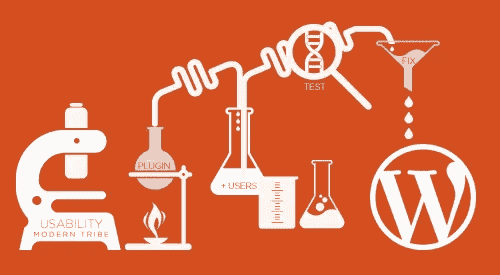
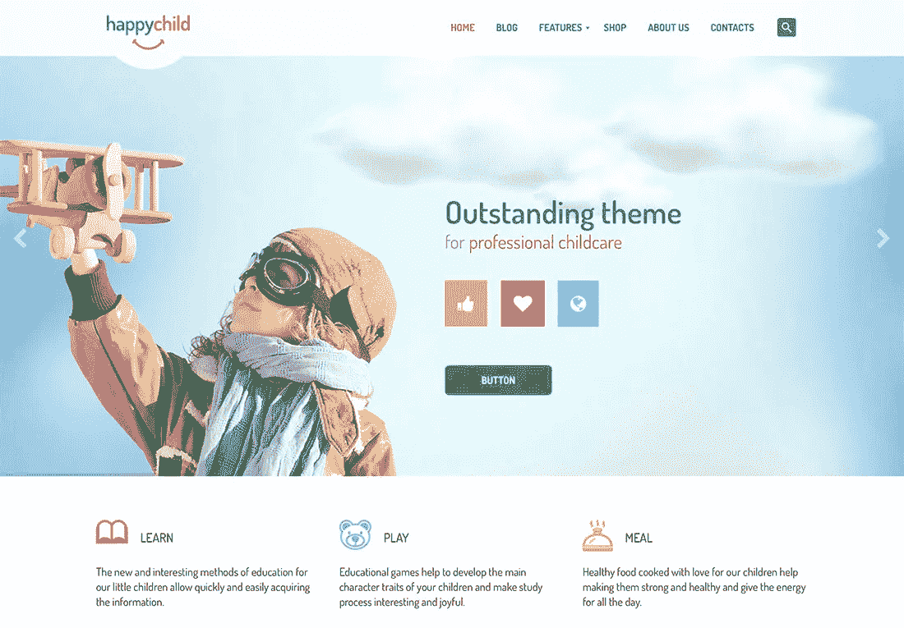

# 为什么我们喜欢 WordPress 软件？

> 原文：<https://medium.com/visualmodo/why-we-love-wordpress-software-c1f068b67a19?source=collection_archive---------0----------------------->

为什么每个人都喜欢 WordPress？WordPress 最大的优点是它简单易用，足够灵活，可以处理任何事情。这是 WordPress 如此受欢迎的主要原因。根据最近的一项调查，WordPress 为互联网上 30%的网站提供支持。

本着感恩的精神，我们想和你分享感谢 WordPress 的 10 大理由。

# 为什么每个人都喜欢 WordPress？

**它是免费的，支持开源**

WordPress 在两个方面是免费的——使用这个平台不需要任何成本，而且它是完全开源的。WordPress 是一个开源项目，支持世界范围内人们的成长。 [Visualmodo 也为支持和贡献](https://visualmodo.com/)开源社区而自豪。开源软件意味着你可以自由地使用、修改、构建和重新发布你需要的软件。

很好奇为什么 WordPress 是免费的？看看这篇伟大的[文章](http://www.wpbeginner.com/beginners-guide/why-is-wordpress-free-what-are-the-costs-what-is-the-catch/)。

容易的事情

因为平台是免费的，所以上手超级容易。你所需要做的就是把它安装到你的电脑上，然后你就万事俱备了！许多网站都是由 WordPress 驱动的，因为它对用户友好。你不必是一个网站开发者来使用它。顺便说一下，我们的一键式安装让客户的安装变得简单。

**与他人合作愉快**

如果你需要将其他平台连接到你的网站来增加功能，WordPress 是一个很好的选择。它很容易与其他平台集成，如电子邮件营销平台 Constant Contact 和通过 [WooCommerce](https://woocommerce.com/) 创建的电子商务商店。这给了你大量的选择来使你的网站满足你的需求。

**无尽的定制选项**

有成千上万吸引人的主题供你的网站设计选择。既有免费主题，也有付费主题。在这些主题中，有更多的选项，如网站颜色、字体等。自定义您的网站，使其成为您的专属网站。

除了大量的主题，还有数以千计的[插件](https://wordpress.org/plugins/)可以为网站添加不同的功能。一些例子包括网站优化、电子商务解决方案和联系方式，

**最优 SEO**

WordPress 使得搜索引擎抓取网页和确定你的网站的上下文变得容易。如果你正在建立一个新的企业，并且想要增加你的网络流量，这是很重要的。

**WordPress 支持你**

WordPress 最初是一个社区项目，不归任何人所有。自从 2001 年开始以来，已经有成千上万的人从事这项工作。所以它自然有一个很大的支持社区。如果你上网，你会发现有无限的 WordPress 论坛和社区为你在网站上遇到的任何问题提供建议。还有许多资源可用于学习新的特性和技能，以便您能够更熟练地使用该平台。

**无论什么都好看**

让我们来看看一些移动使用统计数据。据预测，2017 年至 2021 年间，全球移动数据流量将扩大*七倍*。2017 年初，移动设备占全球网页浏览量的 49.74%。全球移动商务收入预计将从 2016 年的 1700 多亿美元增长到 2019 年的近 6950 亿美元！

这些趋势证实了拥有一个响应迅速的网站(设计用于在不同设备上浏览)是多么重要。大多数 WordPress 可用的主题被设计为自动响应。还有几个响应插件可供选择。

**安全**

毫无疑问，有网络恶棍在网上游荡。无论是无聊的黑客想要恶作剧，还是老练的骗子想要窃取个人信息，您都需要保护您的站点免受这些威胁。

有几个安全插件你可以下载，网上的内容可以帮助你使你的 WordPress 站点更加安全。

**简单的现场管理**

在你建立了你的网站后，你需要管理它。这包括添加新内容或新页面。WordPress 有一个单一的仪表板，给你一个集中的地方来管理你网站上的一切。您还会收到电子邮件，了解平台的任何更新，这样您就不会感到意外。

WordPress 爱我们！

正如本文开头提到的，Visualmodo 热爱 WordPress，并且是 WordPress.org 推荐的 WordPress 主题提供商的第一名！自 2005 年以来，我们一直与 WordPress 合作，优化 WordPress 网站的托管平台，为用户提供无缝体验。有了我们为 [Visualmodo](https://visualmodo.com/wordpress-themes/) 帐户提供的一键式 WordPress 安装、24/7 支持和退款保证，我们将竭尽全力保证您的满意。

我们非常感谢我们与 WordPress 的长期和富有成效的关系，以及我们所有伟大的客户，这就是我们热爱 WordPress 的原因！