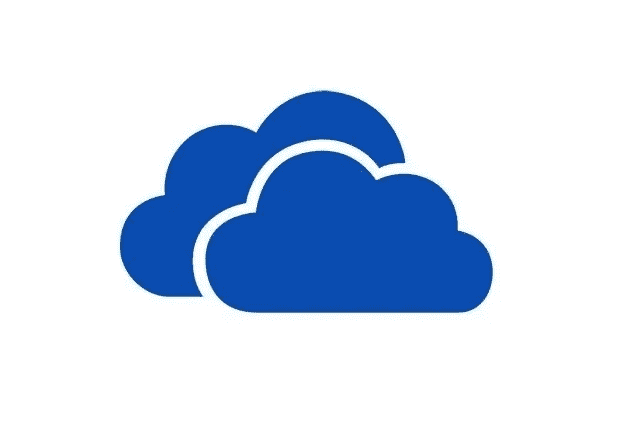

# 为什么您需要使用云

> 原文：<https://medium.com/visualmodo/why-you-need-to-use-the-cloud-ef42033d1ec4?source=collection_archive---------1----------------------->

## 如果你还没有

云不再是科幻小说，如果你的企业还没有采用这项技术，那么你就落后了。一些首席执行官迟迟没有采用云平台，因为他们不太明白它们是如何工作的，但这比你想象的要简单得多。云只是一种在远程服务器上存储数据的方式。这确实是最基本的，但是一种资源已经改变了商业管理。

以前需要将所有数据和软件存储在内部的安全房间中，现在可以从世界任何地方访问您的所有数据，而且完全不需要投资昂贵的服务器技术。以下是您的企业应该尽快采用云的几大原因。

# 云:易用性和灵活性

您应该关注云的一个主要原因是因为它非常容易扩展。随着您业务的增长，您的计算需求可能也会增长。这曾经意味着投资新的软件、服务器和空间，但有了云平台，这种需求不仅减少了，而且消除了。如果您的需求波动，那么这种灵活性很容易通过云来管理，这意味着您的业务具有一定的灵活性，如果您依赖内部硬件，这是不可能的。这也可以大大降低你的开发成本，意味着[你可以省钱](https://www.forbes.com/sites/moorinsights/2016/04/11/tco-analysis-demonstrates-how-moving-to-the-cloud-can-save-your-company-money/)同时增加功能。

# 安全强度

忽视你的[软件](https://visualmodo.com/)更新是非常容易的，这将你暴露在恶意数据泄露的可能性之下。云计算的一个主要好处是，大量的安全管理从你的责任中脱离出来，因为平台本身处理更新，并致力于尽可能保持安全。毕竟，安全因素是转移到云的主要原因之一，所以尽可能保证您的安全符合他们的利益。对于不太懂技术的首席执行官来说，将文件和数据转移到云中可能会令人望而生畏，但还是有很多帮助的。像 [Bytes](https://www.bytes.co.uk/) 这样的公司可以管理你的移交，同时在整个移交过程中尽可能地保护你。

# 远程工作

不是每天都在办公室度过。对于许多企业来说，为了最大限度地提高效率和品牌一致性，世界各地甚至有不同的地方需要协同工作。借助[最佳云平台](http://uk.pcmag.com/storage-devices-reviews/3682/guide/the-best-cloud-storage-and-file-sharing-services-of-2018)，您可以从世界上任何地方的任何设备访问您的数据。不仅如此，您还可以对 word 文件、幻灯片演示和电子表格进行实时协作，无论您的协作者身在何处。随着远程工作在商业文化中变得越来越流行，云平台允许对您的工作负载进行无与伦比的访问。

如果你一直想知道为什么每个人都在谈论云，那么以上是最常引用的原因。还有其他几个原因，比如数据恢复的便利性和变得更加环保的愿望。无论你对云感兴趣的原因是什么，现在都有越来越大的压力要加入进来，像你的竞争对手一样利用同样的[好处](https://visualmodo.com/)。