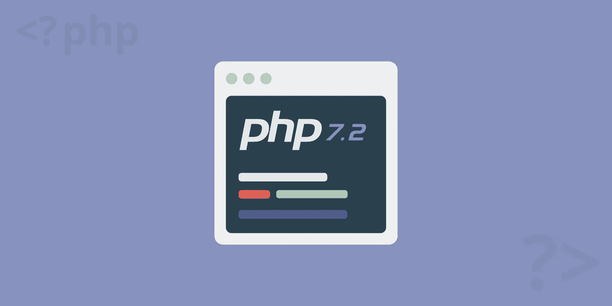
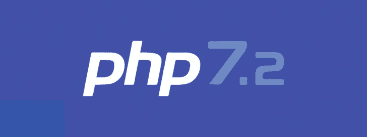
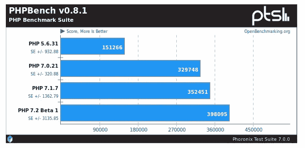

# 为什么你应该使用 PHP 7.2

> 原文：<https://medium.com/visualmodo/why-you-should-be-using-php-7-2-eef08b086c35?source=collection_archive---------0----------------------->

PHP 最近发布了他们 PHP 7 系列的第二个更新。PHP 7.2 带来了新的更新，包括重要的安全措施，新增加的核心，现代加密和更快的网站加载速度。我们的 web 开发专家在下面分析了 PHP 7.2 的最新特性和优势。

# PHP 是什么？

PHP 是一种广泛使用的开源通用脚本语言，可以嵌入到 [HTML](https://visualmodo.com/) 中。它最初源于个人主页工具，现在代表“PHP:超文本预处理器”，这是一个递归的缩写词，在 UNIX 系统的命名约定中随处可见。PHP 的开源服务器端脚本语言用于编写动态生成的网页。脚本在服务器上执行，结果以普通 HTML 格式发送到浏览器。

我们强烈建议(如果你不是开发人员)联系你的主机支持并要求 PHP 更新，这将使你的网站更快，并防止你出错。

# PHP 的优势

PHP 几乎兼容全球使用的所有服务器和数据库标准，包括 MySQL、PostgreSQL、Oracle、Sybase、Informix 和 Microsoft SQL Server。在一个大型开源社区的支持下，PHP 提供了快速的[性能](https://visualmodo.com/)，可以用于各种目的，比如生成动态页面和文件。PHP 允许你在一个站点数据库中存储和管理信息，允许你从一个 web 表单中收集数据并给用户发送电子邮件。PHP 也有安全特性来帮助你加密数据和限制对你网站的未授权访问。PHP 的顶级用户包括脸书、雅虎和维基百科，使用 PHP 构建的 CMS 包括 Drupal、 [WordPress](https://visualmodo.com/wordpress-themes/) 、Joomla 和 Magento。

# PHP 7.2 更新

PHP 第 7 版的最新更新包括重要的安全改进、性能增强和令人兴奋的新特性。要查看版本 7 功能的基线信息图，请参见 Fasthosts 的有用指南[这里](https://www.fasthosts.co.uk/php-infographic)。

# 利钠是核心的一部分

应用层加密库 lib 钠现在是 PHP 7.2 核心的一部分。以前，这个库是通过 PECL 提供的，这是另一个递归的缩写，意思是“PHP 扩展社区库”library 的加入使 PHP 成为第一个将现代密码学加入其标准库的编程语言。这确保了跨平台和跨语言库支持加密、解密、签名、密码散列等等。

# 密码散列中的氩 2

Argon 2 是一个获奖的哈希算法。它赢得了 2015 年密码哈希竞赛，为之前版本的 PHP 带来了 Bcrypt 算法的安全替代方案。它是为最高的内存填充率和有效使用多个计算单元而设计的，同时仍然提供对折衷攻击的防御。Bcrypt 只考虑了一个成本因素，而 Argon 2 考虑了三个成本因素:内存成本、时间成本和并行性因素。内存成本因素定义了哈希过程中应该消耗的 KiB 的数量，而时间成本定义了 hashtag 算法的迭代次数。并行因子设置 hashtag 期间将使用的并行线程的数量。查看更多关于氩 2 如何解决这些因素的信息[这里](https://wiki.php.net/rfc/argon2_password_hash)。

# 表演

根据来自 [Phoronix](https://www.phoronix.com/scan.php?page=news_item&px=PHP-7.2-Beta-1) 的基准测试，PHP 7.2 比 7.1 快 13%，比 7.0 快 20%。它比 PHP 5.6 快 250%，而 PHP 5.6 超过了 40%的 WordPress 用户仍然没有从 T7 开始更新。其他测试支持这些发现。[官方 PHP 基准测试](http://talks.php.net/fluent15#/wpbench)表明，PHP 7 的速度是 5.6 的两倍，延迟是 5.6 的一半，而 [Kinsta 的基准测试](https://kinsta.com/blog/the-definitive-php-7-final-version-hhvm-benchmark/)表明它的速度是 5.6 的三倍。

# 贬值

与每次更新一样，PHP 8.0 之前会删除一些不推荐使用的功能和特性。不推荐使用的函数的完整列表可以在[这里](http://php.net/manual/en/migration72.deprecated.php)找到。这些特性将在 PHP 7.2 中工作，但是在使用过程中会在日志文件中出现错误消息。开发人员应该检查代码，在任何不推荐使用的函数变得向后不兼容之前更新它们。

# 支持

PHP 7.0 于 2017 年 12 月 3 日结束了其安全支持。到 2018 年底，关键支持仍然可用，但 PHP 社区不再为 bug 或小问题提供支持。PHP 7.1 将于 2018 年 12 月 1 日跟进。升级到 7.2 可确保社区持续支持最新的安全更新。

有了重要的安全更新、核心的 lib 钠和大大改进的性能特性，从旧版本的 PHP 迁移到 PHP 7.2 是一个简单而重要的更新。更多关于如何更新的信息，请看官方指南[这里](https://visualmodo.com/wordpress-themes/)。