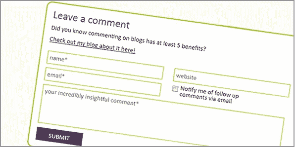

# 为什么你的评论没有得到批准？

> 原文：<https://medium.com/visualmodo/why-your-comments-dont-get-approved-7cf30149200a?source=collection_archive---------0----------------------->

如果你在一些博客上发表评论，但没有得到批准，你可能做错了什么，现在看看解决这个问题的最佳方案，让每个人都看到你的想法。

也许你的评论在某种程度上是垃圾邮件。也许你用了一些名字，像“网上赚钱”“提示和技巧”等等。一些[博主](https://visualmodo.com/)/网站管理员将你的评论标记为垃圾，Akismet 在所有博客上都将你的评论视为垃圾。

简单的方法是，在几个博客上发表评论，并添加有用的详细评论。此外，使用评论表发送电子邮件给所有者，并通知他们，您已经评论了一些有用的评论，但您的评论没有显示，请检查垃圾邮件文件夹。

博客评论是增加你的流量和获得链接的好方法，但是它不应该是自私的。如果你只是为了自我推销，那你就做错了。

你需要添加有价值的评论来联系志同道合的博主。如果你发表有用的评论，它会吸引更多的注意力。更多的关注意味着更多的流量。所以博客评论可以增加参与度、[流量](https://visualmodo.com/wordpress-themes/)和你博客的品牌知名度。

如果你仍然在博客评论中挣扎，这里有一些你的评论没有得到批准的原因。并学习如何修复它。

# 使用名称字段的关键字

姓名字段仅用于您的姓名。显然，你的名字不像“博客技巧”、“seo 技巧”、“技术博客”等。使用关键字或你的博客名作为你的名字是垃圾评论的第一个标志。

如果博客所有者发现关键字作为名字，她/他可能不会阅读您的评论。所以再好的评论，你的评论也会被删除或者移至垃圾。

**怎么修？**不要在姓名字段中使用关键字。用你的全名。这将有助于你与博主和其他人接触。如果你想在名字栏中使用你的博客名，那么在你的名字旁边加上你的博客名，比如“Visualmodo @ [WordPress](https://visualmodo.com/blog/) ”。但这不是一个好的做法。

# 没有内容的评论

我在 Visualmodo 上收到很多这样的一行注释

*“很棒的帖子。感谢分享"*

*“谢谢你的帖子”*

*《你真棒》*

我喜欢这些赞美，但我必须马上删除它。因为他们这样做只是为了链接，这些类型的评论会损害博客的质量。

**怎么修？**花点时间阅读这篇文章，至少用 2-3 行来分享你的想法。评论“很棒的帖子没有错。感谢分享”，但一定要跟进。分享一下为什么你认为这篇文章很棒。试着给你的评论增加一些价值。更重要的是，如果你有任何问题，请提出来。

# 带链接的注释

你的博客上可能有类似的帖子，你想在评论中分享链接。停下来。如果你不是那个博客的定期评论者，就不要这样做。如果包含链接或锚文本，即使是有价值的评论也可能被删除。

大多数博客所有者不喜欢评论中的链接。

**怎么修？**如果你和博主关系很好，那么你可以在评论中分享链接。但是不要养成习惯。千万不要在评论上添加锚文本。

# 不带 Gravatar 的注释

Gravatar 允许你在博客评论中展示你的照片。就我个人而言，我不会因为没有 Gravatar 而删除任何评论。但问题是 Akismet WordPress 插件有时会将[有价值的](https://icons.visualmodo.com/)评论标记为垃圾评论。

不幸的是，如果你的评论被放入垃圾邮件文件夹，你的评论被批准的机会就更小了。但是如果你有一个 Gravatar，博客主人一定会注意到你对垃圾邮件的评论。因为大部分群主在删除垃圾评论前都会看一眼。

**怎么修？**现在设置一个[抓手](https://pt.gravatar.com/)。只需 2-3 分钟就可以为你的每条评论添加一张图片。它会帮助你建立品牌，增加流量，建立关系。

# 无礼的评论

不同意某人的观点没有错。我真的很喜欢有人纠正我。但这并不意味着我会容忍有人使用俚语、骂人或进行任何人身攻击。我会简单地删除评论。

**搞定:**别没礼貌。如果你不同意某事，礼貌地说出来，并给出有力的理由。

# 最后的话

如果你没有犯上述任何错误，但是你的评论没有被批准，我建议你阅读博客的评论政策，并与博客所有者联系。你如何评论博客？你在获得批准的过程中遇到过什么问题吗？通过评论让我们知道。