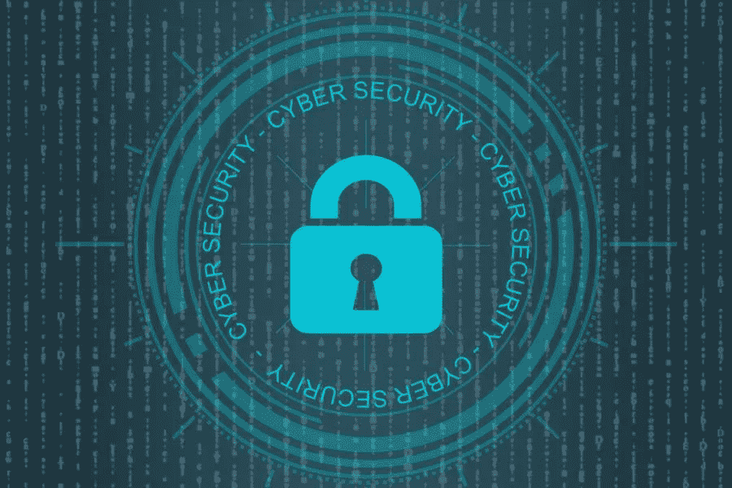

# 为什么你的 WordPress 网站被黑最常见的原因

> 原文：<https://medium.com/visualmodo/why-your-wordpress-website-was-hacked-most-common-reasons-38306f04ddcc?source=collection_archive---------0----------------------->

发现你的 WordPress 网站被黑了，这很令人沮丧。在这篇文章中，我们将分享 WordPress 网站被黑的主要原因，这样你可以避免这些错误，保护你的网站。你的安全扫描是积极的，它确认:你的网站已被成功渗透。而说到 WordPress，“被黑”从来都不是你想听到的词。

# WordPress 安全吗？

这是一个很多人都会问的价值百万的问题。WordPress 作为一个平台安全吗？

简单的回答是“是的”,它确实是一个安全的平台！数字说明了一切；WordPress 占据了互联网上 100 万个顶级网站的 32%以上。不可否认的事实是，为什么 CMS 在攻击者眼中是一个真正的宠儿。有些人甚至称之为网络的微软。

然而，有时候邪恶的思想最终会创建代码在 WordPress 上运行；这就是安全漏洞发生的时候。在大多数情况下，与其他主要的开源内容管理系统相比，在顶层有一个团队可以非常及时地开发和发布即时更新。所以，现在我们将探索一些技巧和实践来保护你的 WordPress 网站，使其永远不会被黑客攻击。

# 不安全的虚拟主机服务

说到网络，你可能会发现价格和主机服务质量之间有着完美的关联。与其他人相比，可以雇佣更多专业人士/专家的主机可能会收取更多的费用。你不应该回避一些关键问题，比如安全问题，或者推迟一天。你甚至必须考虑寻找一个高质量的主机提供商，他可以提供从方便的预算到高质量服务的一揽子服务。说到安全的 WordPress 托管，我鼓励你看看 SiteGround 或者 Bluehost。

# 过时的 WordPress 版本

WordPress 黑客受害者的一个共同点是不更新他们的网站。根据几份可靠的报告，当黑客出现时，55-61%的 WordPress 黑客受害者运行的是过时的 WordPress，这不是巧合。WordPress 安全更新是自动进行的。然而，有一些用户，尤其是非技术人员，会完全禁用该功能。不定期更新网站的人会陷入两个陷阱:

*   首先，他们因为全神贯注而推迟更新或者忽略它们。
*   其次，他们害怕更新会破坏他们网站的性能。

幸运的是，如果你是属于后一类的人，试着采取这些步骤，这样就不会有任何东西破坏你的网站。例如，在运行更新之前，为您的站点创建完整的[备份](https://visualmodo.com/best-wordpress-backup-plugins/)。即使网站崩溃；您将始终可以选择还原到以前的版本。

# 在被黑客攻击的 WordPress 网站上，Week 密码很常见

不要生气，因为这一点是针对那些仍然使用相同的密码访问每个网站的人。好吧，是时候进行干预了。并且认为这也是强制性的！此外，停止在 Google Sheets 中存储凭证。在 WordPress 的上下文中，您需要设置密码规则。借助强制强密码插件，您可以在整个用户群中设置它。

# 错过双因素认证

你可能认为我今天对你要求很多，但这只是因为我在乎。你已经为你的 WordPress 站点设置了一个强密码，但是你是否也考虑过为登录你的网站设置一个"[双因素认证](https://visualmodo.com/wordpress-two-factor-authentication-usage-guide/)"过程？这意味着您每次登录网站时，都需要使用另一台设备进行身份验证。

虽然对黑客来说，欺骗是有挑战性的，但毕竟，完全披露并非不可能。因此，它自动增加了一层安全，以防止未经授权的访问您的网站。幸运的是，WordPress 为 two factor 提供了许多不同的解决方案，这些解决方案来自更商业化的实现，比如功能齐全的 Duo Security，或者更简单的解决方案，比如来自 George Stephanis 的 Two Factor。其他流行的插件有 2FA 内置的附加功能，如 Jetpack 和 WordFence。

# 保护 WordPress 仪表板

一个最常见的 WordPress 黑客攻击企图包括获取你的 WordPress 登录凭证；这可能是通过暴力攻击或密码盗窃。为了防止这种情况发生，你需要保护你的 WordPress 管理目录(简称 wp-admin 页面)。当然，最好的方法之一是对你的 WordPress 管理页面启用可靠的密码保护。

您可以考虑的第二件事是我上面提到的双因素身份认证。在这里，用户不仅需要密码才能登录——他们还需要在短信、电子邮件或应用程序上输入代码。Fabrizio 使用在 Visualmodo 上启用了双因素身份验证的 WordFence，然而，正如我前面提到的，还有许多其他插件可以用来设置 2FA。不要用“admin”作为你的用户名。这是黑客使用这个默认用户名进入你的网站时最常用的方法，所以你应该改变它。

# 糟糕的 WordPress 主题意味着网站被黑

由于我们没有一整天的时间，我就不多讲了。如果你愿意，你可以稍后在谷歌上快速搜索一下。起初，对于网站所有者来说，这似乎是一个很酷的省钱策略，但你可能不知道的是，大多数出售廉价和欢快主题的网站都是不可靠的。从某种意义上来说，他们的主题编码糟糕，缺乏及时更新，支持也很差。

下载和安装任何随机的主题可能会迫使你最终损害你的网站的整体安全性。你知道一句老话，天下没有免费的午餐。对于一个高级主题，确保你从一个著名的 WordPress 开发公司得到它。这家公司已经存在了很长一段时间，建立了信任和声誉，就像稀有一样。

# 普通 FTP 而不是 SFTP/SSH

通常，FTP 帐户用于通过 FTP 客户端将文件上传到您的 web 服务器。尽管大多数提供商最终都在不同协议的帮助下支持 FTP 连接。在普通的 FTP、SFTP 或 SSH 的帮助下，东西可以很容易地连接起来。现在的问题是，当你用普通的 FTP 连接你的网站时，你的密码会被自动发送到加密的服务器上，在最坏的情况下，这很容易被窥探或窃取。因此，不要使用普通的 FTP，尝试使用 SFTP 或 SSH。幸运的是，大多数 FTP 客户端可以通过 SFTP 和 SSH 连接到您的网站。当链接到你的网站时，你只需要把协议改成“SFTP-SSH”。

# WordPress 被黑的原因

这只是部分列表。有许多事情你可以做，我可以简单地继续下去。我们希望这篇文章能帮助你了解 WordPress 网站被黑的主要原因。