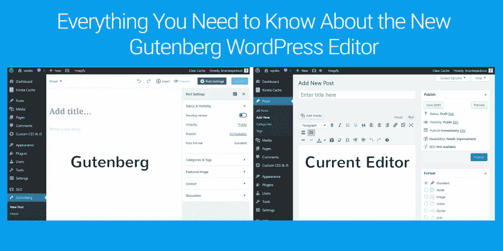
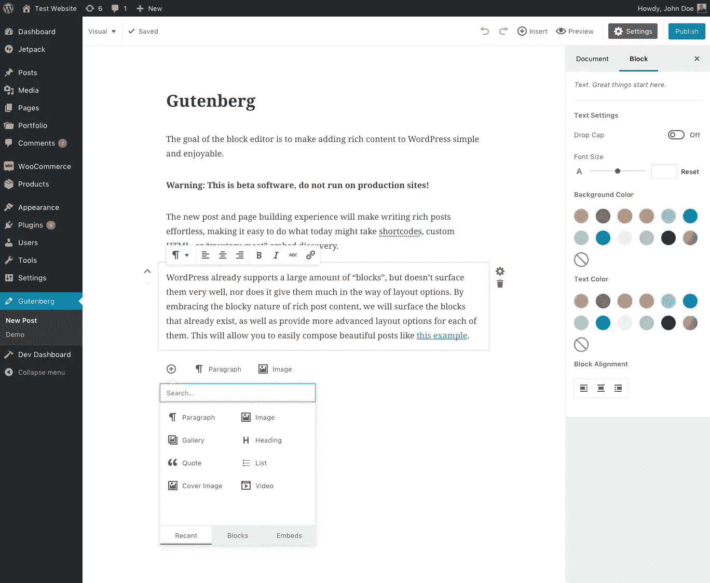
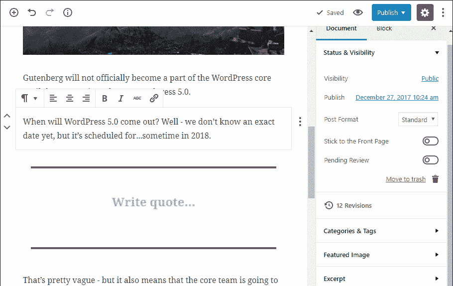

# Gutenberg Editor 会成就还是毁灭 WordPress？

> 原文：<https://medium.com/visualmodo/will-gutenberg-editor-make-or-break-wordpress-5a7fb1a4c6cb?source=collection_archive---------0----------------------->

由于 WordPress 用户预计 WordPress 5.0 版本将于 2018 年发布，因此对将与新的 WP 版本一起发布的 Gutenberg editor 有不同的反应。该编辑器目前正处于测试阶段，所以只能作为插件使用。它被设计成默认 WP 编辑器的永久替代品。

# 一、什么是古腾堡编辑器？

Gutenberg editor 以 500 多年前发明可移动印刷机的大脑约翰内斯·古腾堡的名字命名，是 WordPress 即将推出的编辑器，预计将成为 WP Editor 的永久编辑器，用于编辑该平台上运行的网站内容。使用 React 创建的编辑器是一个客户端界面，它使用基于块的系统构建内容。

如果你想知道官方推出 Guttenburg 是否会影响你的 WordPress 网站，答案是肯定的。一旦正式发布，该软件将被整合到 WordPress 核心中，并成为官方的 WordPress 编辑器。然而，如果你想恢复旧的编辑器，经典编辑器，一个免费的插件将使恢复成为可能。

# 古腾堡编辑器的优势

简化内容块的构建

WordPress 已经决定在其核心中采用[古腾堡](https://visualmodo.com/)编辑器的主要原因是为了让它的用户能够比使用旧的编辑器时更少的麻烦来构建内容块。一旦新的编辑器正式发布，WordPress 主题开发者将能够更容易地为内容块网站创建主题。编辑器将允许主题本身支持这种布局，而不是使用可视化编辑器。因此，该软件将大大减少 WordPress 网站的加载时间，因为不再需要庞大的内容块插件。

简化主题切换

古腾堡预计将为 WordPress 用户提供的另一个好处是可以轻松地从一个主题切换到另一个主题。切换主题，尤其是那些嵌入了内容块构建器的主题，例如 Divi，可能是一个复杂的过程。因此，编辑器将为那些想改变站点主题的用户提供极大的便利。此外，一旦整合到 WordPress 中，Gutenberg 将使主题默认不包含内容块。因此，与主题目前的工作方式不同，它们不需要第三方主题来提供内容构建器。

显示网站内容的确切外观

Guttenberg editor 中的内容显示方式与在网站上发布的方式相同。这将使网站管理员能够在不发布内容的情况下，对内容在网站上的最终外观有一个粗略的了解。

Gutenberg 设计用于平板电脑、智能手机和电脑等移动设备；台式机和笔记本电脑。这绝对是一个巨大的加分！为什么？因为大多数其他内容块插件都不能很好地与移动设备兼容。无论你是在手机网站还是桌面网站上使用 Gutenberg，它的功能都是一致的。

# 古腾堡编辑器有哪些不好的地方？

你的网站会崩溃

已经存在很多年了， [WordPress](https://visualmodo.com/) 一直非常强调其技术的向后兼容性。然而，Gutenberg 将在某种程度上偏离这一立场，因为它需要利用 React、REST API 等现代技术。虽然向后兼容的主要优势是它保持了一致的用户体验，但是考虑到它运行在现代技术上并且不考虑向后兼容性，将 Gutenberg 引入 WordPress Core 很可能会导致站点崩溃。

作为一个用户，当你把一个依赖于自定义元框的 WordPress 站点升级到 WordPress 5.0 版本时，下次编辑文章时，你会有一个破碎的体验。这是任何网站所有者或开发者都想经历的事情，但在 Gutenberg editor 发布后，这似乎是不可避免的。

插件和主题不兼容

古腾堡编辑器的另一个缺点，虽然还没有得到证实，是它可能会导致特定插件的问题，尤其是那些使用自定义元框的插件。编辑器有一个巨大而笨重的设计面板，上面有很多很多的切换框。因此，许多用户在寻找他们需要的元框时可能会遇到困难。

# 人们对此有什么看法？

对 Gutenberg editor 的关注程度如此之大，以至于该插件目前的评级仅为五星之一。新加坡的许多[网站开发者](https://novage.com.sg/)，特别是在 WordPress 的论坛上，已经表达了他们对快速推出编辑器和整合到 WordPress 核心的不满。

虽然有些人认为将该软件设置为 WordPress 的默认编辑器还为时过早，因为用户需要更多的时间来了解它，但其他人认为将它设置为默认编辑器实际上不是一个好主意，因为这将允许客户修补他们的网站，这可能导致网站开发人员的低生产率和更多的工作。

# 需要更多的时间

网站所有者和开发者需要更多的时间来准备这一改变，因为这不仅是一件昂贵的事情，而且需要人们更多地了解拟议的新技术。此外，WordPress 社区需要充足的时间来理解这一变化的影响。不同的用户对 Gutenberg editor 的贡献对它的成功至关重要。但是当他们对此知之甚少或一无所知时，他们怎么能做出令人满意的贡献呢？

人们抗拒改变，古腾堡编辑也不会例外。在掌握之前，WordPress 用户，无论是新手还是专家，在使用编辑器时都会遇到各种各样的挑战。然而，我们希望大多数人能够迅速适应。

# 最后的话

由于各种原因，Gutenberg Editor 是否会打破 WordPress 仍然是一个难题。首先，这个版本仍然在发展，因为到目前为止它还是测试版。其次，有很多 WordPress 主题和插件，没有人确定它们是否都与 Gutenberg 兼容。时机是另一个问题。

毫无疑问，编辑器是一个强大的软件，可以给 WordPress 的工作方式带来很多积极的变化。然而，仓促行事并不是一个好主意，因为一些人可能会被快速和巨大的变化所淹没，最终放弃 WordPress。因此，古腾堡有可能会开发 WordPress，尤其是如果它的社区能够快速适应它将带来的变化。另一方面，如果 WordPress 核心的其他部分不调整与 Gutenberg editor 的兼容性，一些问题，如由于编辑器的引入而导致的网站中断，很可能会破坏[平台](https://visualmodo.com/)。

总之，现在很难判断古腾堡项目是否会成功，但是时间会证明一切。