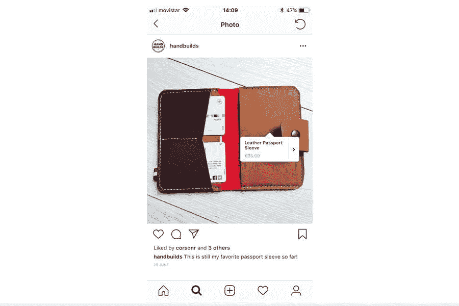

# WooCommerce Instagram 购物设置教程

> 原文：<https://medium.com/visualmodo/woocommerce-instagram-shopping-setup-tutorial-7f307b5a5e14?source=collection_archive---------0----------------------->

在今天的 WordPress 指南文章中，我们将学习如何使用 WooCommerce WordPress 插件来设置 Instagram 购物，以充分发挥其潜力。

你正在探索 Instagram 及其 10 亿用户是否能帮助你发展业务，对吗？如果你有一个 WooCommerce 商店，你甚至有更多的 Insta 机会:在 Instagram 上购物使人们从你的照片转移到收银台变得比以往任何时候都简单。让我们利用在 Instagram 上购物的力量为您的企业服务吧！

比方说，我喜欢照片中的这双鞋，想买给我的女朋友。在这种情况下，Instagram 的可购物帖子让我看到了完整的[产品页面](https://visualmodo.com/knowledgebase/creating-a-store-on-wordpress/)。我们可以在公司网站上点击购买该商品。这个想法是利用人们喜欢在社交媒体上浏览和购买商品的事实。如果你在经营一家网店，Instagram 的可购物帖子功能不仅是免费的，而且可能是一个巨大的收入来源。

# WooCommerce Instagram 购物要求

和许多社交网络一样，你必须遵守一些规则。可购买的帖子没有什么不同。

1.  首先，要有资格在 Instagram 上购物，你需要一个 Instagram 商业账户。这需要批准，某些国家目前被排除在外。
2.  其次，你必须遵守 Instagram 商务政策和商家协议。
3.  有一个脸书网页+需要一个 Instagram 商业网页。
4.  你只能在 Instagram 上卖实物。最后，制作一个脸书目录，并链接到 Instagram。

在商业政策和商业协议中也有很多其他的规则。例如，我在一次测试中发现，如果你的 Instagram 页面没有太多活动，Instagram 不允许可购物的帖子。话虽如此，如果你有一个运营商店、脸书页面和 Instagram 商业账户，大多数企业配置可购物帖子应该没有问题。

此外，我假设你的 WooCommerce 商店已经在运作，并且有一些实体商品(你不能通过 Instagram 的可购物帖子销售数字商品)。如果你想获得建立 WooCommerce 的帮助，请点击这里查看我们的指南。WooCommerce 还有一个安装向导，你可以在 WordPress 上安装它。

# 脸书页面和目录

脸书被要求在 Instagram 上销售，所以你需要生成一个脸书页面，或者确保你当前的页面已经准备好启动。创建一个脸书页面。

演练脸书提供的步骤。您可以选择完全跳过页面设置，但如果您还经营实体店，我们建议您填写所有内容，如个人资料图片、业务描述和营业时间。当你的脸书店没有完工时，它的声誉会下降很多。页面准备就绪后，转到脸书目录管理器页面。单击创建目录按钮。我们假设您的业务是电子商务，但如果您愿意，可以随意选择不同类型的业务。单击下一步按钮。

下一页显示了手动上传产品信息的选项。然而，我们更感兴趣的是链接一个 WooCommerce 网站。点击按钮连接电子商务平台:向下滚动点击 WooCommerce 标志。确保您也有目录的正确所有者。点击完成设置按钮。

# 链接 WooCommerce 帐户

我们需要脸书像素扩展上传到您的 WooCommerce 帐户，以实现 Instagram 购物。这将两个帐户联系起来，使产品同步成为可能。点击下载按钮获得你的脸书像素扩展。完成后，选择继续按钮。脸书提供了一个简短的指南，告诉我们下一步该怎么做。

你只是上传了一个插件，所以在你的 WordPress 仪表盘中进入插件>添加新插件。然后，上传并安装你最近从脸书下载的插件。

# 产品添加流程

在脸书界面中，返回到之前启动的目录管理器。点击您想要使用的目录。通过单击右侧的按钮手动添加产品。或者，你可以下载并安装脸书 WooCommerce 扩展来添加更多的产品。

# 经营概况

打开 Instagram 手机应用。如果您没有帐户，请通过完成以下步骤创建一个帐户:单击注册按钮。键入您的电子邮件地址或使用您的脸书帐户进行注册。进入 Instagram 后，进入“设置”>“切换到商务档案”来设置 WooCommerce Instagram 购物。

之后，你可以填写你的地址和电话号码等商业档案信息。注意:如果你已经有一个个人 Instagram 账户，请随意将其转换为商业账户。和上面第三步的过程一样。前往“设置”>“切换到商业帐户”。

# 连接脸书和 Instagram 进行套装购物

Instagram 企业简介需要附在你的脸书购物目录中。我们如何着手做这件事？由于脸书目录已经创建，请转到该目录。选择设置选项卡。

向下滚动，找到要求您连接 Instagram 企业简介的区域。单击管理配置文件。这是您已连接的 Instagram 帐户列表。如果你的页面已经在列表中，试着链接两个账户。如果没有，登录你的 Instagram 商务页面。如果 Instagram 页面还不是企业档案，您会看到以下消息。确保完成这些步骤。

如果你的帐户不符合 Instagram 可购物帖子的条件，你会看到一个错误和问题原因。例如，我尝试链接的第一个帐户在页面上没有足够的活动。如果一切顺利，Instagram 应该会在一天内批准你的请求。然后，你会收到一个推送通知，说“你已经被批准标记产品。”

# 为 WooCommerce Instagram 购物标记产品

虽然脸书和 Instagram 以及 WooCommerce 现在都已经连接上了，但是如果你想标记产品(或者激活 Instagram 的可购物帖子)，你仍然需要让 Instagram 连接上。在您收到批准推送通知后，单击它以转到您的个人资料。在您的页面上找到类似下面截图的消息。单击“开始”按钮。这将把你带到 Instagram 上的购物区。您也可以自己导航到此页面。选择产品选项，然后选择您想要链接的目录。完成后，单击“完成”按钮。

# 在 Instagram 指南中标记产品

现在是有趣的部分！是时候给你的产品贴上标签了，无论你打算贴什么图片。像平常一样，通过创建一个常规的 Instagram 帖子来开始这个过程。如果您以前从未这样做过，请单击屏幕底部中间的“+”按钮。

在您的图库中找到您喜欢的图片，或者直接在您的 Instagram 应用程序中拍照。有了照片后，点按“下一步”,然后如果您想要添加滤镜，请选取一个滤镜。再次单击下一步。在此页面，您可以决定 Instagram 可购物帖子。你可以写一个标题，给一些人加标签，但是在标题下面，你会看到一个新的按钮，列为标签产品。点击该按钮，显示目录中的商品列表。选择对图像最有意义的项目。确保标签在图像上的正确位置。找到产品后，在图像上选择一个地方进行标记。点击该点，然后点击“完成”。

您可以通过拖动来移动标签，甚至点击标签来将其从图像中完全移除。一旦照片被发布，它将会有我们已经学会喜欢的精彩的 Instagram 可购物帖子功能。提示:你可能已经注意到一些你喜欢的品牌有“商店”标签，所有的列表都被组织到一个部分。只有在你列出了至少九个 Instagram 可购物帖子后，才会出现这种情况。

# WooCommerce Instagram 购物设置总结

本教程的主要部分有点棘手，那就是创建一个脸书商业账户，并将该目录链接到你的 Instagram 账户。你可能会发现它最终连接到你的帐户，而不是你的商业帐户，或者你可能没有与混乱的脸书广告界面的经验。无论发生什么，一步一步地走完这些步骤，我相信你最终会发现管理和分享 Instagram 购物帖子是多么容易。