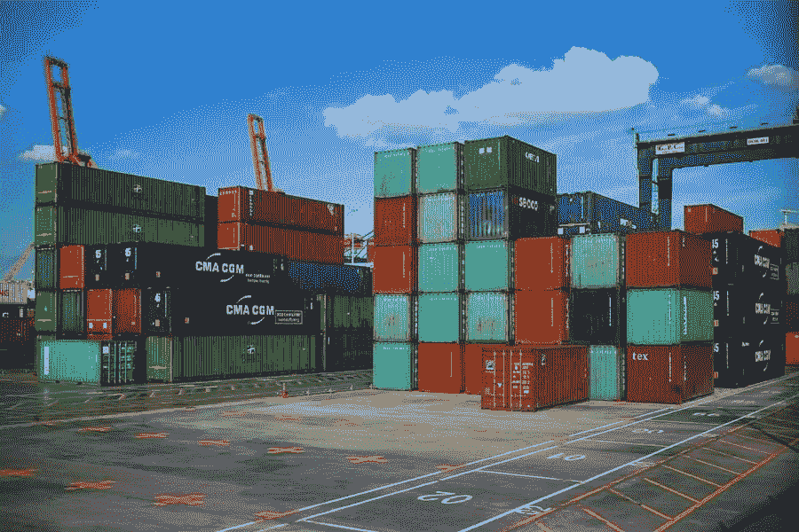

# WooCommerce 运输选项设置教程

> 原文：<https://medium.com/visualmodo/woocommerce-shipping-options-setup-tutorial-fc1237a67bc1?source=collection_archive---------0----------------------->

要在 WooCommerce 中设置运输，您首先要设置运输区域，然后向这些区域添加方法，最后，向您的方法添加费率。您可以创建任意多个区域，并向每个区域添加多种方法和速率。

WooCommerce 有三种主要的运输方式，扩展有助于进一步定制。让我们看一下三个核心运输选项。免费送货:如果您选择免费送货，您可以对任何订单提供免费送货，或者设置“免费送货要求”字段:统一运费:为每个项目、订单或运费分类创建标准运费。稍后，我们将进一步学习航运课程。此外，你可以创建一个免费送货的优惠券。在左边栏的“WooCommerce”下，点击“优惠券”当您创建优惠券时，请选中“允许免运费”框。

我们稍后将介绍如何设置送货区，但当您到达那里时，您需要从“需要免费送货”下拉列表中选择“有效的免费送货优惠券”。本地提货:您可以让客户选择免费提货，而不是送货上门。以下是顾客眼中的结账方式:

# WooCommerce 航运

运输是我们为客户提供的一个非常重要的选择。这是我们的竞争优势，也可能是客户决定购买的决定性因素。我们已经配置了许多东西，但前面还有更多步骤。目前，我们将重点关注 WooCommerce Shipping 选项卡中的设置，您可以通过选择:

当你安装并激活 WooCommerce 插件时，你需要填写几页信息来设置你的账户。其中一页是航运。您可以稍后进行调整和添加扩展，但是现在，您将设置基本的运输区域以及产品重量和尺寸参数。

# 基本装运区设置

在美国和其他地方有两个自动的区域。在美国和“您的其他区域未覆盖的位置”部分，您可以选择统一费率并填写金额，或者选择免运费。另一方面，你可以关闭“设定一个固定价格来支付运费”按钮。如果您更喜欢提供特定运营商的实时费率，您可以添加一些扩展。这一点我们将在下面的另一节中讨论。

# WooCommerce 运输装置重量和尺寸

您还可以在此页面设置如何衡量产品。对于产品重量，您可以选择千克、克、磅或盎司。同样，对于产品尺寸，您可以选择米、厘米、毫米、英寸或码。

# 高级 WooCommerce 运输设置

一旦你完成了 WooCommerce 的初始设置，你就可以进入你的设置(在“WooCommerce”下的左侧栏)来设置运输区域、等级和其他选项。以下是运输区域和运输类别之间的区别:运输区域:具有一组特定运输选项的地理区域。WooCommerce 将根据客户的送货地址向他们展示送货方式。航运类:基于产品类型的航运；适用于按相似性分组的产品。

# 航运区

首先，WooCommerce shipping 只给你两个区域:美国和非美国。但是，您可以在此部分创建美国国内和国外的其他区域。例如，你可以这样做:首先，你住在纽约，所以你可以在纽约州提供免费送货。同样，您允许人们从特定的纽约地点提货。在美国的其他地方，你只需支付 10 美元的统一运费。将包裹寄到澳大利亚，统一运费是 25 美元。最后，在运输区域没有指定的其他地方，统一运费是 15 美元。(这是在“您的其他区域未覆盖的位置”下设置的).

## 统一费率

运输区域可以有自己的统一费率，并且您可以为每个区域创建多个统一费率。要设置统一费率金额，请在您的运输区域下的“运输方式”框中单击“统一费率”，然后填写空白部分。“方法标题”是人们在签出时会看到的内容。纳税状态可以设置为“应纳税”或“无”。整个购物车的运输成本。但是，将该字段留空会禁用统一费率定价。

## 收取额外费用

在“成本”字段中，您可以输入占位符，以便您可以按项目收费，而不是对整个购买应用统一费率。占位符[qty]对购物车中的每个产品收取额外费用。像这样填写“成本”字段:10+(5 *[数量])。这意味着您将收取 10 美元的统一费用，外加购物车中每件商品的 5 美元。

placeholder [fee]根据总额的百分比收取额外的运费。设置一个百分比，然后设置 min_fee 或 max_fee，这意味着费用不能低于或高于特定金额。例如，你的统一运费是 10 美元。在“成本”字段中，您填写 10+[fee percent = " 5 " max _ fee = " 10"。运输将花费您 10 美元的基本费用+购买总费用的 5%*而*不超过 10 美元

# WooCommerce 发运设置分类

如果你的商店有不同重量的商品，并且你的顾客通常一次只买一件商品，那么创建 [WooCommerce](https://visualmodo.com/why-use-woocommerce/) 运输类会很有帮助。比如说。您还可以使用运输分类为某些产品提供不同类型的运输。例如，你可以创建免费运输，定期运输和紧急运输类。这里是你如何填写每个费用:免费送货:0 *[数量]。常规运输:5 * [qty]收取每个项目 5 美元的常规费用。加急运输:10 *[数量]收取每件商品 10 美元的加急运费。

要设置每个运输等级的统一费用，您必须返回到您的运输区域。点击“统一费率”，然后设置每个类别的运费。(为了使整个流程更顺畅，在设置运输区域之前，先设置您的运输等级*。)有两个“计算类型”选项:按类:运费类决定运费。每个订单:订单中最贵的项目决定了成本。如果您使用每类计算类型，您需要填写“无运输类成本”字段。*

# *WooCommerce 运输选项添加产品设置*

*向商店添加产品时，点击“发货”字段，该字段位于主描述框下方的“产品数据”部分。接下来，从下拉菜单中选择正确的运输等级。*

# *WooCommerce 的发货扩展*

*当你在 WordPress 左侧栏选择 WooCommerce 时，你可以点击列表底部的扩展。有一个关于运输扩展的部分，如果你更喜欢根据承运人和位置计算实时运输成本，这是你想去的地方。*

*WooCommerce extensions 将您与世界各地的运营商联系起来，如澳大利亚邮政、联邦快递和皇家邮政。此外，您可以使用扩展来集成库存管理和履行服务，或者提供特殊运输，如买一送一或免费礼品。以下是一些最有用的运输扩展:*

1.  *每个产品的运费:产生不同的、特定于产品的运费；他们将在结账时合并总运费。*
2.  *WooCommerce 距离运费:根据距离或旅行时间计算运费。*
3.  *订单交付:让顾客在结账时选择交付日期和时间。*
4.  *本地提货服务:选择一个提货日期，让客户从预先确定的地点提货。*
5.  *WooCommerce 高级运输包:将购物车分成不同的包，每个包都有自己的运输配置。*
6.  *运送多个地址:将一份订单中的不同项目运送到多个地址。*
7.  *邮政编码/地址验证:让顾客在结账时查找或验证他们的地址。*
8.  *WooCommerce 打印发票和装箱单:为订单生成发票、装箱单和装箱单。*
9.  *WooCommerce Shipping:以尽可能低的 USPS 费率打印 WooCommerce 仪表板上的标签。(还有一个 Stamps.com 扩展，可以让你打印美国邮政运输标签。)*
10.  *发货跟踪:给订单添加发货跟踪信息。*