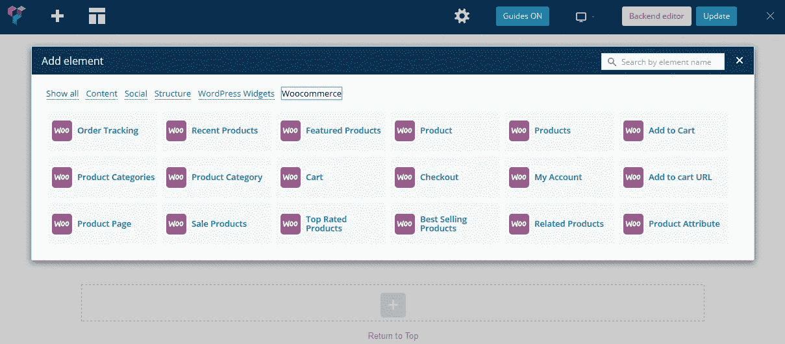

# WooCommerce 短码使用指南

> 原文：<https://medium.com/visualmodo/woocommerce-shortcodes-usage-guide-5db0bb4a8de4?source=collection_archive---------0----------------------->

WooCommerce WordPress 插件附带了几个短代码，可以用来在文章和页面中插入内容。点击这里查看 WooCommerce 短代码列表。

WooCommerce 是 WordPress 的一个广泛使用的免费电子商务/商店插件。它带有各种短代码，可用于定制您的在线商店，如界面、结帐功能、产品列表等。在这篇文章中，我列出了所有 WooCommerce 短代码及其用法的完整列表，以便新用户/高级用户可以从 WooCommerce 中充分受益。

# 网页的 WooCommerce 短码


当你第一次安装 WordPress 时，它会自动创建 4 个页面来运行你的商店——商店、购物车、结账和我的账户。这些页面包含了 WooCommerce 核心的短代码[。因此，如果 WooCommerce 由于某种原因无法创建页面，或者你不小心删除了它，你可以用正确的短代码重新创建它，并在设置中指定。](https://docs.woocommerce.com/document/woocommerce-shortcodes/?aff=2057)

# 商店

商店页面就是你的商店页面。它展示了你所有的 [WooCommerce](https://visualmodo.com/) 产品和礼物给你的访客。目前，还没有自定义该页面内容的简码。WooCommerce 可以自动检测商店页面何时加载，并相应地列出您的产品。

请在 WooCommerce 短代码的前后添加“[”和“]”字符以使其有效。

# 手推车

WooCommerce 为其购物车功能创建了一个购物车页面。这是购物车简码:

```
woocommerce_cart
```

购物车短代码不接受任何附加参数/自变量。它显示了购物车的内容，如项目细节，优惠券代码，运输，税收等。

# 检验

结帐页面为您的客户提供结帐功能。这是结帐页面的 WooCommerce 短代码:

```
woocommerce_checkout
```

checkout 短代码不接受任何额外的参数/自变量。它显示了所有的信息，将收集从用户在结帐时，如帐单信息，运输信息，付款方式等。

# 我的账户

“我的帐户”页面向登录的客户显示一个控制面板。这是我的帐户页面的 WooCommerce 简称:

```
woocommerce_my_account
```

客户可以从“我的帐户”页面查看他们过去的订单、下载和更新他们的个人详细信息，如账单信息、送货信息和帐户密码。

# 订单跟踪表单

默认情况下，不会自动创建订单跟踪表单页面。这是一个可选页面，您可以手动创建该页面以让客户检查订单状态。这是订单跟踪表单页面的 WooCommerce 简称:

```
woocommerce_order_tracking
```

为了查看订单状态，客户需要在订单跟踪表单中输入他们的订单详细信息。

# 更多 WooCommerce 短代码



有一些 WooCommerce 短代码，你可以在任何地方使用。

# 最近的产品

您可以使用这个 WooCommerce 短代码来列出一组最近的产品。

```
recent_products per_page="12" columns="4"
```

您可以使用“per_page”属性确定在页面上显示多少产品。“columns”属性可用于控制包装前产品的列宽。

# 主推产品

您可以使用这个 WooCommerce 短代码来显示已经在 WooCommerce 中设置为“特色”的[产品](https://visualmodo.com/)。

```
featured_products per_page="12" columns="4"
```

# 产品

这个 WooCommerce 短代码允许你通过 ID 或 SKU 显示一个产品。

```
[product id="99"[product sku="FOO"
```

为了找到一个产品的 ID，您可以将鼠标悬停在 WooCommerce 产品菜单中的特定产品上。

# 制品

这个 WooCommerce 短代码允许你通过 ID 或 SKU 显示多个产品。

```
products ids="1, 2, 3, 4, 5"products skus="foo, bar, baz"
```

# 加入购物车

这个 WooCommerce shortcode 显示价格，并按 ID 添加到单个产品的购物车按钮。

```
add_to_cart id="99"
```

# 添加到购物车 URL

这个 WooCommerce shortcode 通过 ID 在单个产品的 add to cart 按钮上打印 URL。

```
add_to_cart_url id="99"
```

# 积范畴

这个 WooCommerce [短代码](https://visualmodo.com/)通过 slug 展示了一个类别的多个产品。

```
product_category category="appliances"
```

你可以在**woo commerce>Products>Categories**下找到特定类别的 slug。

# 产品类别

这个 WooCommerce 短代码可以在一个循环中显示多个产品类别。

```
product_categories number="12" ids="2, 6, 7, 10"
```

您可以使用 number 参数来显示产品的数量，并使用 ids 字段(包含以逗号分隔的类别 id 列表)来选择要显示的类别。

还有一个父参数，您可以将其设置为 0，以便只显示顶级类别。

```
product_categories number="12" parent="0"
```

为了找到一个类别的 ID，请转到产品类别屏幕并将鼠标悬停在该类别上。该 ID 出现在 URL 中。

# 产品页面

这个 WooCommerce 短代码通过 ID 或 SKU 显示 WooCommerce 产品的完整产品页面。

```
product_page id="99"product_page sku="FOO"
```

# 销售产品

这个 WooCommerce 短码展示了你所有在售的产品。

```
sale_products per_page="12" columns="4"
```

# 畅销产品

这个 WooCommerce 短代码展示了你所有的畅销产品。

```
best_selling_products per_page="12" columns="4"
```

# 相关产品

这个 WooCommerce 短代码列出了你所有的相关产品。

```
related_products per_page="12" columns="4"
```

# 顶级产品

这个 WooCommerce 短代码展示了你所有的顶级产品。

```
top_rated_products per_page="12" columns="4"
```

# 产品属性

这个 WooCommerce 短代码按属性列出了产品。

```
product_attribute attribute="color" filter="black"
```

# 产品分类

您可以使用“orderby”或“order”参数对只显示多个产品或一个类别的多个产品的短代码进行排序。“orderby”参数可以接受这些[值](https://visualmodo.com/)中的一个:

*   菜单 _ 订单
*   标题
*   日期
*   边缘
*   身份证明（identification）

“订单”参数可以接受以下值之一:

*   （同 AmericanSecurityCouncil）美国安全委员会
*   desc

例如，此短代码将按日期降序对 3 种产品(SKUs foo、bar 和 baz)进行排序:

```
products skus="foo, bar, baz" orderby="date" order="desc"
```

*披露:我从我审查产品的公司获得报酬。但是，我推荐我个人使用的产品，这里表达的观点是我自己的*