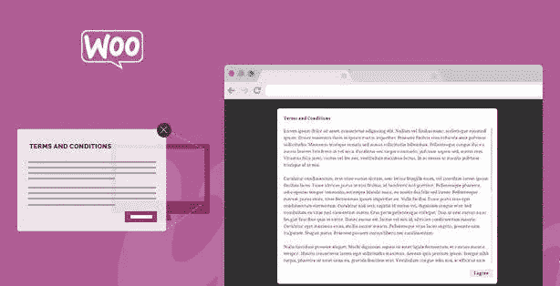
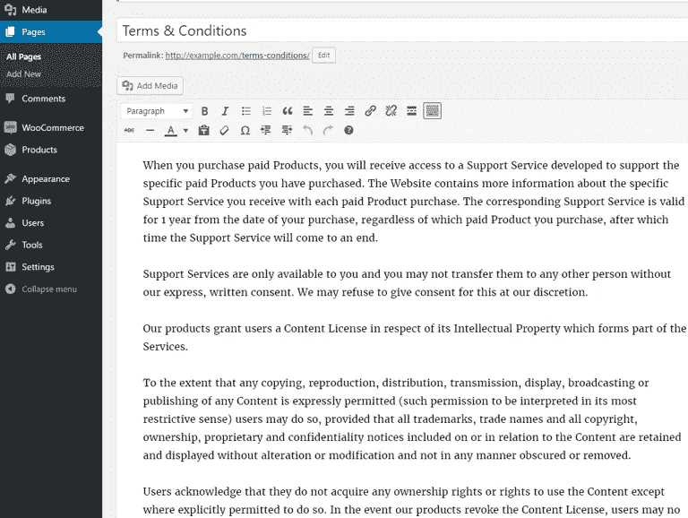
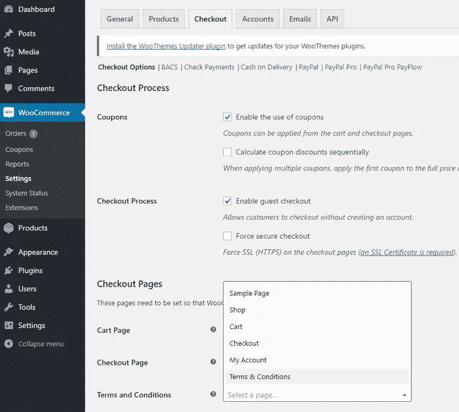
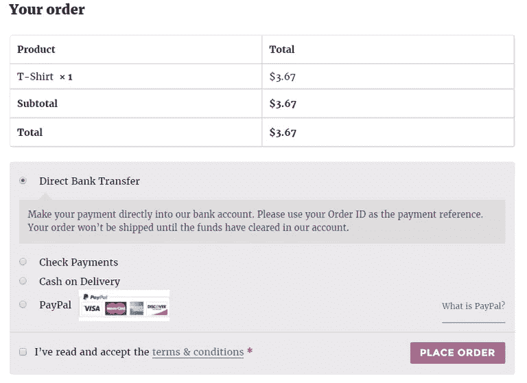

# WooCommerce 条款和条件

> 原文：<https://medium.com/visualmodo/woocommerce-terms-conditions-ae51018c215f?source=collection_archive---------0----------------------->

在这篇文章中，你可以看到如何在你的网上商店的结账页面上添加 WooCommerce 的条款和条件，而不需要编码或者使用额外的插件。

当你在网上销售时，拥有一个条款和条件页面是非常重要的。它可以保护您的企业免受各种问题的影响，如法律纠纷、不匹配的期望，以及帮助您遵守法律和执行客户协议。在这篇文章中，我将向你展示如何向你的 [WooCommerce](https://woocommerce.com/?aff=2057) checkout 页面添加条款和条件，这样用户在购买你的产品之前需要同意这些条款。

# 如何添加 WooCommerce 条款和条件

1)从您的[仪表盘创建一个新的条款和条件页面。](https://visualmodo.com/)

2)进入“WooCommerce >设置>结账>结账页面”并选择您的条款和条件页面。

保存您的设置。

3)现在，当用户进入结账页面时，他们必须同意条款和条件。他们可以通过单击链接来阅读，然后链接会将他们带到您预先配置的条款和条件页面。

你也可以使用免费的 WordPress WooCommerce 插件在你的商店上添加一个弹出式自定义功能，以另一种方式显示它，为此请在这里下载这个工具。woo commerce check out Terms Conditions Popup 为不想去任何地方阅读条款和条件的用户节省了时间和注意力。在这个插件中，用户可以自定义弹出窗口的大小，改变标题，他们可以按自己的意愿制作约定的按钮。在管理面板中有许多选项。用户可以在其中配置插件外观

如果你有一些问题或经验，请在下面的评论区告诉我们。