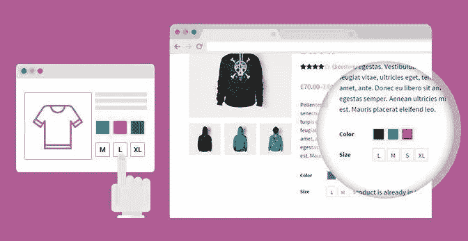
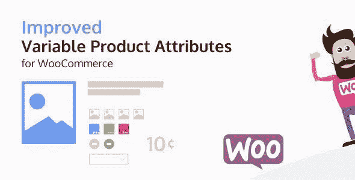

# 产品的 WooCommerce 变体插件

> 原文：<https://medium.com/visualmodo/woocommerce-variations-plugins-for-products-bee6127967b8?source=collection_archive---------0----------------------->

为产品提供一套 WooCommerce 变体，控制每个变体的尺寸、颜色、库存、图像等。

你可能使用过一些好的 WooCommerce 主题，甚至插件，那么你一定明白让你的用户在无尽的产品列表中滚动，只是为了找到他们需要的东西。

假设你有一个网上商店，在那里你出售各种各样的小饰品和小摆设。也许你有一个奇妙的手套收藏，并想开始出售它们。所以你已经有了一些在商店里生产的产品，事情进展顺利。

你碰到一双和你已经做好的手套一模一样的手套，唯一的区别是颜色。那么，设置新产品的最佳方式是什么呢？如果你以不同的尺寸出售同样的商品呢？在本文中，我们将了解产品的变化以及这些变化如何有所帮助！

我在使用 WooCommerce 时亲眼目睹的一个问题是在产品中创建 WooCommerce 变体，并以时尚的方式向我的客户展示它们。

幸运的是，在 WordPress 和 WooCommerce 的帮助下，你可以为你的产品添加 WooCommerce 变体属性，以帮助你的用户更有效地获得它们。例如，您可以添加鞋号作为您商店出售的鞋子的变量。因此，每当用户来你的网站买鞋时，他们可以选择他们的鞋码，只需要在合适的鞋码中进行选择。

现在，这是一个非常方便的功能，但 WooCommerce 的默认功能相当枯燥和不实用。因此，为了提高用户参与度，这里有十个插件可以提高 WooCommerce 变体的功能:

# WooCommerce 变体插件

# YITH WooCommerce 颜色和标签变化

[下载链接](https://wpdean.com/go/yith-woocommerce-color/)

YITH WooCommerce 插件可以用来改变不同的产品属性，包括图标，自定义图片，甚至动态标签。这与你在上面看到的所有选项都不一样。因此，有了这个插件，你可以得到一点偏心以及开箱即用的产品变化样式。如果做得好，这本身就能帮助你树立品牌。

还有一点需要注意的是，这个插件非常通用，可以用于任何产品。从服装到珠宝，你可以放心，无论你的在线销售业务，该插件将成为一个有价值的资产。

# 伍斯奇

[下载链接](https://wpdean.com/go/wooswatches-woocommerce/)

WooSwatches 可以帮助你将单调的产品属性转化为好看的、色彩满足的和高度互动的东西。这是 Codecanyon 中销量第一的样本插件。除了改进变量属性表示，该插件还可以通过产品编辑页面覆盖全局值来帮助配置全局值。还有另一个功能，允许用户在商店页面上显示属性样本，并在悬停时更改产品图像。

总的来说，如果你正在寻找一些基本的东西，但可以帮助你把不同属性的可变产品的视觉吸引力水平，那么这是你会找到的最好的。此外，你还将获得顶级的支持，所以如果你有任何关于插件的问题，你可以放心

# JC WooCommerce 高级产品属性

[下载链接](https://wpdean.com/go/jc-woocommerce/)

JC WooCommerce 高级产品属性，与前面的条目非常相似，有助于用图像、文本和颜色样本替换普通的可变产品下拉菜单。但是这个有一些额外的功能。例如，您可以选择为其中一个属性选择图像缩略图。

此外，所有属性样式都可以轻松定制。这个插件的另一个新增功能是属性组功能，它有助于产品管理过程。这也将证明对用户来说是非常令人愉快的。但是，与上一个不同，您将不会获得高级支持。因此，如果你对此没有意见，并想做出牺牲以获得更好的产品管理工具，那么毫不犹豫地选择这一个

# WooCommerce 属性样本

[下载链接](https://wpdean.com/go/woocommerce-attribute/)

WooCommerce 属性样本可以帮助你使你的可变产品属性变得有用，设计良好和视觉上自信。它确实是这个列表中的顶级作品，也是最昂贵的作品之一。你将为这个插件支付大约 49 美元，你将获得惊人的功能，如颜色样本，图像样本，文本样本，单选按钮，样本工具提示，全球产品样本，以及更多。

你还可以选择使用漂亮的前端和后端交互体验。此外，还有一个世界级的客户支持台，随时准备在您需要时为您提供帮助。总的来说，如果你对运营一个高产的在线商店非常认真，那么这个插件是你最好的选择。
下载

# 改进了 WooCommerce 的可变产品属性

[下载链接](https://wpdean.com/go/improved-variable-product/)

虽然是这个列表的最后一个，这个插件可以被认为是你可以选择来丰富你的 WooCommerce 变化的最好的插件之一。它最重要的功能之一是防止用户选择产品不可用的属性组合。因此，它确保用户永远不会在你的网站上再次遇到“缺货”的屏幕。这可以在心理层面上发挥作用，帮助你的网站在用户中获得更好的声誉。

除此之外，这个插件还拥有所有上面提到的插件的所有常见功能。但是除此之外，您还将获得一个优秀的用户界面、属性术语定制、产品档案选择器以及更多功能。

# woo 组合器

[下载链接](https://wpdean.com/go/woocombinator-for-variable-products/)

本质上，WooCombinator 有一个基本的功能，就是把你在各种产品上无聊的选择元素变成吸引人的按钮。您将有多达七种预定义的样式可供选择，或者您可以随时选择添加您的 CSS 样式。

在这方面，WooCombinator 是独一无二的，它可以帮助你把“你”的东西带进你的电子商店。除此之外，该插件的一些值得注意的特性包括对[定制器、元素和状态的 CSS 类以及一些缩小的 CSS 和 JS 文件的支持。这里需要注意的另一件事是，插件只是改变了产品变量属性的显示逻辑。它不会或不能随控制逻辑而改变，因此对于新手来说是安全的，因为没有出错的余地。](https://visualmodo.com/wordpress-themes/)

# 打开样本

[下载链接](https://wpdean.com/go/openswatch-woocommerce/)

Openswatch 是另一个功能丰富的 WordPress 插件，用于改变产品变化和加载更多内容。总的来说，它对任何运行 WooCommerce 网站的用户都非常有用。以下是它的一些特性，包括为产品变化属性更改或添加样本图像的基本功能。

有了这个插件，你可以选择添加 filer follow 属性，价格过滤器，启用和禁用样本颜色以及预选。所有这些都可以轻松扩展和控制。总的来说，这是一个很好的插件，它可以给你一些额外的功能，而不仅仅是为产品变化添加颜色和文字。

# WooCommerce 视觉属性和选项样本

[下载链接](https://wpdean.com/go/woocommerce-visual-attributes/)

对于这个插件，名字说明了一切。有了视觉特征，就像上面所有的插件一样，你将能够无缝地将枯燥乏味的产品变化属性变成更具美感的东西。至于美学吸引力，插件确实给了你一些选项，比如使用标签、单选按钮、颜色、图片等等。

它的一些主要功能包括基于图片的样本，与 WooCommerce 的本机集成，配置批量定义的能力，超过 14 个包含的皮肤，以及一个高级皮肤编辑器，用于手动控制创建您的在线商店的完美外观。

总而言之，你将获得更多的定制自由和过多的选择，让你的商店如你所愿地真实反映你的品牌。

# WooCommerce 变化大师

[下载链接](https://wpdean.com/go/woocommerce-variation-master/)

WooCommerce Variation Master 本质上是 WooCommerce 的 make web better 插件的扩展。这为 WooCommerce 产品变体提供了极其丰富的定制级别。例如，它允许管理员添加多个画廊图像以及使用颜色和图像样本。总的来说，这个插件为管理员提供了很好的控制来创建一个吸引人的商店。

以下是该插件的一些显著特性。其中最令人印象深刻和创新的是允许客户在购物车页面上更新他们的变化。此外，还有批量添加颜色和样本以及[图像](https://visualmodo.com/how-to-find-the-best-images-online/)的功能。

# WooCommerce 的变化样本

[下载链接](https://wordpress.org/plugins/variation-swatches-for-woocommerce/)

如前所述，WooCommerce 的变化样本是一个非常有用的插件，可以帮助定制产品的变化属性，使其比默认的平淡风格更有吸引力。

你将从插件中获得的一些特性包括与 WooCommerce 的完全集成。这确保了不会有任何兼容性问题。除此之外，你还可以选择创建颜色样本、图像样本、标签和文本样本、全局属性管理等属性。

现在，这个插件是一个免费的解决方案，可以帮助你解决产品变化的需求。因此，这是一个伟大的方式来尝试这些功能。但是为了更多的溢价和更好的性能，特别是如果你是认真对待你的电子商店，最好是你尝试一些付费的替代品，就像下面的那些。

# 结论

所以这些是一些顶级的 WordPress WooCommerce 插件，用于改进产品的多样性。现在，如果你最喜欢的插件在这方面被忽略了，请在评论区随意引用它们。这将扩大阅读的范围，也为你的读者朋友提供更多的选择。