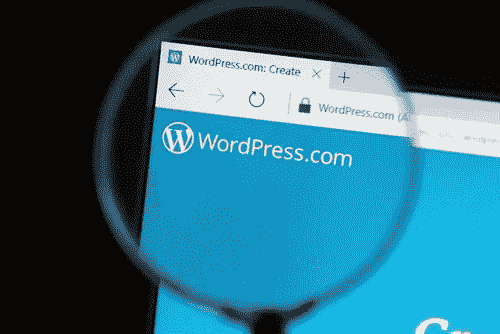

# 迪拜 WordPress 和网页设计

> 原文：<https://medium.com/visualmodo/wordpress-and-web-design-dubai-2be38e195a80?source=collection_archive---------1----------------------->

如何在网上吸引当地观众

WordPress 是一个易于使用的平台，有很多功能可以让一个网站实现其全部潜力。网站主要是用来做生意的，WordPress 可以帮助你做好你的生意所需的一切。它提供了一个独特的自定义域名，所以你不必满足于标准域名。至关重要的是，你的网站是专业设计的，这样你才能吸引你的目标市场并获得可观的收入。采取以下 WordPress 和网页设计迪拜的技巧来成功吸引当地观众。

# 迪拜网页设计

# 了解阿联酋客户

首先要做的是了解你的目标市场。阿联酋人民有以下特点:

*   a 以家庭为导向，所以他们倾向于购买全家都能受益的东西。
*   他们不太喜欢在交易中冒险。
*   避免任何会造成冲突或威胁的事情。
*   他们的决定主要受其宗教信仰的影响，作为一个伊斯兰国家，重大决定由男性做出，任何与家庭有关的事情都由女性做出。

了解阿联酋文化将有助于在这个国家经营你的业务，因为你可以定制你的营销，以适应他们的需求和倾向。

**创建适合阿联酋客户的网站设计**

创建一个迪拜居民会欣赏的网页设计将是你在迪拜生意中最重要的部分。虽然迪拜是一个非常现代化的国家，但数字营销和网上购物还没有得到广泛的光顾。他们非常不愿意从国外在线购买，所以这将是一个很大的挑战。大多数人仍然在商店购物，而不是在网上。

如果你想在迪拜的在线行业大展拳脚，你必须想出有创意的点子，让他们有兴趣看你的网站，并鼓励他们在网上购物。你可以这样做:

*   你的网站设计不要太浮华，太奢侈。
*   应该是保守一点，非常值得信赖。
*   你应该聘请一家[网站设计公司迪拜](https://www.react-digital.com/what-we-do/web-design/)会接受；换句话说，雇佣一个了解阿联酋人民需求和偏好的本地网页设计师。

# 使用社交媒体

还有什么比社交媒体更好的途径呢？社交媒体是迪拜人已经接受的东西，因为他们对提供双向沟通的平台更加开放——他们希望在提出询问时收到即时回应。您可以通过以下方式吸引观众的注意力:

*   使用正确的主题。与你的网站设计者合作，想出最适合你的产品和目标市场的网站。
*   创建一个脸书账户，因为大多数迪拜人使用脸书超过任何其他社交媒体平台。建立一个吸引人的脸书网页，在那里你可以欢迎你的潜在客户。创建关于你的产品或服务的帖子，并注入你的网站的 URL 来引导你的客户到你的 WordPress 站点。

# 使用本地搜索引擎优化

[SEO](https://en.wikipedia.org/wiki/Search_engine_optimization) ，或称搜索引擎优化，旨在让你的网站在搜索引擎结果中名列前茅，这样人们就能轻松找到你。如果你的网站在网上的可见性更高，你就会获得更多的网站流量，而流量就是你需要让人们知道你的业务的东西。以下是如何在你的网站上实现 SEO 的方法:

*   使用本地人会使用的关键字来使你的网站可见。互联网已经成为迪拜近一半人口的重要组成部分，谷歌是他们搜索任何东西的主要工具。
*   发布包含相关内容的博客。迪拜的人们仍然非常喜欢阅读文章，所以这是你可以花大部分时间的地方。尽额外的努力让你的内容更吸引人，更有信息量——你的读者每次阅读你的文章时都应该有收获。这是建立客户忠诚度和品牌可信度的一种方式。

迪拜的人口构成非常多样化。有些是非常过时和保守的，有些是不可思议的现代。很好地理解他们的文化和他们如何进行数字营销将会帮助你使你的 WordPress 网站吸引你在迪拜的当地[市场](https://visualmodo.com/blog/)。