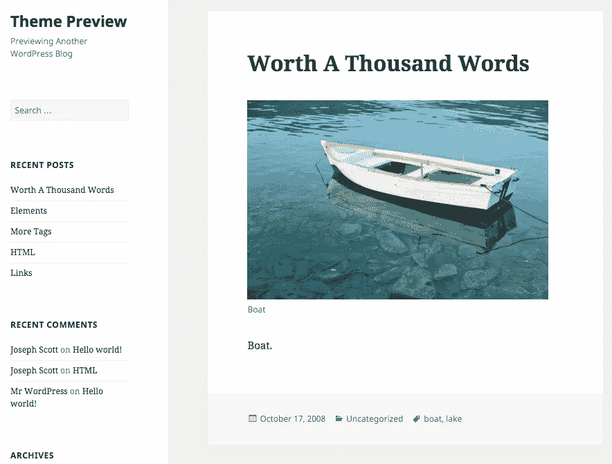
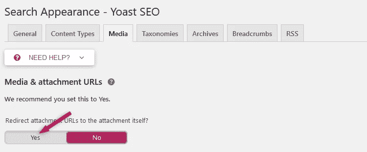

# WordPress 附件页面禁用指南

> 原文：<https://medium.com/visualmodo/wordpress-attachments-page-disable-guide-ace7cc4554ea?source=collection_archive---------0----------------------->

默认情况下，WordPress 为你网站上的每个附件创建一个单独的页面。这包括图像、音频/视频文件、pdf 等。这个功能对摄影师来说很棒，但对我们其他人来说就没那么好了。现在看看如何禁用 WordPress 中的附件页面。

坏消息是，这个页面将默认发布，这意味着它可以被普通公众访问。您不需要将媒体文件附加到帖子或页面上就可以看到它。

有时候，你网站上的图片会变得很受欢迎，人们可能会直接从谷歌登陆到附件页面。理想情况下，你会希望他们在你的帖子上看到你使用过的图片。在这篇文章中，我们将向你展示如何在 [WordPress](https://visualmodo.com/wordpress-themes/) 中禁用图片附件页面。

你们中的大多数人都希望防止这种情况发生，要么是因为你有一个不想被任何人访问的媒体文件，要么是因为附件页面看起来很糟糕，因为主题开发人员没有注意到它。我觉得这看起来很奇怪，不是吗？只有文件，它的标题，你的边栏，评论区，因此，在这篇文章中，我将向你展示如何用这两个插件中的一个禁用 [WordPress](https://visualmodo.com/blog/) 中的附件页面。

# WordPress 附件页面禁用指南

# Yoast SEO 插件

对于那些正在使用 [Yoast SEO](https://wordpress.org/plugins/wordpress-seo/) 插件的人，你们所有人都应该使用它，因为它会让你的生活变得更加容易，不仅仅是为了 SEO；这是一个必备的插件——你只需要激活一个选项。

*   进入**SEO**->搜索外观；
*   选择**介质**标签；
*   选择**将附件 URL 重定向到附件本身下的**是**选项。**；
*   点击**保存更改**按钮。

7.0 之前的版本会将附件页面重定向到父帖子。

从 Yoast 7.0 开始，它会将附件页面重定向到媒体文件本身，这样就好多了。

# 附件页面重定向插件

如果你还没有安装 Yoast，也不想安装它，尤其是对于一个特性，那么安装[附件页面重定向](https://wordpress.org/plugins/attachment-pages-redirect/)，它会处理这个问题。

一旦激活，它将执行 301 重定向(永久重定向),从附件页面到父帖子，如果媒体文件附加在那里。如果没有附加，那么它会执行 302 重定向(临时重定向)到你的主页。

该插件没有任何设置。你只需要激活它，就是这样。

# 最后的话

希望这篇文章对你有用，对你有帮助！别忘了分享给你的朋友们！如果您有任何问题或想法，请发表评论，[联系](https://visualmodo.com/)我们或在脸书上给我们发消息。