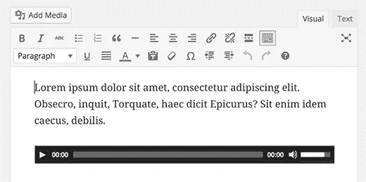
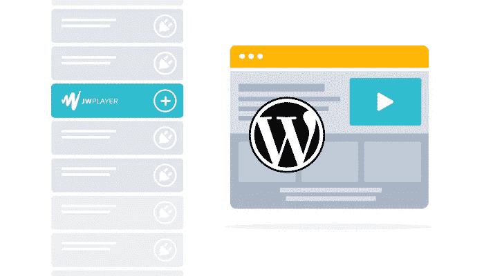

# WordPress 音频上传指南

> 原文：<https://medium.com/visualmodo/wordpress-audio-upload-guide-a7bd09ca5425?source=collection_archive---------0----------------------->

您想将 WordPress 音频文件添加到您的 WordPress 站点吗？作为一个内容管理系统，WordPress 能够处理音频文件，现在看看如何用一种简单的方法上传你的音轨。

WordPress 提供了给你的文章添加不同类型的媒体的能力。音频文件是庆祝书写文字的媒体中不太为人所知/使用的特征。然而，有时候你的网站需要添加音频，你可以通过 WordPress 提供的内置[功能](https://visualmodo.com/)轻松做到。这是你去:—

# WordPress 音频上传指南

[caption id = " attachment _ 72650 " align = " align center " width = " 520 "]

WordPress 音频上传指南[/caption]

如果您想要将音频文件添加到帖子或页面，您可以从帖子/页面编辑器中执行此操作。

#1.当你输入文章的文本内容时，在你想显示音频播放器的地方，点击**添加媒体**按钮。

#2.如果您已经上传了音频文件，请从**媒体库**中选择它。

#3.如果没有，请转到**上传文件**选项卡，尝试上传文件。

#4.音频文件和其他媒体文件通常很大。默认的 PHP 最大上传文件大小是 2M。因此，您可能会遇到此错误，即您选择的文件超过了最大上传文件大小。

#5.在这种情况下，转到 php.ini 文件并查找这一行:

`upload_max_filesize = 2M`

把它改成

`upload_max_filesize = 64M`

#6.重新启动 apache 服务器，然后重试上传文件。您应该会在**上传文件**屏幕上看到新的大小。

#7.上传文件，然后插入媒体，你会在文章编辑器中得到一个播放器。

#8.发布的帖子也将有一个类似的播放器，可以用来开始/暂停/停止音频。您也可以调整音频剪辑的音量。这是 WordPress 自带的默认音频播放器。

# 音频短代码:

[caption id = " attachment _ 72651 " align = " align center " width = " 520 "]

WordPress 音频上传指南[/caption]

除了使用**添加媒体**按钮，您还可以使用音频[短代码](https://wordpress.org/plugins/tags/audio-player/)来插入音频。点击文章编辑器的文本标签，你可以看到你刚刚上传的剪辑的音频简码。

默认的音频短代码如下所示。将音频源文件作为参数添加到短代码中，如下所示。

音频播放器可以使用各种格式的音频文件。支持的格式有 mp3、Ogg 和 Wav 格式。您可以像这样包括其他支持的音频格式的后备。

是否要循环连续播放音频剪辑？用循环参数来做。默认情况下，回路设置为“**关**”。在上设置为**；**

当访问者到达某个页面时，是否要开始自动播放剪辑？您可以使用自动播放参数来实现。

默认为假或 **0** 。将其设置为 true 或 **1** 。

有些网站会在访问者访问网站时自动在后台循环播放剪辑。除了一些额外的 CSS 之外，这可以通过设置了循环和自动播放的音频短码来实现，即，通过为音频播放器设置“**可见性:隐藏**”。

然而，在做这样的事情时要谨慎。[还要考虑](https://visualmodo.com/)用户体验。不想听一些背景音乐的用户没有任何选择，只能继续听剪辑。这可能会让你的访客敬而远之。

# 添加播放列表

有时，在音乐网站或音频网站中，需要显示播放列表，而不是单个音频文件。

在 WordPress 中也可以很容易地创建播放列表。遵循下面的说明。

#1.在帖子/页面编辑器中，点击**添加媒体**。现在，点击**创建音频**播放列表。

#2.出现**创建音频播放列表**屏幕。您可以添加所需的(已经上传的音频文件或者您可以从**上传文件**选项卡上传)音频文件，然后点击创建新播放列表按钮。

#3.文件被包括在内，并出现**编辑音频播放列表**页面，您可以在其中选择播放列表的设置。您可以选择显示或隐藏曲目列表、艺术家姓名和缩略图[图像](https://visualmodo.com/)。这些也可以使用播放列表短码来完成(在下一节详细描述)。现在，点击**插入音频播放列表**按钮。

#4.您可以保存帖子并查看它。您将看到一个带有缩略图的播放列表、播放列表的详细信息、音频播放器，以及最后一个带有艺术家姓名和持续时间的曲目编号列表。

看看文章编辑器的文本标签，你会看到播放列表的短代码，包括了音轨的 id(或者上传的音频文件)。

# 播放列表简码:

[caption id = " attachment _ 72649 " align = " align center " width = " 700 "]

WordPress 音频上传指南[/caption]

除了使用**添加媒体**按钮创建播放列表，您还可以使用帖子编辑器中的播放列表简码。

基本格式是添加 IDs 参数，并以逗号分隔 id 列表，如上所示。

## 如何找到 WordPress 音频文件的 id？

1.去媒体库过滤掉音频文件。

2.点击音频文件进行编辑。在**编辑媒体**屏幕中，您可以在 URL 顶部看到 id。

3.既然您已经知道了如何使用基本的播放列表短码，那么让我们来看看各种可用的选项。

4.您可以使用 style 参数更改播放列表的样式。将它设置为暗或者让它成为默认灯光。

5.播放列表现在有了深色风格，这在浅色背景下看起来不错。

6.您可以通过设置为假或 **0** 而不是默认的真或 **1** 来选择不显示曲目列表。

7.您将只能看到播放列表的详细信息和音频播放器。

8.您可以更改 id 的顺序来更改曲目在播放列表中的顺序。

9.您也可以将曲目编号参数设置为 false 或 **0** 而不是默认的 true 或 **1** 来分别隐藏或显示曲目编号。

10.看看隐藏了曲目编号的播放列表。

如果您不想在顶部显示缩略图，该怎么办？为此，您可以将 images 参数设置为 false 或 **0** ，而不是默认的 true 或 **1** 。

这是没有缩略图的播放列表。

最后，为什么不删除艺术家的名字呢？

使用艺术家参数，并将其设置为**假**或 **0** ，而不是默认的**真**或 **1** 来分别隐藏或显示艺术家姓名。

这是去掉了艺术家名字的播放列表。

所以，你在这里。在你的网站上使用和显示[音频](https://visualmodo.com/)文件的两种不同方式——单个或列表显示。使用短代码快速简单地添加音频文件。玩弄这些论点或它们的组合，以达到你想要的结果。