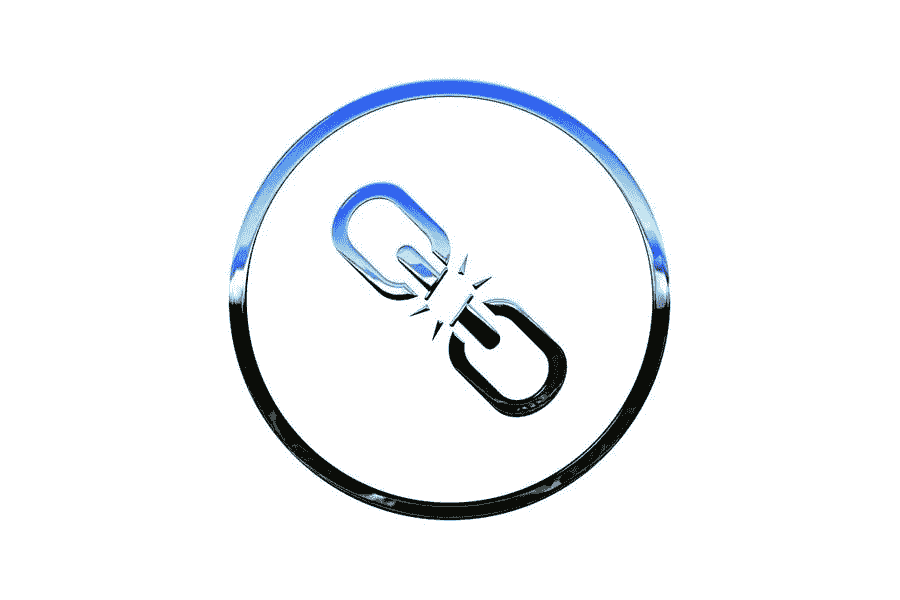

# 断开的链接

> 原文：<https://medium.com/visualmodo/wordpress-broken-links-74ecb5efab3?source=collection_archive---------0----------------------->

## 查找和修复指南

确保内容中的所有链接都正常工作。要做到这一点，你需要一个简单的方法来找到并修复 WordPress 中的坏链接。因为一旦你的网站运行了一段时间，你需要开始进行一些维护工作。其中一项任务是这样的。

断开的链接是网页上可用的链接，由于这样或那样的原因不再有效。可能是所有者删除了链接指向的网页，该网页不再可用。

# 如何在 WordPress 中找到并修复断开的链接

现在你知道什么是坏的网址及其副作用。这里有一个快速的一步一步的手册，你可以用它来找到你的网站中有缺陷的网址，并轻松地修复它们，而不用分别检查每个页面和每个链接。

# 安装断开的链接检查插件

断开链接检查器插件帮助你在你的文章、页面、评论、博客和自定义字段中找到断开的链接或丢失的图片。此外，您可以使用它来阻止搜索引擎跟踪这些线索。所以你的搜索引擎排名不会受到影响，直到你解决了这个问题。

另一个很酷的功能是，你可以直接从插件的页面过滤和编辑链接，而不必手动更新每个帖子。(我们稍后会谈到这一点。).这个插件可以帮助你节省大量的时间，并保存你的排名从哑问题，你没有手在大多数时间。

所以现在，你应该去安装它。它和其他插件一样易于安装:

1.  首先，进入 WordPress 仪表盘>插件>添加新的。
2.  其次，在搜索栏中键入名称“断开的链接检查器”。
3.  最后，点击安装按钮并激活它。

您也可以从插件的链接下载 zip 文件，然后通过 FTP 或在 Add New 页面上传 zip 文件到您的站点。虽然，我觉得第一种方法简单多了。

> 破碎的网址检查器是一个非常耗费资源的插件。所以不要一直运行这个插件。一旦你修复了链接，删除插件。否则，它可能会减慢你的网站速度。断链检查器是由 [ManageWP](https://visualmodo.com/use-wp-db-manager-to-implement-wordpress-database-management/) 团队开发的一个插件，可以帮助你监控你的博客并找到断链。

# 断开的链接查找和修复(WP 工具面板)

一旦你安装了插件，进入工具>断开的链接开始玩这个插件。插件会开始寻找损坏的网址，在这个页面上，你会发现插件检测到的有缺陷的网址。给它一些时间来找到所有坏的网址。

# 仔细讨论

下一步很简单。只需检查每个断开的链接，然后从以下 5 个不同的选项中进行选择:

1.  编辑 URL:用新链接直接编辑 URL。
2.  取消链接:删除链接，保留文本不变。
3.  没有坏:当你检查它没有坏，并决定保留它。
4.  解散:解散编辑它。
5.  重新检查:如果你想让插件在链接再次工作后重新检查链接，等等。

最后，一旦你完成了列表，你就完成了。然后直接删除插件。7-8 个月后再次安装，并再次检查断开的链接。