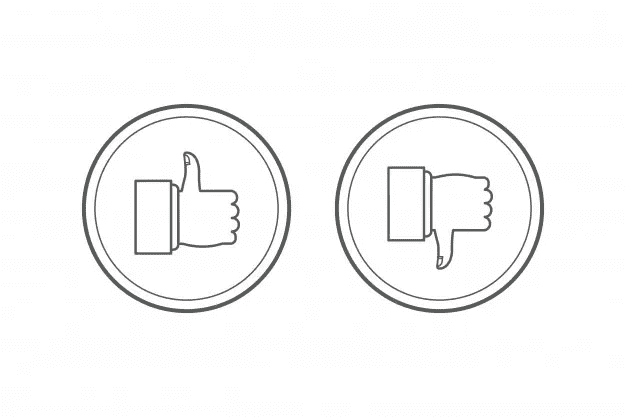

# 喜欢和不喜欢插件的评论

> 原文：<https://medium.com/visualmodo/wordpress-comments-like-dislike-plugins-2b71801d3759?source=collection_archive---------0----------------------->

你想在你的 [WordPress](https://visualmodo.com/) 站点讨论中添加喜欢或不喜欢的评论吗？允许你的用户投赞成票/反对票可以提高你网站的参与度。在这篇文章中，我们将向你展示如何允许用户喜欢或不喜欢 WordPress 中的评论。

如果你使用 WordPress，那么你的网站不会有内置的喜欢和不喜欢功能的评论，但是在一些很棒的插件的帮助下，它很容易安装。事实上，网上有一些，这样你就不会在选择中迷失。许多插件要么价格过高，要么代码笨拙。猜猜看，简单的东西最容易被忽视。不管怎样，我们已经为你提供了一些最佳选择来帮助你。

# 喜欢或不喜欢的评论

# WP ULike

如果你不想要太简单的东西，但又不愿意花太多钱，WP [ULike](https://wordpress.org/plugins/wp-ulike/) 就找到了最佳选择。它完全免费，为你提供完整的解决方案来处理你喜欢和不喜欢的 WordPress、BuddyPress 甚至 bbPress 等功能。

你甚至可以在帖子、页面、论坛帖子中添加功能，而不仅仅局限于评论区。你还可以看到你网站上所有好恶活动的详细日志和分析报告

如果你想喜欢或不喜欢迎合你所有网站的功能，而不仅仅局限于评论区，那么这是一个理想的选择。最棒的是，它是免费的。

现在所有这些都只是一些插件的名字，你可以用它们在你的网站上添加喜欢和不喜欢的功能，但是你如何在本质上整合服务呢？

# 喜欢按钮评级

如果你不喜欢前一个选项，想要一些沉重的东西，那么这是你最好的选择。[喜欢按钮评级](https://wordpress.org/plugins/likebtn-like-button/)为你喜欢和不喜欢的按钮提供超过 25 种不同的风格，以及经典的脸书设计和许多折衷的选择。如果你在《脸书》上发布文章，并带有网站的反向链接，那么你的读者会欣赏这种环境的相似性(至少是喜欢和不喜欢)。

该插件与 WordPress、bbPress 和 WooCommerce 完全兼容，所以你可以放心，你的网站将成为一个用户参与的平台。如果你喜欢的话，你也可以用 CSS 自由调整按钮样式。

以下是该插件提供的一些令人印象深刻的特性:

总的来说，如果你对喜欢和不喜欢的功能非常认真，并认为这对你的网站模型至关重要，那么这是一个非常好的插件，可以帮助你。

# 评论喜欢不喜欢

[评论喜欢不喜欢](https://wordpress.org/plugins/comments-like-dislike/)是 WordPress 用户的免费插件，帮助他们启用 WordPress 本地评论的喜欢和不喜欢按钮，它还显示喜欢和不喜欢的计数。

这个插件非常简单轻便，可以非常高效地完成工作。它带有一个简单的开关来打开和关闭功能，以及一些更多的定制选项。你可以调整颜色，防止垃圾投票，并在一些预建的模板之间进行切换。不同的模板包括拇指向上和拇指向下按钮，或笑脸和皱眉，正确或错误的图标。如果你愿意，你也可以上传你的自定义图标。

现在，这是你能得到的最好的插件，如果你需要一个简单和没有麻烦的方法来处理这个问题。

# 设置

如前所述,“不喜欢”这样的注释是列表中最容易使用的插件之一，为了便于讨论，我们将使用它。

安装过程和任何其他 WordPress 插件一样简单。安装完成后，你会想去插件标签，然后前往设置选项。

现在只需配置[按钮](https://visualmodo.com/blog/)的位置、启用状态、选择订单、启用限制等。您还可以防止垃圾邮件，并让您控制允许重复喜欢或不喜欢基于 cookies 或 IP 地址。

然后，您可以使用配置页面顶部栏中的设计设置选项卡进行调整。选择模板，上传自定义图标，选择按钮的颜色，以及更多可以在这个屏幕上处理的事情。

# 利益

现在你可能会想，如果喜欢和不喜欢的功能如此之好，那么反应风格的功能将会对你网站的整体参与度产生奇迹。嗯，事实并非如此，一个简单的喜欢和不喜欢的特点是简单易懂，直观，不会吓到门外汉。

此外，基于喜欢和不喜欢的反应提供了更好的统计理解，而不是用过多的表情符号使其复杂化。

一旦人们觉得反应很容易(说真的，现在人们认为点击是工作)，那么你的网站就会得到更多的参与，这将导致更多的评论和更多的参与，最终为你的 [SEO](https://visualmodo.com/wordpress-membership/) 创造奇迹。

# 最后的话

正如你现在所理解的，在你的评论区设置一个喜欢不喜欢的功能很容易，但它会产生巨大的影响。使用插件将新的特性和功能整合到 WordPress 中是它最强的优势之一。

这三个插件是市场上最好的，将帮助你提高网站的整体参与度。