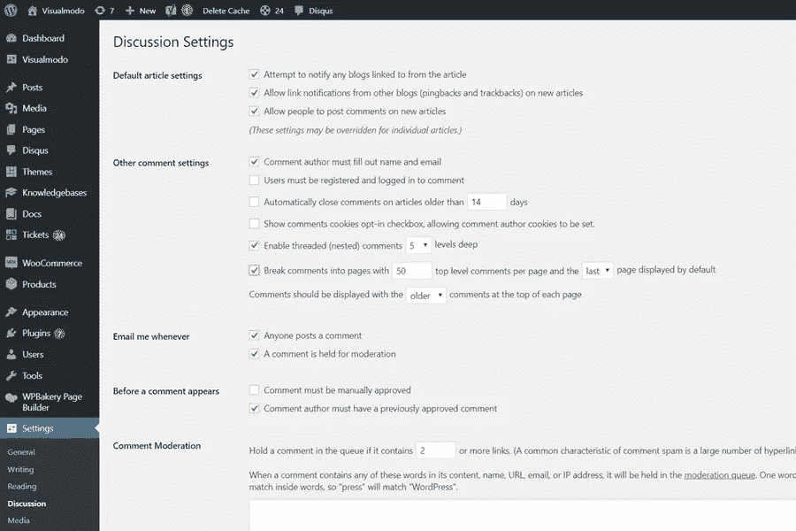

# WordPress 评论分页指南

> 原文：<https://medium.com/visualmodo/wordpress-comments-pagination-guide-628b3f0280fb?source=collection_archive---------2----------------------->

在这篇文章中可以看到如何以及为什么使用 WordPress 评论分页。你有没有注意到你有很多评论的博客文章比其他文章加载得慢？这是因为加载如此多的评论会增加服务器的负载，从而增加你的平均页面加载时间。有很多评论是一件好事，因为这意味着你的用户在关注你的内容。你评论最多的帖子通常是你博客上最受欢迎的帖子。

给你的评论分页的另一个原因是保持你文章的关键词密度。评论为你的文章页面增加了很多内容，它们可能并不总是包含足够数量的目标关键词。

# WordPress 评论分页指南

在 WordPress 中给评论分页是非常容易做到的。只要遵循这些简单的步骤。首先，登录你的 WordPress 仪表盘，进入设置>讨论>其他评论设置。选中“将评论分成页面”复选框，并选择您希望在每个博客帖子上显示的评论数量。您还可以选择哪个页面显示旧的或新的注释。不要忘记点击“保存更改”按钮来保存您的设置。

就是这样。完成了。现在转到你有很多评论的帖子，看看你的 [WordPress 站点](https://visualmodo.com/wordpress-themes/)上的评论分页，你会看到它不是显示所有的评论，而是在不同的页面上显示评论。你的主题将决定分页风格。只有当您获得大量评论时，将评论分页才是一个好主意。否则，您不必担心分页问题。

# 是否分页

如果您将该数字设置得相对较高，对注释进行分页可能是一个好主意。您可能不想像我在示例中那样将数字设置为 5。但是如果你把它设置为 25 条或更多，那么即使你通常不会得到很多评论，如果一个帖子碰巧引起了比平常更多的讨论，你也会准备好。