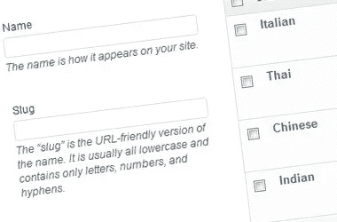

# WordPress 自定义分类法

> 原文：<https://medium.com/visualmodo/wordpress-custom-taxonomies-a74768684957?source=collection_archive---------1----------------------->

关于什么是分类法，如何在 WordPress 中以简单的方式创建自定义分类法，以及如何显示自定义分类法的完整指南

在 WordPress 中，默认情况下可以使用类别和标签对内容进行分组。WordPress 称这些群体为*分类法*。当你对你的内容很认真并且有很多内容的时候，创建其他的群组也是值得的。通过创建这些自定义分类法，您可以让内容作者的生活变得更加轻松。更重要的是，你要为你的访问者尽最大努力构建你的网站。他们将能够找到与他们相关的内容，并更容易地找到相关内容。本文将深入研究定制[分类法](https://visualmodo.com/)的使用。

# 等级与非等级

WordPress 在 2.3 版本中引入了标签的概念。根据维基百科的描述，标签是“分配给一条信息的无层次的关键字或术语。”这意味着从 2.3 版本开始，WordPress 已经有了一种分级的信息分类方式(类别)，和一种非分级的信息组织方式(标签)。早在 2006 年(！)，人们在讨论[标签不是类别](http://carthik.net/blog/vault/2006/02/21/tags-are-not-categories/)的事实。问题是 WordPress 称它们都是“分类法”，但这并不完全正确。单词 taxonomy 假设了排序的层次结构，[在另一个维基百科页面](http://en.wikipedia.org/wiki/Taxonomy)上有解释。

在 2.8 版本中，WordPress 引入了**自定义** [**分类法**](https://visualmodo.com/) 。或者实际上，允许更容易地访问已经可用的定制分类法的后端。这些自定义分类法可以是非分层的(例如“类似标签的”)或分层的(例如“类似类别的”)。但是现在，只有非层次分类法从平滑集成中受益。不过，这些更像实际的分类法，因为它们给标记结构增加了一种层次结构。

让我给你一个例子:你可以有一个“人”和一个“地方”的分类。比方说，你写了一篇新文章，决定在“人物”分类中添加一个关键词。这样做，你就说它是“People”类型的一个关键字(或者标签，如果你想的话)，所以它在某种程度上是有层次的。但它也使关键字更加丰富，因为它增加了另一层信息。

几年前， [Roy Huiskes](http://chapter42.com/) 通过对这个主题的图形化解释，为我们创造了这种视觉效果:

*有趣事实:上图中的人物分类部分现在会包括更多的分支。*

你可以想象用它来表示位置，或者公司网站上的员工，也可以表示图书网站上的作者，旅游网站上的目的地，等等。它以一种方便的方式对项目进行分组，既方便维护，也方便访问者。

# WordPress 中的自定义分类法

在 WordPress 中添加自定义分类法并不难。要手动注册分类，可以使用 register_taxonomy()函数。大多数 WordPress 开发者可能曾经使用过这个，对吗？

[WordPress.org 有一个关于如何进行人员分类的例子](https://codex.wordpress.org/Taxonomies):

这段代码给你的 WordPress 文章编辑界面添加了一个元框，看起来像标签框。它甚至以同样的方式工作。我不是标签云的粉丝，但是理论上，你甚至可以为你的新分类法创建一个云。关于更深入的解释，请看 wpmudev.org(2016)的这篇文章。

这些定制分类法可以是公共的和私有的，这也使得它们对于元素的内部分组非常有用。我可以想象分组 VIP 用户，社会影响者；你说吧。

# 注意:(自定义)分类法和古腾堡

正如马特·克伦威尔所描述的，“古腾堡是 WordPress 内容的未来。它将提供媒体的优雅，但在布局和内容类型上有更大的能力和灵活性”。但是 Gutenberg 目前正在开发中，99%的 WordPress 用户可能在它完成之前看不到它。

然而，就在上周，我的同事 Tim 给[WordPress/Gutenberg Github repo](https://github.com/WordPress/gutenberg/issues/2450)添加了一个问题:Gutenberg 在类别和标签列表中显示私有分类法。只是把它放在这里作为注释，因为我确信开发团队在向公众发布 Gutenberg 之前会解决这个问题。但是如果你在一个真实的网站上测试 Gutenberg，并且你在那个网站的某个地方使用了定制分类法，这可能是需要检查的。只是为了确定一下！

# 你是如何使用定制分类法的？

因此，总之，定制分类法非常有用。如果你有大量的内容，并且想为你自己和你的用户创造秩序，你可以使用它们。

这给我留下了两个问题:**您是否在使用定制分类法，如果是，您是如何将这些分类法添加到您的站点中的？**期待大家在评论中的回答！