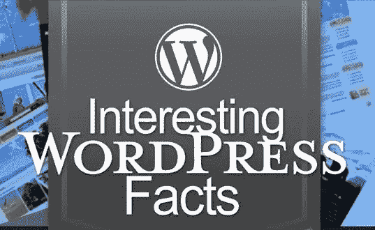

# 事实和好奇

> 原文：<https://medium.com/visualmodo/wordpress-facts-and-curiosities-3e68e682b32b?source=collection_archive---------0----------------------->

WordPress 是网络开发人员使用的流行的博客、网站设计和网站管理工具。不同于其他带有限制的专有网络开发软件，WordPress 使用开放源代码，使用户能够随着时间的推移修改和改进他们的网站。现在看看一些 WordPress 的事实和奇闻。

截至 2018 年，超过 1200 万个网站由 WordPress 提供支持。《纽约客》(The New Yorker)、BBC 美国频道(BBC America)和索尼音乐(Sony Music)只是依赖这一平台的众多知名品牌中的几个。

# 数以千计的免费插件

WordPress 有超过 40，000 个在线插件可以通过这个平台下载。它们使用户能够通过简单的拖放操作[界面](https://visualmodo.com/)轻松定制并持续切换网站功能。

定制范围从客户端 web 脚本到服务器端脚本，确保托管网站两端的连贯性和一致性。

# 令人惊叹的可定制主题

WordPress 主题允许网络开发者在不改变网站内容的情况下改变网站的外观。WordPress 开发的一些主题是免费的，而其他的可以以很少的费用[下载](https://visualmodo.com/)，所以你可以把你的钱花在真正有价值的地方——比如在[一个可靠的主机提供商](https://websitebuilder.org/best-wordpress-hosting/)

# 你为什么要选择 WordPress？

1.  它是搜索引擎友好的——WordPress 整合了一个免费的 Yoast SEO 插件，可以帮助用户确定他们内容中关键词的密度，以及帮助解决一些其他与 SEO 相关的关键词。
2.  WordPress 是手机友好的——即使不是全部，也是大部分的主题都是手机友好的。这使得用户可以轻松创建网站，让他们的客户可以通过手机自由访问内容。
3.  它很容易设置和管理——你不需要成为设计 WordPress 网站的专家。所有你需要的是一个独特的主题，一些你的业务需要的插件，你很好去。主题和插件已经编码好了，但是如果你想进一步定制，你只需要做几行代码。

WordPress 是小型电子商务企业家最值得推荐的网站构建工具，他们最终会随着时间的推移而成长，因为他们可以逐步调整他们的网站。在你免费注册了一个 WordPress 账户后，你可以在 10 分钟内拥有你的网站框架结构。

# 事实与好奇——信息图

关于 WordPress 的 50 个惊人事实——信息图

[https://visualmodo.com/wordpress-facts-curiosities/](https://visualmodo.com/wordpress-facts-curiosities/)