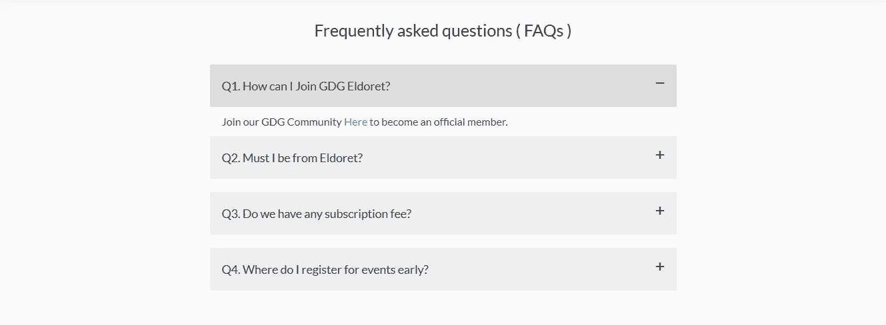

# WordPress 常见问题插件

> 原文：<https://medium.com/visualmodo/wordpress-faq-plugins-999f04d46231?source=collection_archive---------0----------------------->

正确的 WordPress FAQ 插件可以帮助客户在不联系客服的情况下找到答案。在这个列表中，我们为你回顾了一些伟大的用法。

为什么 FAQ 这么有效？嗯，如果用户有迫切的问题需要问，他们可能不是第一个(也不会是最后一个)问这个问题的人。作为一个企业主，你正在浪费你的支持团队的大量时间，或者，像小企业通常的情况一样，浪费你自己的时间，对同样的无聊问题重复同样的无聊答案。

通过编制一个最常见问题的列表，你可以让你的支持团队放松一些。你可以很快让用户参考这个列表，或者访问者自己也可能偶然发现它，省去了你回复邮件的麻烦。

更重要的是，不得不提出一个问题并等待答案会推迟购买决定。在此期间，潜在客户可能会对购买冷淡——特别是如果他们是冲动购买——或者这变成了与竞争对手的支持团队赛跑，看谁能第一个回复并完成[销售](https://visualmodo.com/)。

换句话说，FAQ 从一开始就给客户提供了他们需要知道的一切，这意味着你的工作*和*更少的额外转换。你还能要求什么？

在这篇文章中，我们将通过向你介绍 WordPress 的五个最好的 FAQ 插件来帮助你在你的网站上添加 [FAQ](https://visualmodo.com/) 部分。有免费和高级插件的组合，所以每个人都有适合的东西——不管预算如何。

# WordPress 常见问题插件

# HTML5 响应常见问题解答(免费)

接下来，我们有了今天第一个完全免费的选项: [HTML5 响应式 FAQ](https://wordpress.org/plugins/html5-responsive-faq/) 。顾名思义，这个插件是移动优化的，确保它在较小的设备上看起来很棒。

该插件允许你创建 FAQ 问题和答案作为一个自定义的文章类型。然后你可以将每个问题分配到你的博客类别中。

将 FAQ 部分添加到您的站点也非常简单。只需复制并粘贴一个简单的短代码，然后添加您想要包括的类别。而且，因为您可以将一个问题分配到多个类别，所以您可以在各种常见问题部分中弹出相同的问题，这对于访问者反复询问的热门问题来说是完美的。然后，访问者点击他们想要阅读的问题，答案就会像手风琴一样打开。

所有的造型选项都在一个方便的屏幕上。在这里，您可以选择项目符号的颜色、字体大小以及问题之间的间隔。您还可以选择问题文本的标题类型—例如[的](https://visualmodo.com/)，您可以选择 H3 标签。

设计 FAQ 部分所需的一切都可以在一个空间中找到。

那么很容易设置，但是插件产生的 FAQ 部分呢？他们达到标准了吗？幸运的是，答案是肯定的——它们看起来很棒，尤其是搭配上你喜欢的款式。

# Arconix 常见问题解答(免费)

[Arconix](https://wordpress.org/plugins/arconix-faq/) 是另一个很棒的免费 FAQ 插件，和 HTML5 响应式 FAQ 一样，是同类中最受欢迎的。这个插件也是短代码驱动的，允许你在网站的任何地方添加 FAQ 部分。

该插件支持两种常见问题:jQuery 开关和折叠框。您还可以决定是否希望所有答案都默认显示，或者访问者是否必须单击才能访问它们。

Arconix FAQ 要求你输入 FAQ“组”,而不是将问题分类，这就像你典型的 WordPress 标签一样。您可以为每个问题附加无限数量的这些组，这意味着问题可以出现在多个 FAQ 列表中。要配置 FAQ 部分，您只需将想要显示的组添加到短代码中。

样式选项很少，但是如果你想用一个免费插件建立一个纯功能的 FAQ 部分，你不会找到比 Arconix FAQ 更好的了。

# 苦难常见问题解答(35 美元)

[磨难常见问题](http://tribulant.com/plugins/view/8/wordpress-faq-plugin)是一个高质量的优质常见问题插件。它有很多很酷的特性，这使得它比免费插件更好(前提是你有 35 美元的闲钱)。

首先，这个插件允许访问者在你网站的前端提问(你也可以决定访问者在提问前是否必须注册)。然后，每个用户提交的内容都会出现在 WordPress 仪表盘上，等待你的批准，然后发布一个答案。当你点击发布时，提问者将会收到一封指向该答案的电子邮件通知。

事实上，大多数蒺藜常见问题的最佳功能是面向前端用户。例如，有一个方便的搜索功能，让访问者浏览你的常见问题的深度。访问者可以在特定类别(或网站范围)内进行搜索，该算法会返回与搜索查询相关的问题和答案。

蒺藜的常见问题部分是最好的，你会发现，也有美丽的，滑动手风琴效果。有大量的定制选项，而且你甚至可以在你的[回答](https://visualmodo.com/)中添加时尚的社交分享按钮。

# FAQ plus(19 美元)

如果你选择一个 FAQ 插件的主要标准是定制，那么只需看看 [FAQPlus](https://codecanyon.net/item/faqplus-wordpress-faq-plugin/7068037?ref=WinningWP) 就行了。它让你只需粘贴一个短代码就可以添加 FAQ，这意味着你可以在你网站的任何地方显示它们——包括 widget 空间。

如前所述，FAQPlus 拥有丰富的造型选择。有 25 个动画效果，多种布局，无限的颜色和字体真棒图标。您也可以在一个 FAQ 部分中对每个问题应用不同的样式。

手风琴式的 FAQ 拥有漂亮的风格。

你也可以用各种丰富的内容填充你的 WordPress FAQ 部分，包括图片和视频——如果你想让你的答案更容易理解，试试这个。每个问题都被编译成一个 FAQ 列表，使用拖放重新排序，然后分配一个唯一的短代码。

用图片和视频让你的常见问题更有吸引力。

访问者可以通过点击或简单的悬停来触发答案——根据您的喜好配置此设置。而且，如果你想把你的 FAQ 部分变成一些复杂的自定义布局，FAQPlus 完全兼容 CodeCanyon 最畅销的插件 Visual Composer。

# 最后的想法

如果你正试图建立一个成功的网站，FAQ 部分可能就是你所缺少的一部分。当你知道你的访问者需要什么信息时，你的常见问题可以赶走任何买家的异议——现在没有什么可以阻止你完成销售。

因此，一个信息量大且设计良好的[常见问题解答部分可以产生良好的回报——并节省你大量的工作。今天所有的插件都很容易使用，并且可以构建好看的 FAQ。你真正需要问自己的唯一问题是:免费还是收费？](https://visualmodo.com/)

在我看来，保费通常是更好的选择，前提是你有预算。高级 FAQ 插件通常具有更好的设计和更广泛的定制选项，并支持附加功能——最有用的是前端访问者提交的问题和答案。而且，由于价格低于 40 美元，仅仅一两次额外的销售就意味着这个插件已经收回了成本——一点也不差！