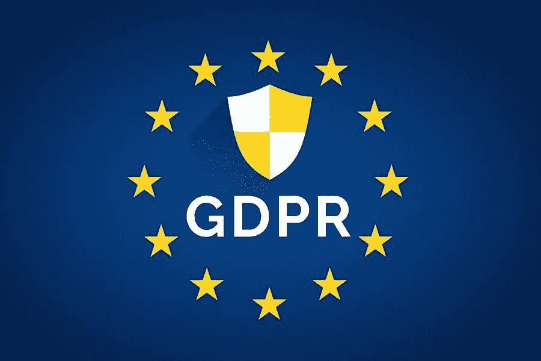

# 免费的 GDPR 插件

> 原文：<https://medium.com/visualmodo/wordpress-gdpr-plugins-for-free-95073934fa4b?source=collection_archive---------0----------------------->

你需要一个免费的 GDPR 插件来确保你的 WordPress 网站符合法律吗？收集数据的网站需要符合 GDPR 标准。一些奇妙的免费 WordPress 插件可以帮助你。因此，我们将列出 WordPress 的顶级免费 GDPR 插件，你可以用它们来使你的网站兼容。

# 顶级免费 WordPress GDPR 插件

新的通用数据保护条例(GDPR)指令和指南要求网站创建者、所有者或企业展示一条消息，清楚地告诉用户除了所使用的信息之外，还收集了什么类型的信息。此外，您需要添加一个方法来删除这些收集的数据。

所有这些功能在调味 WordPress 中都没有。此外，还有另一个关键的 GDPR 要求。所以，网站应该征求具体的知情同意。非功能性的 cookies 和脚本要在知足之前停止，这对于网站主来说很难。甚至对于隐私插件开发者来说。

幸运的是，如果你在你的网站上使用 WordPress，事情是相对合理的，因为你需要做的一切；选择一个插件来组成这个 WordPress GDPR 插件列表。

# GDPR 的三重知识

这是另一个最好的 WP GDPR 工具，以确保您的客户的隐私。此插件使数据保护官(DPO)、管理员和数据处理员能够满足其客户的数据保护要求。该插件的一些显著功能包括同意管理、隐私政策页面配置、用户数据的假名化、审计日志、数据泄露通知和遥测跟踪器，等等。

# 免费 WordPress GDPR 插件

接下来，我们将获得 GDPR/CCPA Cookie 许可。这是唯一一个为你提供符合 GDPR 和 ePrivacy 指令所需的一切的插件，全部免费。该插件提供每周更新的网站扫描，并在同意之前阻止统计数据和营销 cookies。如果页面包含 iFrames 或 YouTube 视频等内容，内容会自动改变，并带有一个占位符，要求网站访问者同意。通过一个全面但易于理解的向导，您可以生成一个 Cookie 策略，该策略会随着每周的网站扫描自动更新。让您的网站符合 GDPR 标准再容易不过了。

# WP GDPR 合规

WordPress 开发者的最爱，这个插件集成了许多客户隐私管理的功能。它与 contact form 7、WooCommerce integration 和 Gravity Forms 兼容。其他选项包括 cookie 弹出许可、数据存档和用户从您的网站删除其全部数据的选项。

# GDPR 插件

我们列表中排名第一的免费 GDPR 插件是 Cookiebot。Cookiebot WordPress 插件是一个基于云的解决方案，帮助你的网站完全符合新的 Cookie [同意政策](https://visualmodo.com/is-it-time-to-update-your-compliance-training/)和 GDPR 准则。一旦插件被激活，它会自动扫描网站，找到所有的 cookies。现在，总的来说，大多数插件功能都是免费提供的。然而，如果你想访问高级选项，那么有空间包括额外费用。