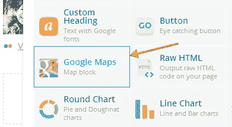
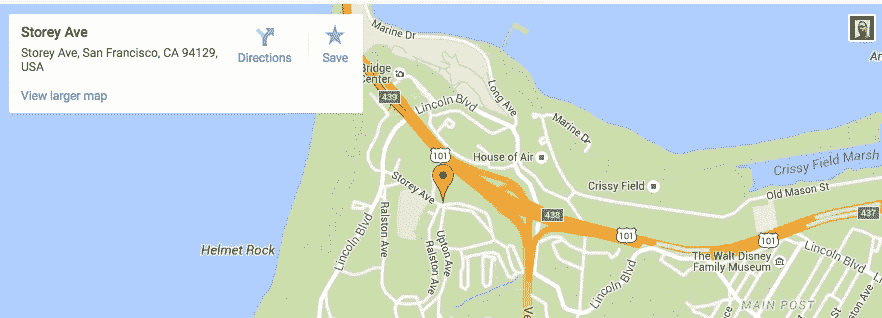

# 使用可视化编辑器的谷歌地图

> 原文：<https://medium.com/visualmodo/wordpress-google-maps-using-visual-composer-e318a2fa9a02?source=collection_archive---------5----------------------->

现在看看如何使用 Visual Composer WordPress 插件的元素轻松地在你的 WordPress 站点上添加 Google 地图——该元素包括了向你的 WordPress 站点添加地图的简单方法。考虑到地图和嵌入方式的不断改进，我们会不断更新这篇博文，提供最新的信息，这样你就不用自己琢磨了。

# 1.在地图上查找位置

在您将特定地图添加到您的网站之前，您需要访问[谷歌地图](http://www.google.com/maps)网站。在左上方，您会看到搜索栏，可用于查找特定位置。输入你要找的位置，更重要的是确保你的地图缩放比例和你希望在你的 WordPress 站点上显示的完全一样。

# 2.接收嵌入代码

一旦你有你的位置和缩放级别设置，你将需要检索嵌入代码，将其插入到您的网站。在地图的右下方，你会看到“齿轮”图标，这将触发菜单出现。选择“共享或嵌入地图”选项-这将打开一个弹出窗口，您必须转到“嵌入地图”选项卡。复制整个嵌入代码，因为你会在谷歌地图元素需要它。

# 3.插入谷歌地图

现在你可以去你的 WordPress 站点，为 Visual Composer 添加谷歌地图元素。在谷歌地图元素参数窗口中，你会看到“地图嵌入 iframe”字段，你必须复制从谷歌地图得到的嵌入代码。

就这样——现在你只需 3 个简单的步骤就可以在你的 WordPress 站点上拥有地图了。

之后，您可以为新添加的地图设置附加参数并保存它。现在你已经在你的 WordPress 站点上创建了谷歌地图，并得到了 Visual Composer 的支持。

所有的 [Visualmodo WordPress 主题](https://visualmodo.com/)都包括免费的 Visual Composer 页面生成器 WordPress 插件及其所有元素。

# 视频指南