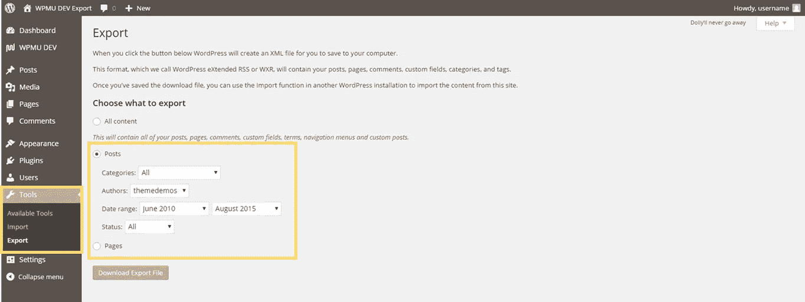

# WordPress 从其他网站导入内容-迁移

> 原文：<https://medium.com/visualmodo/wordpress-import-content-from-other-site-migration-ce152d4a77f3?source=collection_archive---------7----------------------->

如果你想把你的网站换成一个新的网址，或者想把所有的东西从一个 WordPress 系统转移到另一个，好消息是你选择了简单的方法。WordPress 自己的导入和导出工具将完美地为你工作，所以没有必要在引擎盖下做任何太复杂的事情。

以下是如何将你所有的 WordPress 内容——页面、图片和文件、帖子以及其他一切——转移到一个新的安装中。

顺便说一句，在新服务器上创建一个新的安装(或者甚至在服务器中的新位置)并导入/导出可能比更改文件的配置更容易。然而，如果你宁愿这样做，T2 的 WordPress Codex 可以提供建议。你的安装应该是最新的 WordPress 版本，所以这不会是一个问题，但如果不是，首先升级你的旧安装。如果你因为某种原因真的不能更新——比如保留了一个不支持新版本的插件——你的新安装可能是一个[旧版本](https://wordpress.org/download/release-archive/)。这并不值得推荐，因为许多旧版本的 WordPress 有严重的安全缺陷。

[caption id = " attachment _ 54905 " align = " align center " width = " 2172 "]

WordPress 从其他网站导入内容-迁移[/caption]

# 如何导入到新站点？如何迁移？

## 1.从旧安装中导出

转到你的 WordPress 仪表盘，从**工具**部分选择**导出**项目。

因为您正在导出所有内容，所以很简单:保持选择**所有内容**选项，然后点击**下载导出文件**。

将创建一个 XML 文件。将它保存在一个安全的地方，并转到您要迁移到的安装。

## 2.安装导入程序

WordPress 导入程序屏幕。

[caption id = " attachment _ 54902 " align = " align center " width = " 490 "]

WordPress 导入程序插件[/caption]

在新的 WordPress 安装上，再次进入**工具**，但是这次选择**导入**。

你会看到一个进口商列表，你应该从中选择 WordPress 选项。

点击**立即安装**，等待导入器插件下载并安装。

如果一切正常，你可以在下一个屏幕上点击**激活插件&运行导入器**。

此时，您已经做好了导入的准备，前面生成的 XML 文件开始发挥作用。

## 3.上传您的内容

在随后的屏幕上单击**选择文件**，并选择您在旧站点上创建的 XML 文件。

接下来，点击**上传文件，导入**。

## 4.分配内容

您可以选择将内容分配给新网站上的现有用户(如果您在两个网站上都有帐户，您可以将旧帖子分配给新帐户)，或者使用旧用户名或您选择的新用户名创建新用户。这确保了所有内容都属于新网站上的作者帐户。

如果您有任何图像或文件要移动到新网站，**务必勾选*下载并导入文件附件***——默认情况下未选中。

点击**提交**按钮，你就完成了！该页面的加载时间可能会比平时长一点，因为它正在数据库中创建所有的新行，但它*会*通过它。只要耐心等待它被处理，你所有的内容都应该被导入到新的网站上，为它在那里的生活做好准备。

# 部分内容移动

这是最简单的一点。然而，如果你只是想导出你的部分内容，恐怕 WordPress 的工具本身并不能满足你的需求。

选择**所有内容**是导出附件(出现在**媒体**部分下的文件)的唯一方法。因此，如果您想要传输内容的特定部分*和图像的特定部分*，您要么需要移动所有内容，然后将其删除(对于较大的站点来说很耗时),要么在您的文件和数据库中摸索——现在我将向您展示如何做。

我将要向您展示的导出和更改 SQL 将演示如何移动附件，但是您也可以使用类似的方法来跨数据库传输整个数据库。如果您想传输所有内容，但 XML 文件太大，无法通过导入程序上传，这很有用。

## 选择要导出的内容

再次进入**工具>导出**屏幕开始。

一旦您选择了想要导出的内容，像以前一样点击**下载导出文件**。如果您想要进行多项选择(例如，在一个日期范围内两个作者的帖子，或者某人的帖子*和*所有页面)，完全可以返回并为每个选择创建多个导出文件。

## 像以前一样导入

在你有了所有你想要的 WXR XML 文件后，进入新的站点，安装 WordPress 导入器，如前所示。你可以像以前一样上传你的文件(一次一个),他们会将特定的帖子/页面/其他内容安装到网站上。

所有 Visualmodo [WordPress 主题](https://visualmodo.com/)都带有主题演示内容。xml 文件和一键式演示内容导入选项内置。