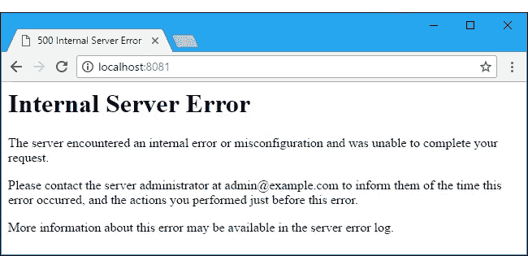
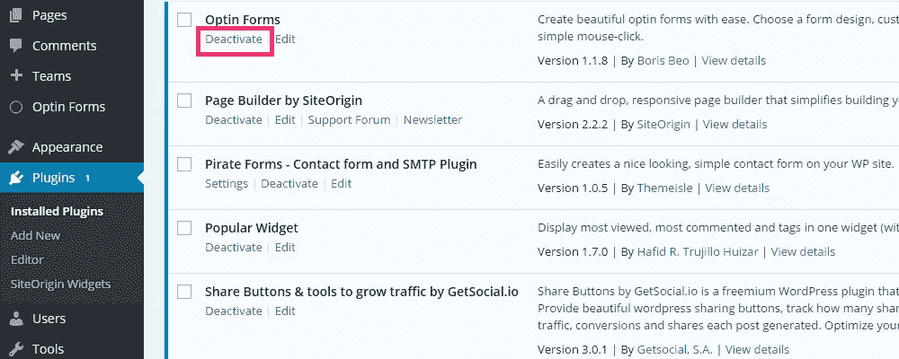
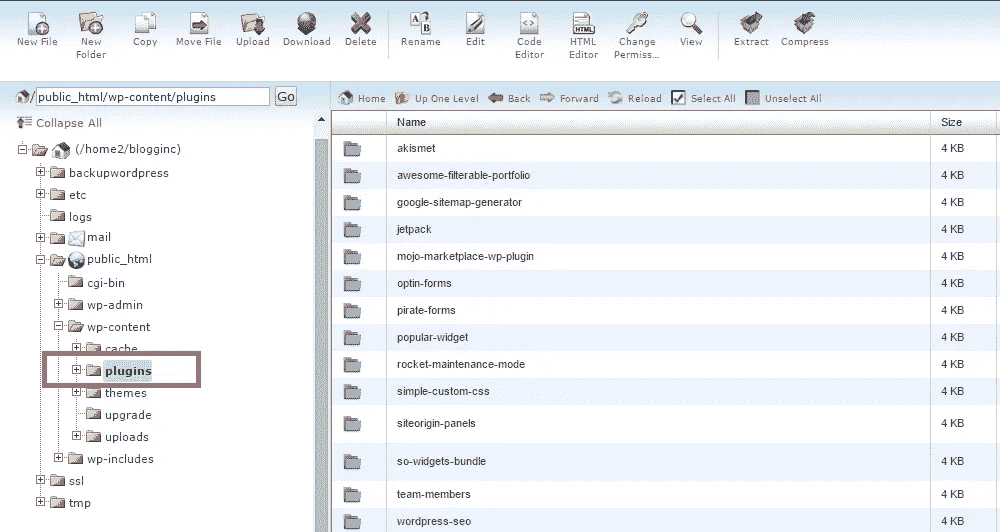

# WordPress 内部服务器错误修复

> 原文：<https://medium.com/visualmodo/wordpress-internal-server-error-fix-fbd36e0e1b47?source=collection_archive---------0----------------------->

如果你曾经在你的 WordPress 网站上遇到过零星的错误，那么你来对地方了。WordPress 的错误可能非常令人恼火，但是总有办法克服它们——在大多数情况下，存在几种不同的解决方案，这里有一个针对内部服务器错误的解决方案。

一些用户发现，在试图访问他们的 WordPress 管理面板时，他们会看到一个类似这样的内部服务器错误:

> 服务器遇到内部错误或配置错误，无法完成您的请求。

这个特殊的错误让人们绞尽脑汁，希望找出他们网站的问题所在，以及如何修复它。在本文中，我将介绍几个简单的解决方案，您可以尝试诊断错误并解决它。

让我们开始吧！

# 这个错误是怎么发生的？

顾名思义，内部服务器错误不是 WordPress 特有的错误。事实上，它们可能是由于与你的 WordPress 站点运行在同一服务器上的其他服务和软件的故障而发生的。假设你托管在一个共享服务器上，WordPress 的内部服务器错误比你想象的更常见。

错误本身和它显示的消息一点也不具体。实际上没有办法通过阅读内部服务器错误消息来找出错误是如何发生的。然而，当这个错误发生在 WordPress 网站上时，我们可以将其原因缩小到:

1.  主题的功能。
2.  插件的功能。
3.  腐败。htaccess 文件。
4.  达到 PHP 内存限制。

通常，当用户遇到内部服务器错误时，他们会试图访问他们的 WordPress 管理区。在这种情况下，网站的其他部分照常工作，而对网站管理区的访问受到限制是很常见的。

现在，让我们来看看解决这个问题的几种方法。

# 如何修复内部服务器错误

正如我们上面所讨论的，没有真正的方法找出*确切的*你的 WordPress 站点出了什么问题，以及为什么每次你试图登录 WordPress 管理区时，它都会给出一个内部服务器错误。

> 采取一种方法，试一试，这是常识。如果失败了，坦白承认，再试一次。但最重要的是，尝试一些东西。——[富兰克林·罗斯福](https://en.wikipedia.org/wiki/Franklin_D._Roosevelt)

正如罗斯福先生非常微妙地指出的那样，我们将逐步采用试错法来解决这个问题。如果一种方法不能解决问题，那就继续下一种！

# 1.确保`.htaccess`文件正常工作

我们要做的第一件事是确保我们的 WordPress 站点的`.htaccess`文件没有损坏，并且正在做它想要做的事情。按照这些简单的步骤来检查你的`.htaccess`文件的状态:

*   登录到你的 WordPress 站点的 FTP 客户端。
*   导航到*文件*下的*文件管理器*
*   找到您站点的`.htaccess`文件，并将其重命名，例如`.htaccess_original`
*   尝试访问你的网站和 WordPress 管理区。
*   如果现在一切正常，从您站点的仪表板导航到*设置* > *永久链接*。
*   点击*保存*按钮。

通过保存这些设置，您将生成一个新的包含正确重写规则的`.htaccess`文件。这些新规则将保证你网站的文章页面在被访问时不会返回错误。

如果您的`.htaccess`文件导致了内部服务器错误，现在应该可以修复了。然而，如果你发现在重新加载你的站点和 WordPress 管理区域时错误仍然存在，那么继续下一步，我们将向你展示如何增加你的站点的 PHP 内存限制。

# 2.增加 PHP 内存限制

如果内部服务器错误问题仍然存在，即使你已经检查了你的`.htaccess`文件，那么它可能是因为你达到了内存限制。在这种情况下，您还会经常遇到这样的错误:

> 上传的文件超过了 php.ini 中的 upload_max_filesize 指令

当您尝试将文件上传到媒体库时。或者可能更像这样:

> 致命错误:在第 1234 行的/home/your-username/public _ html/WP-includes/plugin . PHP 中，耗尽了允许的 1234567 字节内存大小(试图分配 87654321 字节)

每当你尝试登录你的站点的管理面板或者上传一个文件/图像到你的 WordPress 站点时，你会遇到这个错误，你可以按照下面的方法来增加 PHP 的内存限制。(不要让代码吓到你，我保证没那么难！)

**编辑您的** `**wp-config.php**` **文件**

通过将这一行代码添加到你的 WordPress 站点的`wp-config.php`文件中，你可以将内存限制增加到一个更合适的值。在下面的步骤中，我将它增加到 64M (M 代表兆字节)。

*   登录到你的 WordPress 站点的 FTP 客户端。
*   导航到您站点的根目录并找到`wp-config.php`文件。
*   在`<?php`标记内，添加以下代码行:

define('WP_MEMORY_LIMIT '，' 64M ')；

[view raw](https://gist.github.com/rafaysansari/eb4f5df5608d6cb2eabe/raw/e391f9f2663072b79bc3dd9e7e9e139742ba478a/wp-config.php)t11】wp-config.php 与❤共同主持 [GitHub](https://github.com/)

每当我必须增加内存限制时，这个简单的一行程序就是我的首选方法——它每次都有效！

**更新** `**php.ini**` **文件**

如果你找不到`wp-config.php`文件，尝试寻找`php.ini`文件！这种方法允许您同时增加几个不同的值，从而更深入地了解了内存限制。让我们来看看。

*   登录到您的 cPanel 并导航到*文件* > *文件管理器*。
*   找到 wp-admin 文件夹并找到您的`php.ini`文件。(如果文件不存在，点击*新建文件*按钮创建一个。)
*   找到/创建文件后，打开它并编辑/添加以下代码行:

upload _ max _ filesize = 1500m post _ max _ size = 2000m memory _ limit = 2500m file _ uploads = on max _ execution _ time = 120

[查看 raw](https://gist.github.com/rafaysansari/a6c55df152a5275550ed/raw/5c8568bf11e930d3a60a68ca7dda08d77c64a293/php.ini) [php.ini](https://gist.github.com/rafaysansari/a6c55df152a5275550ed#file-php-ini) 由 [GitHub](https://github.com/) 与❤共同主持

*   保存更新的文件并清除浏览器的缓存。

**编辑** `**.htaccess**` **文件**

假设您无法找到`wp-config.php`文件或`php.ini file`文件，您可以通过在底部添加几行代码来修改旧的`.htaccess`文件。这个方法对我总是管用！

*   登录到你的 WordPress 站点的 FTP 客户端。
*   导航到*文件*下的*文件管理器*
*   找到您站点的`.htaccess`文件，并在文件末尾编辑/添加以下代码:

PHP _ value upload _ max _ filesize 1500 PHP _ value post _ max _ size 2000 PHP _ value memory _ limit 2500 PHP _ value max _ execution _ time 120 PHP _ value max _ input _ time 120

[观生](https://gist.github.com/rafaysansari/19856b2d5e8ad402e8b0/raw/98559bdf6add5eceb8b9027b8235faedaf27468e/.htaccess) [。htaccess](https://gist.github.com/rafaysansari/19856b2d5e8ad402e8b0#file-htaccess) 由❤主持 [GitHub](https://github.com/)

*   保存更新的文件并清除浏览器的缓存。

如果出于某种原因，你仍然不确定进入你的站点的核心文件并更新它们，你可以安装[增加最大上传文件大小](https://wordpress.org/plugins/upload-max-file-size/)插件来完成这项工作。

这些变化很容易合并，有望解决您遇到的内部服务器错误。一旦你使用上述三个步骤中的任何一个增加了 PHP 内存限制，试着重新加载你的 WordPress 站点并访问管理区。

如果你仍然被错误屏幕提示，那么准备好下一步——现在事情要变得严重了。

# 3.停用您的插件

在这个阶段，可以有把握地假设你会有很多工作要做。这个错误很有可能是由你在 WordPress 网站上安装的插件引起的。即使有很好的评论和五星评级的插件也可能是这种情况下的根本原因。方法如下:

*   场景 1: 插件与你的 WordPress 版本不兼容。
*   场景 2: 插件与你运行的主题不兼容。
*   **场景 3:** 该插件与您安装的另一个插件不兼容。

插件扩展并增加了你的 WordPress 站点的功能。它们安装起来很有趣，可以节省你大量的时间，让工作变得超级简单。唯一的问题是他们可能最终导致错误——不管他们得分多高。没有一种实用的方法或精心设计的公式可以让你避免插件出现内部服务器错误。具有讽刺意味的是，找到这样一个由错误的插件-插件或插件-主题组合引起的错误本身就是一种试错技术！

要解决这个问题，你必须停用你网站上安装的所有插件，然后一个接一个地重新激活它们。让我们简化这个过程，给它一些逻辑结构，这样看起来就不会那么混乱:

**使用 WordPress 仪表盘**

停用所有插件最简单的方法是通过你的 WordPress 仪表盘。

从你的 WordPress 仪表盘停用插件。

*   登录你的 WordPress 站点的仪表板。
*   导航到*插件* > *已安装插件*。
*   点击每个插件下方的*停用*链接。

然而，如果你不能访问你的 WordPress 仪表盘，你可以通过 FTP 客户端关闭插件。方法如下:

**使用 FTP 客户端**

使用 FTP 客户端去激活插件不像通过仪表板那么简单，但这是完全可能的。

重命名插件文件夹。

*   登录到您站点的 FTP 客户端或 cPanel。
*   导航到`/wp-content/`文件夹。
*   找到*插件*文件夹，重命名为*去活插件*。

一旦你这样做了，你的网站的所有插件将被停用。这种方法要快得多，但是需要你登录到一个 FTP 客户端或者你的托管服务提供的文件管理器。

一旦你用上面提到的任何一种方法停用了所有插件，是时候回到你的 WordPress 仪表盘并再次激活它们了。

*   登录你的 WordPress 站点的仪表板。
*   导航到*插件* > *已安装插件*。
*   从顶部开始，点击第一个插件下方的*激活*链接。
*   重新加载您的网站和管理区，以确保它仍然工作。
*   如果你的网站和管理区工作正常，也就是说，他们没有给出内部服务器错误，继续激活下一个插件。
*   如果你的网站或管理区崩溃，你会知道是最后激活的插件导致了内部服务器错误。

一旦你发现有问题的插件，再次停用它，如果可能的话，把它报告给插件的作者，连同你已经安装的插件列表，你当前运行的主题和你的 WordPress 站点的版本。

**注意:**重要的是，即使你已经找到了有问题的插件，你也要一个接一个地重新激活你所有的插件。由于不兼容问题，可能是多个*插件导致了该错误。*

# 3.联系您的主机提供商

在这里，你似乎没有办法修复你的 WordPress 网站上可怕的内部服务器错误。当你自己做不到的时候你会怎么做？

如果您还记得，我们一开始解释了什么是内部服务器错误，并指出它发生在服务器级别。在这个阶段，最好的办法是联系你的主机提供商，并向他们报告这个问题。你的主机提供商可以访问你的 WordPress 站点所在的服务器错误日志。他们可以查看日志，确定问题发生的时间和方式，并有希望采取一些措施。

有几件事你一定要在给主机提供商的邮件中提到:

*   您网站的 URL。
*   当您第一次遇到内部服务器错误时。
*   遇到错误时您试图访问的内容，例如网站、管理区等。
*   你已经在你的站点上安装的插件列表。
*   您当前运行的主题。
*   你的 WordPress 站点的版本。
*   你是如何试图自己解决问题的。

根据您提供的信息和他们在服务器错误日志中找到的任何信息，您可以放心，您的站点将立即启动并运行，不会出现任何错误。

在最坏的情况下，如果他们不能解决问题，他们至少可以给你提供建议，建议你采取适当的措施来解决问题。

# 包装它

现在你知道了——你可以采用三种简单、连续的技术来解决你的 WordPress 站点的内部服务器错误。内部服务器错误在 WordPress 站点中很常见，尤其是当你的站点托管在一个共享平台上的时候。

我们提供了三个快速解决方案来修复错误，根据根本原因，其中一个应该适合您。希望您现在处于一个更好的位置，可以进一步尝试本文中介绍的技术。

你遇到过内部服务器错误吗？你是怎么修好的？我们上面详述的任何技术有助于您解决问题吗？请在下面的评论区告诉我们，如果你对你的 WordPress 有更多的问题，请看这里。

来源:https://visualmodo.com/