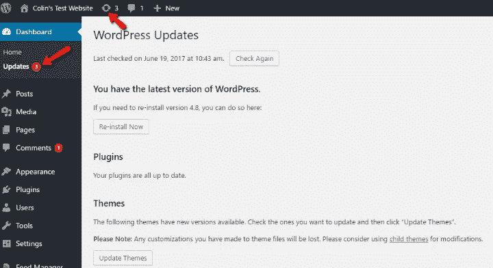
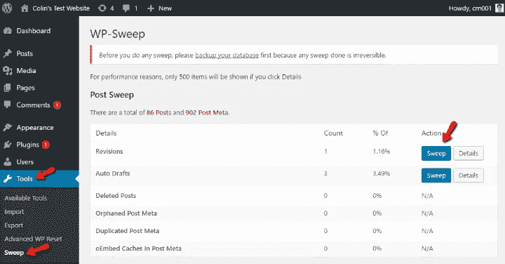
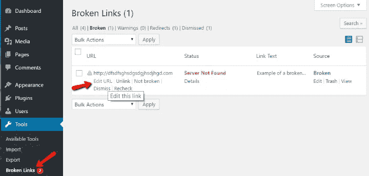
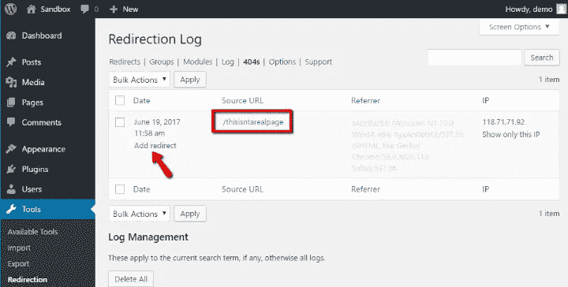

# WordPress 维护技巧

> 原文：<https://medium.com/visualmodo/wordpress-maintenance-tips-9db52034b118?source=collection_archive---------0----------------------->

为了保持您的网站平稳运行

当 WordPress 没有进行维护时，小故障和缓慢的性能会变得很明显。尽管管理 WordPress 很容易，但这并不意味着它是免维护的。幸运的是，你不必成为一个绝对的技术大师来确保你的网站的出色表现。在这篇文章中，我将讨论十种方法来帮助你清理并保持你的 [WordPress 网站](https://visualmodo.com/)平稳运行，以获得最大的用户体验和收入潜力。

# WordPress 维护技巧

还记得你的 WordPress 网站上的“新车味”吗？回到一切都是新鲜的，整洁的，完全最新的时代？是的，那会持续几个月。然后，油的现实变化和瘪胎开始下沉。

就像你维护你的主要交通工具一样，如果你想让你的 WordPress 站点正常工作，你同样需要维护它。为了有所帮助，我将利用这篇文章来展示一些基本的 WordPress 维护技巧。

我将从最重要的(*因而也是最重要的* [*流行的*](https://visualmodo.com/) )保养技巧开始。如果你是一个有经验的 WordPress 用户，我几乎可以保证你熟悉前几个技巧(至少)。在这种情况下，你可能想要向前跳一点，找到一些你可能还没有实现的想法。

# 1.定期更新你的网站。是的。这很重要

是的，这可能是 WordPress 历史上最不性感的提示。**但这也是你能做的最重要的事情之一，以确保你的站点的** [**安全和功能**](https://visualmodo.com/) **。**

在苏库里的 2016 年 Q1 分析中，56%被黑的 WordPress 网站(*苏库里查看了*)运行的是过期的 WordPress 软件。这种相关性是有原因的——虽然 WordPress 非常安全，但偶尔也会有漏洞。这些漏洞一旦被发现就会被修复… **但前提是你必须更新。**例如，最近的一个 REST API 漏洞影响了数十万个 WordPress 网站。但是，如果 WordPress 4.7.2 发布时，所有这些网站都立即更新到该版本，它们本可以幸免于难。

不仅仅是 WordPress 软件需要更新，你也需要保持插件和主题的更新。在 Sucuri 的分析中，仅仅三个过时的插件就占了被黑 WordPress 网站的 25%。**再来一次**，外挂其实早就给安全问题打补丁了……用户只是没有更新而已。所以，让**更新**标签成为你的朋友吧。它会告诉您需要更新的所有内容，您只需单击按钮:

# 2.运行定期备份(并确保它们正常工作)

幸运的话，你的网站不会发生任何不好的事情。但是你网站的数据不是你想靠运气得到的。**所以……算了，定期备份吧**。不要被那些告诉你不需要备份的神话所迷惑。但不仅仅是“运行”备份。您还需要确保两件事:

*   您的备份确实有效。即使像英国航空公司这样的大公司也不总是能确保他们的备份流程有效…这可能会导致问题。
*   您的备份可用。

要解决第一个问题，您至少应该定期尝试将备份恢复到测试服务器。对于第二个问题，我喜欢 3–2–1 策略:

*   总共保留 3 个备份
*   2 个在物理位置(如您的计算机或外置硬盘)
*   和 1 存储在云中

此外，尝试在不同的时间段进行备份。如果你的备份和你的实时网站有同样的问题，那就没什么用了。

# 3.检查错误标记的垃圾评论

虽然没有前面的建议那么可怕，但你会惊讶地发现有多少高质量的评论被意外标记为垃圾评论。你会遇到的大多数被标记的评论确实是垃圾评论，但是我打赌你会遇到一些真正的值得保存的评论。我一般每次检查都会发现一两个！

*注意——我会把它写得更长，因为它是一件小事……但是如果你尝试在下一步之后完成它，就不会有什么需要检查的了！*

# 4.清理和优化您的数据库

当你第一次安装 WordPress 的时候，你的数据库是如此的干净和小巧。但是当你开始在你的网站上“生活”时，你的数据库开始收集各种各样的垃圾。就像你家里的灰尘。你没有做任何“导致”灰尘的事情… **但是它仍然在积累，让一切看起来很脏**。

张贴修订，瞬变，表格开销，垃圾邮件评论，以及更多这样做你的数据库。每个单独的数据库条目都没什么大不了的…但是结合起来(就像那些灰尘)，它们会让你的网站变得非常迟钝。

谢天谢地，它们很容易清理。你需要做的就是运行一个类似 WP-Sweep 的[插件。无需配置——只需安装，进入**工具→清扫**并清理你的各种桌子:](http://wordpress.org/plugins/wp-sweep/)

你也可以**扫描页面底部的所有**——尽管我不推荐这样做，因为你可能会抹掉你的草稿。通常最好是单独浏览每个类别，以确保不会删除重要信息。

# 5.检查断开的内部和外部链接

断开的链接不利于用户体验，在较小程度上也不利于 SEO。它们让人类更难使用你的网站，让机器人更难抓取你的网站。手动很难找到它们…但是用正确的工具([断开链接检查器](https://wordpress.org/plugins/broken-link-checker/))，你可以立即嗅出你的 WordPress 站点上的每一个断开链接。

虽然这个插件有一些高级设置，但对于大多数网站来说，你可以安装它，然后进入**工具→断开的链接:**

您可以将鼠标悬停在每个链接上以快速编辑或移除该链接。

因为有人说断链检查器会降低 wp-admin 仪表板的速度，所以我建议只在你想检查断链时才启用这个插件。

# 6.监控你的 404 网页并设置重定向

404 页是你的访问者在登陆一个不存在的页面时看到的内容(比如说，从一个断开的链接)。虽然你可以控制你的*自己的*网站上断开的链接，但你不能控制其他网站上的链接。这就是为什么监控你的 404 页面流量是值得的，这样你就可以找到丢失的页面，如果有必要，301 可以将它们重定向到正确的页面。

虽然你可以使用谷歌分析来监控你的 404 页面，但我认为对初学者来说更简单的解决方案是[重定向插件](https://wordpress.org/plugins/redirection/):除了监控你的 404 页面的流量，它还可以帮助你快速添加适当的重定向，将流量发送到正确的地方。

# 7.检查你网站的页面加载时间

如果你像大多数网站管理员一样，你可能读过一篇关于如何提高 WordPress 速度的文章，实施了提示，改善了页面加载时间……然后就收工了。这听起来像你吗？我知道自己在某个时候犯了这种错误。

但是你会注意到你的网站在未来会变慢吗？我们倾向于认为我们的站点是“优化的”，即使优化是一个持续的过程，而不是一次性的事情。

你可以添加一个新的插件来减慢速度。你的主持人会做出一些改变来降低你的表演吗…谁知道呢？找出答案的唯一方法是定期测试页面加载时间。使用 Pingdom 这样的[工具，只需要几秒钟，你就可以安心了，你仍然*快*。](https://tools.pingdom.com/)

# 8.以正确的方式测试您的表单

我再怎么强调这一点也不为过。如果你在经营任何类型的企业，测试你的表格是非常重要的*。这不仅仅是测试你的表单，更是测试好你的表单。*

这是我个人犯的一个错误，可能对我的生意产生了真正的影响。

去年，我更换了联系方式插件，并注意到对我的自由写作服务的询问数量有所下降。这不是降到零…但大约是我通常得到的一半。很自然，我的第一反应是再次测试我的新表单插件。

我给自己发了几封测试邮件，一切都很完美。结案了，对吧？人们肯定不再有兴趣雇用我了，对吗？呃，不完全是。

不是我自吹自擂，但这实际上是我的[联系人表单插件](https://www.wpkube.com/7-best-contact-form-plugins-for-wordpress/)缓存问题的结果。**但是因为我是在登录我的管理员帐户(不包括在缓存中)时测试表单的，所以我从未遇到过这个问题。**

从我的错误中吸取教训— *像普通用户一样测试你的表单*。也就是用一个隐姓埋名的 tab！

# 9.让某人为你进行维护

虽然你可以自己做所有的事情，但是 WordPress 维护服务可以让你摆脱一些繁琐的工作。Visualmodo 为您设置了:请随时联系我们:

*   每周 WordPress 更新
*   每日备份
*   性能监控
*   黑客防护和恶意软件删除
*   正常运行时间监控
*   以及大量其他有用的服务

# 包装东西

我认为没有人*喜欢*维护 WordPress。但是如果你想保持你的网站安全和运行良好，这是你绝对需要做的事情。一些小技巧——比如更新你的网站和运行备份——你需要时刻掌握。而其他的，如断开的链接和垃圾评论，可以安全地归入“每隔几个月检查一次”的那一堆。但是重要的是——维护需要永远在你的脑海中。