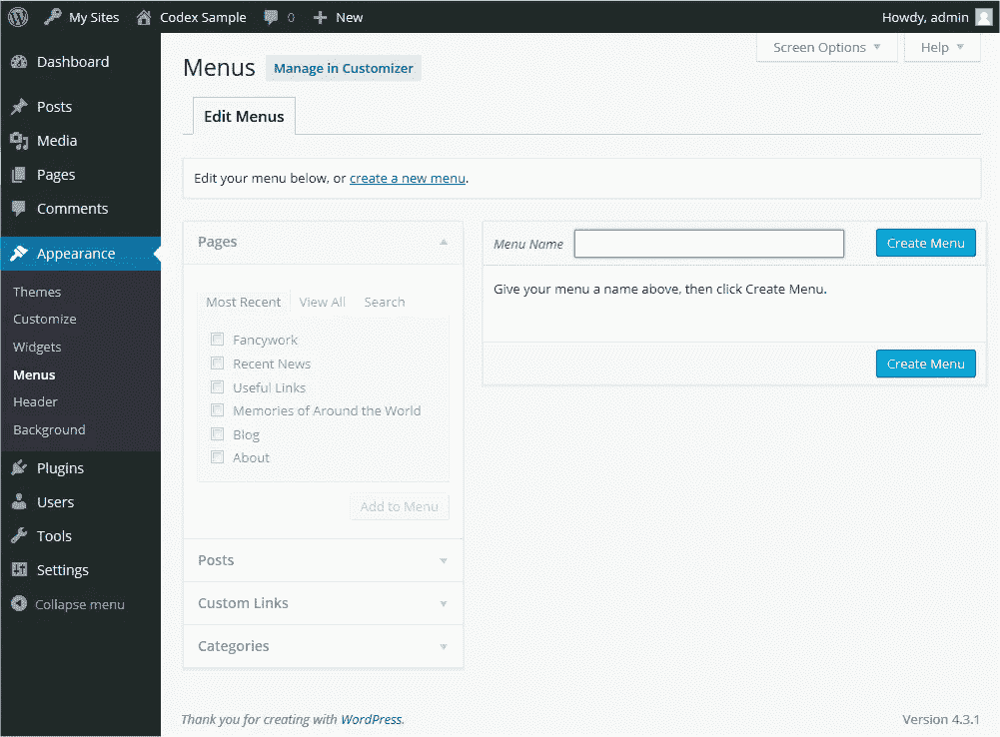
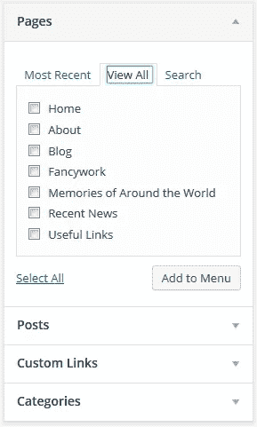
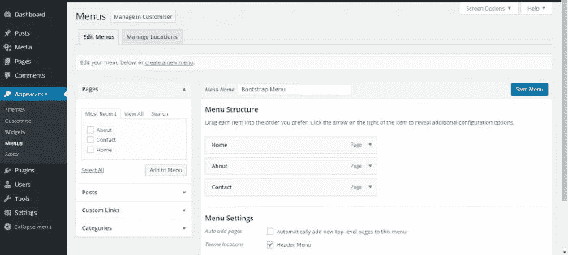
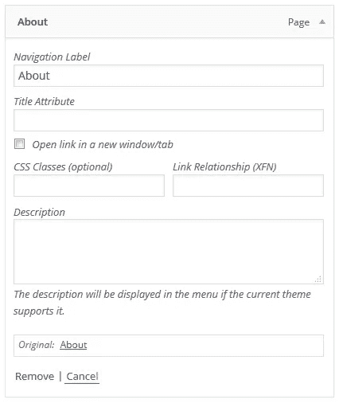
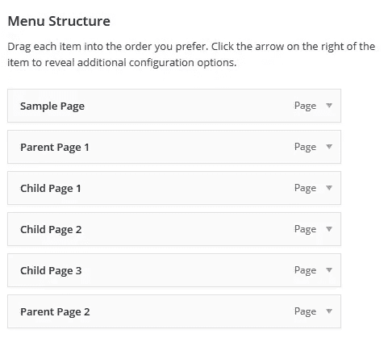
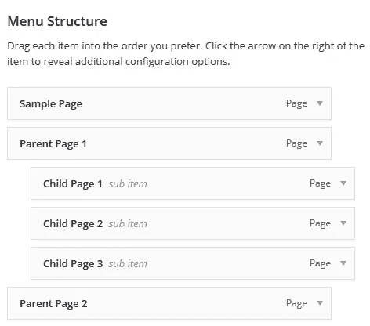
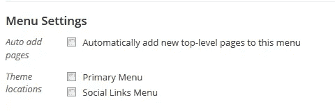

# WordPress 菜单构建指南

> 原文：<https://medium.com/visualmodo/wordpress-menu-building-guide-5d8ae6848965?source=collection_archive---------0----------------------->

这份 WordPress 菜单系统指南涵盖了用户在使用内置菜单编辑器在你的网站上设置菜单时可能执行的基本任务。

> WordPress 主题为这个原生的 WordPress 工具增加了特殊的、高级的菜单布局和定制功能。

# 定义一个 WordPress 菜单

在添加项目之前，你必须定义一个 WordPress 菜单。

1.  登录 WordPress 仪表盘。
2.  从仪表板左侧的“外观”菜单中，选择“菜单”选项，调出菜单编辑器。
3.  选择页面顶部的**创建新菜单**
4.  在菜单名称框中输入新菜单的名称
5.  点击**创建菜单**按钮。

现在已经定义了新的自定义菜单。

# 向菜单添加项目

您可以将不同的链接类型添加到菜单中，这些链接类型会在您当前正在编辑的菜单左侧的窗格之间拆分。

1.  找到标题为**页面**的窗格。
2.  在此窗格中，选择*查看所有*链接，显示您站点上所有当前发布的页面列表。
3.  通过单击每个页面标题旁边的复选框来选择要添加的页面。
4.  单击位于该窗格底部的**添加到菜单**按钮，将您的选择添加到您在上一步中创建的菜单中。
5.  添加完所有想要的菜单项后，点击**保存菜单**按钮。

您的自定义菜单现已保存。

**注**[屏幕选项](https://codex.wordpress.org/Administration_Screens#Screen_Options)允许您选择可用于添加到菜单的项目。某些项目，如**标签**在默认情况下是隐藏的。

# 删除菜单项

1.  在菜单编辑器窗口中找到要删除的菜单项
2.  单击菜单项/菜单项框右上角的箭头图标将其展开。
3.  点击*移除*链接。菜单项/框将立即被删除。
4.  点击**保存菜单**按钮保存您的更改。

# 自定义菜单项

导航标签该域指定自定义菜单上项目的标题。这是你的访问者在访问你的站点/博客时会看到的。原始链接指向菜单项的原始来源(例如，查看文章或页面的链接)。

默认情况下，以下项目是隐藏的。使用[屏幕选项](https://codex.wordpress.org/Administration_Screens#Screen_Options)显示必填字段。

标题属性该字段指定菜单项的替换(“Alt”)文本。当用户的鼠标悬停在菜单项上时，将显示此文本。链接目标从下拉列表中选择“同一窗口或标签”或“新窗口或标签”。CSS 类此菜单项的可选 CSS 类链接关系(XFN)允许自动生成 XFN 属性，以便您可以显示您与所链接网站的作者/所有者的关系。详见[链接关系](https://codex.wordpress.org/Links_Add_New_Screen#Link_Relationship_.28XFN.29_Link_Relationship)。描述此链接的描述。如果当前主题支持，描述将显示在菜单中。

1.  单击菜单项右上角的箭头将其展开。
2.  为要分配给项目的必填字段输入值。
3.  点击**保存菜单**按钮保存您的更改。

# 创建多级菜单

规划菜单的结构时，将每个菜单项想象成正式报告文档中的一个标题会有所帮助。在正式报告中，主要部分的标题(一级标题)离页面左侧最近；小节标题(二级标题)稍微向右缩进；同一节中的任何其他下级标题(3 级、4 级等)将进一步向右缩进。

WordPress 菜单编辑器允许你使用简单的“拖放”界面创建多级菜单。上下拖动菜单项以更改它们在菜单中的显示顺序。向左或向右拖动菜单项，以便在菜单中创建子级。

要使一个菜单项成为另一个菜单项的下属，您需要将“子”放在其“父”的下面，然后稍微向右拖动它。

1.  将鼠标放在“子”菜单项上。
2.  按住鼠标左键，向右拖动。
3.  释放鼠标按钮。
4.  对每个子菜单项重复这些步骤。
5.  点击菜单编辑器中的**保存菜单**按钮保存您的更改。

# 将菜单添加到您的网站

如果你当前的主题支持自定义菜单，你可以将新菜单添加到**主题位置**之一。

1.  滚动到菜单编辑器窗口的底部。
2.  在标题为*主题位置*的部分，点击您希望菜单出现的位置的复选框。
3.  做出选择后，点击**保存菜单**。

如果您当前的主题不支持自定义菜单，您需要通过[外观部件屏幕](https://codex.wordpress.org/Appearance_Widgets_Screen)中的自定义菜单部件添加新菜单。

恭喜你！您的新自定义菜单现已添加到您的网站中。