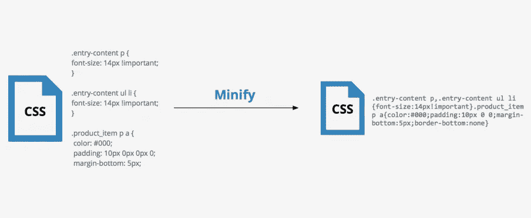
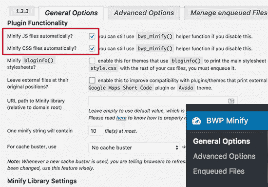
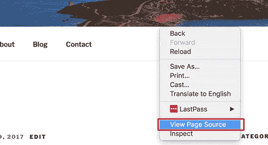

# 缩小 CSS / JavaScript 文件

> 原文：<https://medium.com/visualmodo/wordpress-minify-css-javascript-files-564b0dfaec15?source=collection_archive---------0----------------------->

你想缩小你的 WordPress 网站上的文件吗？缩小你的 WordPress CSS 和 Javascript 文件可以让它们加载得更快，并加速你的 WordPress 站点。在本指南中，我们将向你展示如何在 WordPress 中缩小 CSS/Javascript 文件以提高性能和速度。

# 什么是 Minify，什么时候需要？

术语“缩小”是用来描述一种使你的网站文件变小的方法。它通过从源代码中删除空白、行和不必要的字符来实现这个目标。

通常建议仅用于发送到用户浏览器的文件。这包括 HTML、CSS 和 JavaScript 文件。您也可以缩小 PHP 文件，但 PHP 是一种服务器端编程语言，缩小它不会提高用户的页面加载速度。

[caption id = " attachment _ 53745 " align = " align center " width = " 904 "]

什么是 Minify，什么时候需要？[/标题]

缩小文件的明显优势是提高了 WordPress 的速度和性能。压缩文件加载更快，并提高您的网站的速度。

然而，一些专家认为，对大多数网站来说，性能改善非常小，不值得这么麻烦。缩小只是减少了大多数 WordPress 网站上几千字节的数据。你可以通过简单地优化网页图片来减少更多的页面加载时间。

下面是一个普通 CSS 代码的例子:

> *正文{
> 边距:20px
> 填充:20px
> 颜色:# 333333；
> 背景:# f7f7f7
> }
> h1 {
> font-size:32px；
> 颜色# 222222；
> 边距-底部:10px
> }*

缩小代码后，它将如下所示:

> *正文{ margin:20px；填充:20px 颜色:# 333；背景:# f7f 7 f 7 } h1 { font-size:32px；下边距:10px}*

如果你试图在 Google Pagespeed 或 GTMetrix 工具上达到 100/100 的分数，那么缩小 CSS 和 JavaScript 将显著提高你的分数。

说到这里，让我们来看看如何在你的 WordPress 站点上轻松地缩小 CSS/JavaScript。

## 在 WordPress 中缩小 CSS/Javascript

你需要做的第一件事是安装并激活 [Better WordPress Minify](https://wordpress.org/plugins/tags/minify/) 插件。更多细节，请看我们博客上的逐步指南。

激活后，插件会在你的 WordPress 管理栏中添加一个新的菜单项，名为“BWP 迷你”。点击它会带你到插件的设置页面。

[caption id = " attachment _ 53743 " align = " align center " width = " 550 "]

迷你 CSS JavaScript 文件[/caption]

在设置页面，你需要检查前两个选项来自动缩小你的 WordPress 站点上的 JavaScript 和 CSS 文件。

现在，您可以单击“保存更改”按钮来保存您的设置。

此页面上还有许多其他高级选项。默认设置适用于大多数网站，但您可以根据具体情况查看和更改这些选项。

接下来，你需要去你的网站。右键单击任意位置，然后从浏览器菜单中选择“查看页面源”。

[caption id = " attachment _ 53744 " align = " align center " width = " 550 "]

迷你 CSS JavaScript 文件[/caption]

现在你会看到由你的 WordPress 站点生成的 HTML 源代码。如果你仔细观察，你会注意到这个插件会从插件自己的文件夹中加载 CSS/JavaScript 文件，而不是你的 WordPress 主题和插件。

这些是原始 CSS 和 JavaScript 文件的缩小版本。更好的 WordPress Minify 插件会将它们缓存起来，并为浏览器提供缩小版。

就这些，我们希望这篇文章能帮助你学会如何缩小你的 WordPress 站点。你可能也想看看我们关于如何加速 WordPress 初学者的终极指南。