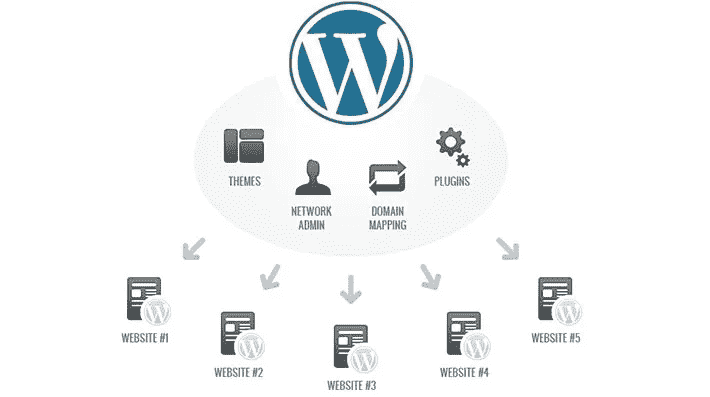

# 多站点解释

> 原文：<https://medium.com/visualmodo/wordpress-multisite-explained-3664024e4dba?source=collection_archive---------0----------------------->

Multisite 是 WordPress 的一个特性，它允许用户在一个 WordPress 安装上创建一个站点网络。从 WordPress 版本 3.0 开始可用，Multisite 是 WPMU 或 WordPress 多用户项目的延续。

WordPress 最容易被误解的特性之一是多站点。网站所有者被它所吸引，因为它承诺使管理多个 WordPress 网站变得更加容易。他们往往意识不到这种好处是以灵活性为代价的，直到为时已晚。在某些用例中，多站点非常有用，而在其他用例中，它会导致管理的复杂性。在您决定使用多站点之前，了解什么是多站点以及它旨在解决什么问题是很重要的。

# 什么是 WordPress Multisite？

WordPress Multisite 是 WordPress 的一个版本，它允许你在一个 WordPress 安装上运行多个站点。它使得在一个 WordPress 仪表盘下运行一个网站网络成为可能。

您可以管理一切，包括网站数量、功能、主题和用户角色。用这种方式管理数百、数千甚至数百万个站点是可能的。WordPress Multisite 最好的例子是 WordPress.com，互联网上最大的 WordPress 网络之一。

WordPress Multisite 最初是 WordPress 的一个分支，旨在让网站所有者在一个网络下轻松管理多个博客网站。这个项目最终在 WordPress 3.0 发布时被添加到了 WordPress Core 中。这意味着你现在使用的任何 WordPress 当前版本都可以转换成多站点安装。

# 在以下情况下使用它:

当你建立一个共享相似功能的网站网络时，WordPress Multisite 是最好的选择。理想情况下，这种类似的功能是通过插件、定制应用程序或特定的服务器配置添加的。与允许网络成员上传他们自己的定制主题相比，当它使用有限数量的主题[时，它的效果最好。](https://visualmodo.com/)

如果你的网络由插件、主题和定制方面差异很大的 WordPress 站点组成，那么 Multisite 并不适合你。

到目前为止，WordPress.com 是多站点网络的最大范例。其他在 Multisite 上取得成功的网站所有者通常都有一个共同的主题，将他们的网站网络联系在一起，并提供相似的功能和主题。大学就是一个例子。

他们中的许多人使用多网站为他们的员工提供一种发布内部博客的方式。房地产公司是另一个很好的例子。他们使用 WordPress Multisites 作为一种简单的方式为他们的房地产经纪人提供一个基本的网站。这些网站的设计是相同的，只有内容是不同的房地产经纪人。

# 不要使用如果:

WordPress 多站点出现的时候，还没有很多好的选择来管理多个非常不同的 WordPress 站点。幸运的是，现在有很多很好的选择来帮助解决这个需求。因此，如果你发现自己管理着许多不同的 WordPress 网站，你应该研究一下管理插件，比如 [Jetpack](https://wordpress.org/plugins/jetpack/) 和 [ManageWP](https://managewp.com/) 。

这些可以让你运行不同的 WordPress 实例，并通过一个直观的仪表板集中管理它们。您通常可以使用它们来监控站点的当前状态，在所有站点上全局应用更新，以及执行其他常规维护功能，如备份。

# 多站点最佳实践

因此，如果你发现你是一个优秀的多站点候选人(例如，你需要为大量用户提供类似的 WordPress 网站)，有几个最佳实践你应该遵循以确保成功。

首先，我们建议你和 WordPress 顾问一起工作，他是扩展 WordPress 多站点的专家。如果多站点网络增长，你需要留意你的站点使用的服务器资源的数量，以及你的数据库的维护。只要你积极主动，这是完全可以管理的，而且它有助于与能够指导你发展多站点的专家合作。

对于 WordPress Multisite 来说，使用一个已经支持 Multisite 各种功能的真正好的主机提供商也很重要。例如，在 Pressable，我们托管了相当多的大型多站点网络，并开发了技术和程序来确保我们的多站点部署平稳高效地运行。

在托管多站点部署方面拥有良好记录的[托管](https://www.bluehost.com/track/claudiocamposp)提供商将极大地增加您的项目持续成功的可能性。

我们希望这些信息能让您更容易确定 Multisite 是否适合您。如果我们可以帮助回答您的任何其他问题，请随时添加评论或联系我们。