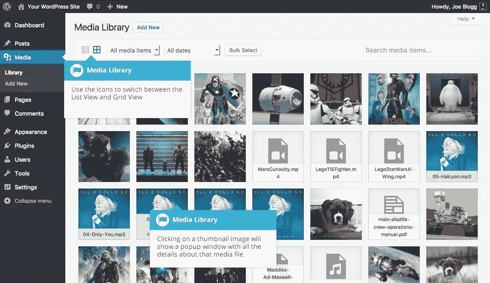

# WordPress 多站点媒体共享

> 原文：<https://medium.com/visualmodo/wordpress-multisite-media-sharing-6da8bd6ca46a?source=collection_archive---------0----------------------->

如果你使用 multisite 来发布多个站点，那么在你的站点间重用媒体就意味着插入一个 URL 或者加载图片两次。很难令人满意。在这篇 WordPress 指南中，我们将看看如何在你的站点上共享图像、视频和音频，通过共享多站点媒体为你节省大量的时间、麻烦和磁盘空间。

# WordPress 多站点媒体共享网络

当您建立一个多站点网络时，您可以使用一个集中的仪表板来管理多个网站。在某些情况下，多站点设置甚至可以让你在你的网络站点之间共享资源，比如[主题](https://visualmodo.com/)。

但是，网络上的每个站点仍然有自己的媒体库。如果您计划在多个站点之间重复使用图像，这可能会很麻烦。如果是这样的话，你需要一遍又一遍地上传它们，并且不断地从一个仪表板跳到下一个仪表板。

拥有一个所有站点都可以访问的中央媒体库可以解决这些问题。虽然这是一个小众功能，但它对多站点所有者组织他们的媒体文件非常有帮助。另外，它非常酷，这也是我们想向您展示它是如何工作的原因之一。

# 多站点媒体库插件

[网络媒体库](https://github.com/johnbillion/network-media-library)是一个插件，你可以用它来创建一个跨多个站点的共享库。它的工作原理是将你的网络中的一个站点指定为“中央图书馆”。该网站仍将照常运行，除了您上传到该网站的任何文件也可以被网络中的其他网站使用。

该插件也是即插即用的(原谅双关语),所以很容易测试。我们还应该提到，虽然该插件目前只在 GitHub 上可用，但我们可以直接告诉你，它和你在 WordPress.org 上找到的一样好。

**主要特点:**

*   为您的多站点媒体设置创建一个网络库。
*   在您的网络中指定一个站点作为中央媒体库。
*   易于安装和使用。

# 如何为 WordPress Multisite 创建一个网络图书馆(3 步)

正如我们前面提到的，我们将要使用的插件设置起来很简单。我们现在将带你完成从 GitHub 安装插件的过程，然后测试它是否正常工作。

# 网络媒体库插件

从 GitHub 下载插件几乎和从 WordPress.org 库下载插件一样。首先，进入[插件的 GitHub 库](https://github.com/johnbillion/network-media-library)，在屏幕右上角寻找*克隆或下载*按钮。点击它并选择*下载 ZIP* 选项:

您现在可以打开您的多站点仪表板并导航至*插件>添加新的*选项卡。选择*上传插件*选项，添加你一分钟前下载的 *zip* 文件:很简单，对吧？现在，记住激活你网络的插件，然后进入第二步。

# 上传媒体文件

您可能知道，您的多站点仪表板不包括图库选项卡。为了解决这个问题，插件会指定你的一个网站作为中央图书馆。默认情况下，插件会选择 ID 号为 2 的站点。

在大多数情况下，ID 号 2 应该对应于您在建立网络后创建的第一个站点。对于我们的测试，我们建立了一个虚拟的多站点网络(使用飞轮本地)并添加了几个站点。下图中，*网站一*对应的是 ID 号二:

您也可以通过点击任意站点的*编辑*选项来检查您站点的 ID，这将打开它们各自的设置。如果你看一下那个页面的 URL，你会在它的末尾看到一个 ID 号:

这样一来，导航到您将用作中央[图库](https://visualmodo.com/wordpress-themes/)的站点的仪表板。一旦你进入，进入它的*媒体*标签，上传任何你想测试插件是否工作的图片。如果你有一张小狗的照片，我们建议用那张:

一旦你的照片被上传，继续访问你的网络内的任何其他网站的仪表板，并打开它的媒体库。您现在应该会看到您的测试图像出现在这里。如果你像我们一样好奇，你可能想知道如果你上传一张图片到二号网站的媒体库会发生什么。我们尝试了一下:

在检查了第一个站点的媒体库之后，我们可以确认第二个图像也出现在每个站点的库中。这里的要点是，一旦你安装了插件，所有连接的网站的媒体库将被同步。但是，您的多站点网络将仅在您的中央库中存储这些图像的单个副本。

# 上传文件的一份副本

为了测试插件是否正常工作，我们决定深入我们的多站点网络目录。这意味着我们进入我们的多站点*根*文件夹，然后进入 *wp-content/uploads* 目录。正如您在下面看到的，里面有两个文件夹，分别对应我们测试网络中的一个网站:

因为我们使用本地设置，所以我们使用 Windows Explorer 而不是[文件传输协议(FTP)](https://codex.wordpress.org/Using_FileZilla) 来运行我们的测试。除此之外，我们检查了第二个网站的上传文件夹，发现它是空的:然而，下面是我们在检查第一个网站的媒体文件夹时发现的内容:

如果你还记得的话，我们把你在左边看到的第一张图片上传到了第二个网站。然后插件把它移到了第一个站点，并给第二个站点提供了访问中央图书馆的权限。

正如你所看到的，该插件完全按照预期工作，它不会为你的任何图像创建额外的副本。因此，你可以上传尽可能多的小狗照片！

# 最后的话

当你管理多个网站时，效率是关键。为您的网站使用集中式媒体库可以帮助您节省时间，并避免一次又一次地上传文件。为 WordPress 创建(和测试)一个网络库只需要三个步骤:安装多站点媒体库插件。通过将媒体文件上传到多站点网络来测试插件。检查您上传的文件是否只有一份副本。