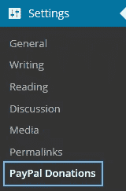
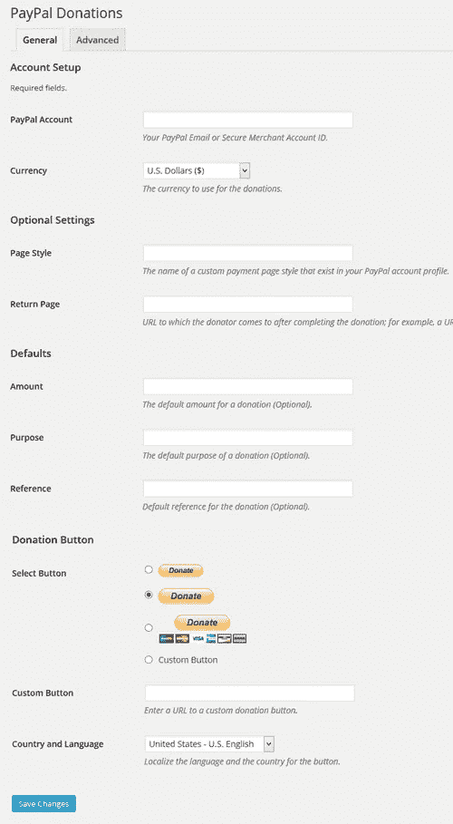
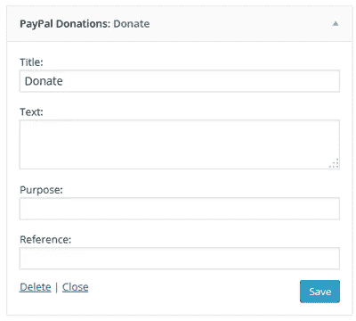

# WordPress PayPal 捐赠按钮

> 原文：<https://medium.com/visualmodo/wordpress-paypal-donations-buttons-ed7dee189419?source=collection_archive---------8----------------------->

添加一个 WordPress PayPal 捐赠侧边栏小部件和短代码，以一种简单的方式添加到页面和帖子上。“选项”菜单允许您设置 PayPal ID 和其他一些可选设置。您可以选择要使用哪个 PayPal 捐款按钮，或者是否要使用自己的按钮。您还可以设置一个可选的默认用途和引用，可以使用小部件和短代码选项在每个插入的实例上覆盖它。还有货币，自定义支付页面样式和返回页面的设置。

# PayPal 捐赠小工具插件安装

*   在你的 WordPress 管理区进入**添加新的**插件页面
*   点击 [**上传**](https://wordpress.org/plugins/paypal-donations/) 标签页
*   浏览插件文件(paypal-contributions . zip)
*   点击**立即安装**，然后**激活**插件

# 插件使用

安装并激活插件后，从 WordPress dashboard 设置菜单进入“paypal 捐赠”菜单链接:



# 管理页面配置

您需要从插件的管理界面输入捐款和您的 PayPal 帐户的一些详细信息:



## PayPal 帐户

您的 PayPal 电子邮件或安全商家帐户 ID。捐款将直接汇入这个贝宝账户。

## 货币

选择捐赠的货币。

## 页面样式(可选)

到达 PayPal 付款页面时与捐赠按钮关联的自定义页面样式。

登录 PayPal ->个人资料->销售偏好->自定义付款页面，设计您自己的页面风格。

*注:*部分 PayPal 账户有此选项，位于此处:
我的账户- >个人资料- >我的销售工具- >在线销售- >自定义支付页面。

## 返回页面(可选)

用户在完成支付后将返回的 URL。例如，在你的网站上有一个“感谢你的捐赠”页面的 URL。

## 金额(可选)

设置插件使用的默认数量。仅使用数字，如 9.95 或 20，不带任何货币符号。

## 目的(可选)

您可以在此输入捐赠的默认目的。通过在短代码中使用 purpose= " "参数，可以在插入特定按钮时覆盖此目的。如果没有定义目的，用户将有可能在 PayPal 的支付页面上输入目的。

## 参考(可选)

您可以在此输入捐赠的默认参考。在插入特定按钮时，可以通过使用 shortcode 中的 reference= " "参数来覆盖此引用。

## 选择按钮

在这里你可以选择 PayPals 的三个默认按钮，或者输入一个你自己的自定义按钮的 URL 来代替。本部分的最后一个选项是语言和国家。它让你本地化的按钮图形，以使用任何贝宝的可用按钮与翻译按钮图形。当使用带有信用卡符号的按钮时，通过选择您的目标国家，它们将被调整为适合所选国家的符号。

## 临时演员

*   *禁用 PayPal 统计数据*启用此项不加载 PayPal 用于统计的隐藏图像。建议加载统计图像，但出于速度考虑，可以使用此选项关闭它。
*   *主题 CSS 覆盖:居中按钮*如果你使用的主题不将表单按钮居中，但是你希望捐赠按钮居中，启用这个选项将其居中。
*   *设置结账语言*启用此选项可覆盖捐款人可能在浏览器中设置的任何潜在 PayPal 语言 cookie，并控制第一个 PayPal 结账页面使用的语言。

# 捐款侧边栏小部件

从您的管理仪表板进入**外观**->-**小部件**菜单，将捐赠小部件添加到您的侧边栏。您可以为小部件输入一些可选设置。

*   出现在小部件上的标题(默认为捐赠)
*   出现在按钮上方的描述性文本(它会在显示时自动在其周围添加)。
*   目的以覆盖默认目的。
*   引用以覆盖默认引用。



# 捐赠小部件短代码

你也可以使用一个短代码来添加捐赠部件到 WordPress 文章或页面。

用下面的短代码在你的页面或文章中插入按钮:

[paypal-捐赠]

这是最简单的选项，使用所有默认和可选设置。如果你想为一个特定的目的制作一个特定的按钮，你可以在短代码中添加以下参数。这里有一个例子:

[paypal-捐赠目的= " Spline Importer " reference = " LW3D Plugins "]

短代码的可用参数:目的、引用、金额、return_page 和 button_url。

> 所有的 [Visualmodo WordPress 主题](https://visualmodo.com/wordpress-themes/)都已经过测试，并且与捐赠插件和系统完全兼容。

# 使用你的主题模板文件中的捐赠部件

在你的主题模板文件中使用下面的 PHP 代码:

```
<?php echo do_shortcode('[paypal-donation]'); ?>
```

或以下内容(如果您想要使用自定义参数):

```
<?php echo do_shortcode('[paypal-donation purpose="Donation Purpose" reference="Sample Reference"]'); ?>
```

# 过滤器和挂钩

以下过滤器可用于挂接插件:

*   **paypal _ announcements _ amount**在生成按钮之前过滤预定义的金额。
*   **paypal _ 捐赠 _url** 过滤表单指向的 url。有用的改变到贝宝沙盒网址测试按钮。
*   **paypal _ contributions _ purpose _ html**为目的过滤默认隐藏表单输入元素。

# 示例代码

```
function change_donation_amount( $amount ) {
// Do something
return $amount;
}
add_filter('paypal_donations_amount', 'change_donation_amount', 10, 1);function change_paypal_url( $url ) {
// Do something
return $url;
}
add_filter('paypal_donations_url', 'change_paypal_url', 10, 1);// Add a drop down menu for donation purposes
function paypal_purpose( $purpose ) {
return '
<select name="item_name">
<option value="Donation Purpose 1">Donation Purpose 1</option>
<option value="Donation Purpose 2">Donation Purpose 2</option>
</select>
';
}
add_filter( 'paypal_donations_purpose_html', 'paypal_purpose' );
```