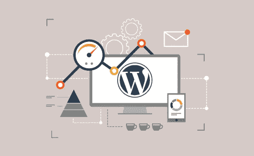
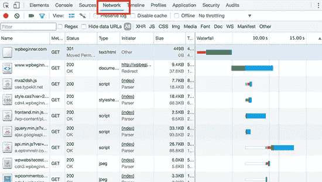
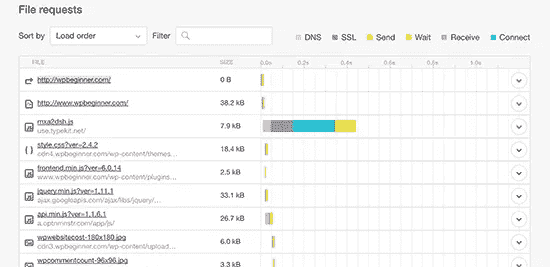
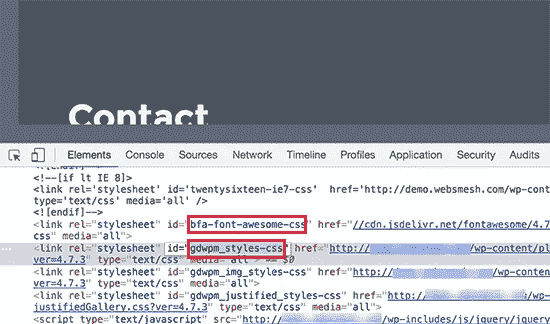
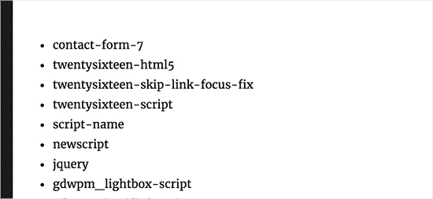

# WordPress 插件影响网站加载时间？

> 原文：<https://medium.com/visualmodo/wordpress-plugins-affect-site-load-time-c8a5c6fb3bf5?source=collection_archive---------0----------------------->

你有没有想过 WordPress 插件是如何影响网站加载时间的？WordPress 插件允许你给你的网站添加功能，但是它们也会影响你的网站速度。在这篇文章中，我们将向你展示 WordPress 插件如何影响你网站的加载时间，以及你如何更有效地控制它们。

## WordPress 插件如何工作？

WordPress 插件就像你的 WordPress 网站的应用程序。你可以安装它们来为你的网站添加更多的功能，比如[联系表格](https://wordpress.org/plugins/contact-form-7/)，照片库，或者电子商务商店。

当有人访问你的网站时，WordPress 首先加载其核心文件，然后加载你所有的活动插件。

## 插件如何影响网站加载时间？

每个 WordPress 插件提供不同的功能和特性。为了做到这一点，一些插件在后端进行数据库调用，而另一些插件在前端加载资产，如 CSS 样式表、JavaScript 文件、图像等。

进行数据库查询和加载资产会增加站点的加载时间。大多数插件发出 HTTP 请求来加载脚本、CSS 和图像等资源。每个请求都会增加网站的页面加载时间。

如果处理得当，性能影响通常不会太明显。

然而，如果你正在使用多个插件，这些插件发出太多的 http 请求来加载文件和资源，那么它将会影响你的站点的性能和用户体验。

## 如何检查 WordPress 插件加载的文件？

要了解插件如何影响你的页面加载时间，你需要检查 WordPress 插件加载的文件。

有很多工具可以用来解决这个问题。

你可以使用浏览器的开发者工具(谷歌 Chrome 中的 Inspect 和火狐中的 Inspect Element)。

只需访问您的网站，右键单击选择检查。这将打开开发者工具面板。

您需要点击“网络”标签，然后重新加载您的网站。当页面重新加载时，您将能够看到浏览器是如何加载每个文件的。

您也可以使用第三方工具，如 Pingdom 和 GTmetrix 来查看这一点。除了其他有用的信息之外，这些工具还会向您显示所有已加载的文件以及加载它们所花费的时间。

## 多少插件才算多？

当你看到这些文件被加载时，你可能会开始想，我应该在我的网站上使用多少插件？多少插件才算多？

答案取决于你在网站上使用的插件。

一个坏的插件可以加载 12 个文件，而多个好的插件只会增加几个额外的文件。

所有良好编码的插件都试图将它们加载的文件保持在最小。然而，并不是所有的插件开发者都那么小心。一些插件会在每次页面加载时加载文件，即使它们并不需要这些文件。

如果你使用了太多这样的插件，那么这将开始影响你的网站的性能。

## 如何控制插件？

在你的 WordPress 网站上，你能做的最重要的事情就是只使用那些编码良好、评论良好、并且被可靠来源推荐的插件。

看看我们的指南，如何找到哪些 WordPress 插件。

如果你发现一个 WordPress 插件影响了你网站的负载，那么寻找一个更好的插件，做同样的工作，但是更好。

接下来，你需要开始使用缓存和 CDN 来进一步提高你的网站的性能和速度。

另一个你应该考虑的因素是你的网站托管。如果你的主机服务器没有得到适当的优化，那么它将增加你的网站的响应时间。

这意味着不仅仅是插件，你网站的整体性能都会变慢。确保你使用的是最好的 WordPress 托管公司之一。

作为最后的手段，你可以卸载那些你可以不用的插件。仔细检查你的网站上安装的插件，看看你是否可以卸载其中的一些。这不是一个理想的解决方案，因为你将不得不在速度特性上做出妥协。

## 手动优化 WordPress 插件资产

高级 WordPress 用户可以尝试管理 WordPress 插件如何在他们的网站上加载文件。这样做需要一些编码知识和一些调试技能。

在 WordPress 中加载脚本和样式表的正确方法是使用`wp_enqueue_style`和`wp_enqueue_script`函数。

大多数 WordPress 插件开发者用它们来加载插件文件。WordPress 也提供了简单的功能来注销那些脚本和样式表。

然而，如果你只是禁止加载那些脚本和样式表，那么这会破坏你的插件，它们将不能正常工作。要解决这个问题，您需要将这些样式和脚本复制并粘贴到主题的样式表和 JavaScript 文件中。

通过这种方式，您可以一次加载所有的页面，最大限度地减少 http 请求，有效地减少页面加载时间。

让我们看看如何轻松地在 WordPress 中取消注册样式表和 JavaScript 文件。

## 禁用 WordPress 中的插件样式表

首先，您需要找到想要取消注册的样式表的名称或句柄。您可以使用浏览器的检查工具找到它。

找到样式表句柄后，可以通过将这段代码添加到主题的 functions.php 文件或特定于站点的插件中来取消它的注册。

`add_action( 'wp_print_styles', 'my_deregister_styles', 100 );`

`function` `my_deregister_styles() {`

`wp_deregister_style( 'gdwpm_styles-css'` `);`

`}`

您可以在此函数中取消注册任意数量的样式句柄。例如，如果您有多个插件需要注销样式表，那么您可以这样做:

`add_action( 'wp_print_styles', 'my_deregister_styles', 100 );`

`function` `my_deregister_styles() {`

`wp_deregister_style( 'gdwpm_styles-css'` `);`

`wp_deregister_style( 'bfa-font-awesome-css'` `);`

`wp_deregister_style( 'some-other-stylesheet-handle'` `);`

`}`

请记住，取消注册这些样式表会影响您网站上的插件功能。你需要复制你注销的每一个样式表的内容，并粘贴到你的 WordPress 主题的样式表中，或者作为自定义 CSS 添加。

## 禁用 WordPress 中的插件 JavaScripts

就像样式表一样，您需要找到 JavaScript 文件用来注销它们的句柄。但是，使用检查工具将找不到控制柄。

为此，你需要深入挖掘插件文件，找出插件用来加载脚本的句柄。

找出插件使用的所有句柄的另一种方法是将这些代码添加到你的主题的 functions.php 文件中。

`function`

`$wp_scripts`

`$handlename`

`foreach( $wp_scripts->queue as` `$handle` `) :`

`$handlename` `.= '<li>'` `. $handle` `.'</li>';`

`endforeach;`

`$handlename`

`return` `$handlename;`

`}`

`add_shortcode( 'pluginhandles', 'wpb_display_pluginhandles');`

添加这段代码后，您可以使用`[pluginhandles]` shortcode 来显示插件脚本句柄列表。

现在您已经有了脚本句柄，您可以使用下面的代码轻松地取消它们的注册:

`add_action( 'wp_print_scripts', 'my_deregister_javascript', 100 );`

`function` `my_deregister_javascript() {`

`wp_deregister_script( 'contact-form-7'` `);`

`}`

您还可以使用此代码禁用多个脚本，如下所示:

`add_action( 'wp_print_scripts', 'my_deregister_javascript', 100 );`

`function` `my_deregister_javascript() {`

`wp_deregister_script( 'contact-form-7'` `);`

`wp_deregister_script( 'gdwpm_lightbox-script'` `);`

`wp_deregister_script( 'another-plugin-script'` `);`

`}`

现在，正如我们之前提到的，禁用这些脚本会阻止你的插件正常工作。

为了避免这种情况，你需要将 JavaScripts 结合在一起，但有时并不顺利，所以你必须知道你在做什么。你可以从反复试验中学习(就像我们很多人一样)，但是我们建议你不要在一个实时网站上这样做。

最好的测试地点是在本地 WordPress 安装上，或者在托管 WordPress 主机提供商的临时站点上。

## 仅在特定页面上加载脚本

如果你知道你将需要一个插件脚本来加载到你的网站的特定页面上，那么你可以在那个特定的页面上允许一个插件。

这样，脚本在站点的所有其他页面上都保持禁用状态，只在需要时才加载。

以下是如何在特定页面上加载脚本的方法。

`add_action( 'wp_print_scripts', 'my_deregister_javascript', 100 );`

`function`

`if` `( !is_page('Contact') ) {`

`wp_deregister_script( 'contact-form-7'` `);`

`}`

`}`

这段代码只是在除联系人页面之外的所有页面上禁用 contact-form-7 脚本。

来源:[https://visualmodo.com/](https://visualmodo.com/)