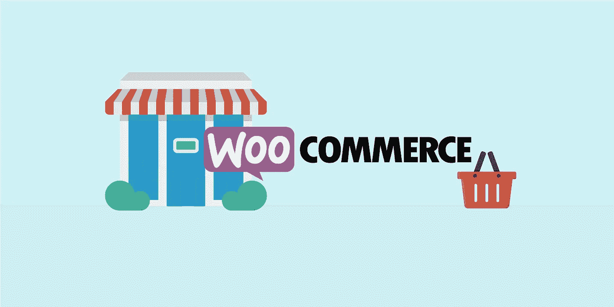
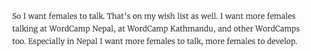
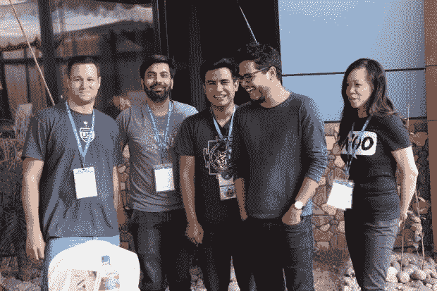
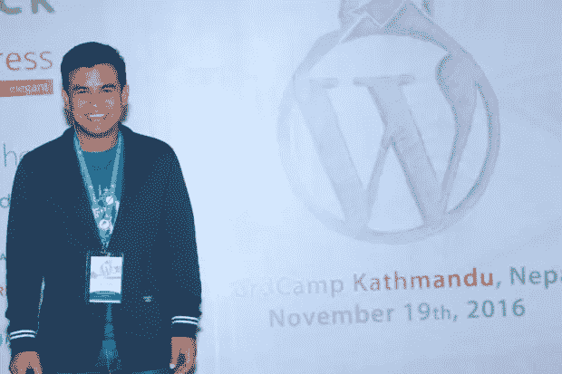

# WooCommerce 的 WordPress 功能

> 原文：<https://medium.com/visualmodo/wordpress-power-with-woocommerce-7abec9d6afaa?source=collection_archive---------0----------------------->

想象一下你住在一个大城市，但是 WordPress 几乎不为人知。有存在感的网站由政府运营，没有 WordPress 或 meetup 或创业文化，当你说你是一名计算机工程师时，人们会认为你是制作键盘的，现在看看 WooCommerce 真正的 WordPress 力量。

现在想象一下五年后的那个城市。通过博客和网站可以听到各种各样的声音，最近的 WordPress 吸引了 300 多名参与者，其在线 WordPress 社区拥有 5000 多名注册成员，每年至少有 10 家新的 WordPress 企业诞生，WooCommerce 帮助数十家企业在客厅和车库中起步。当每个人都说一项任务不可能完成时，转变就开始了。

这是加德满都和 Sakin Shrestha 的故事。

# 会见沙金

我第一次见到 Sakin 是因为名声，这是一个无名的声音，她的愿望与我在 2016 年承担的使命相匹配，即通过犹豫和紧张地成为一名女性演讲者，倡导更多的女性演讲者。

我的机器人同事 [Mahangu Weerasinghe](https://mahangu.blog/) 告诉我关于印度和中国之间的一个内陆国家和一个有需要的社区，并把我放在明年可能发言的联系人名单上。

那个电话是在仅仅两个月内打来的，三个月和三次飞行之后，我站在加德满都的 WordCamp 的舞台上谈论【WordPress 如何让我的 Dr e [ams 成为现实](http://wordpress.tv/2017/06/19/kat-christofer-how-wordpress-made-my-dreams-come-true/)。

从左至右:里奇·科利尔，拉夫·梅什拉姆，沙金，西达尔特·阿肖克，凯特。

在 WordCamp 前一天的午餐上，我和另一位演讲者 Rich Collier 聊天，我不知道是他的话最终把我带到了尼泊尔。

谦逊而低调，我也永远不会猜到他是七家基于 WordPress 的企业的所有者兼首席执行官，一家几乎所有尼泊尔公司都使用的定制 t 恤店的合伙人，一个真正的社区冠军。

他的性格让我想起了很多 Woo 的联合创始人 [Mag](http://jepson.no/) 和 [Mark](http://mark.blog/) ，所以当 Sakin 说:“当你和你的团队坐在一起时，真的会带来协同效应和很多积极的能量。”马克也在开普敦的 Woo 总部和我们坐在一起。

# WordPress 起源故事

Sakin 走了一条许多人走过的路，在国外完成学业并获得 MBA 学位，然后回国。在背景中潜伏着对网络的兴趣，这是他高中毕业前几年的兴趣，通过在空闲时间自学设计和编码来满足。

结合学术和个人兴趣，他申请了尼泊尔最大的科技公司的人力资源经理职位。

面对使用自定义编码和自定义框架的问题，Sakin 想用 WordPress 重做他们的公司网站。每个人都告诉他这是不可能的。

2007 年，Sakin 将不可能变为可能，然后“完全爱上了 WordPress”想要将他们所有的项目都转换到 WordPress，他的愿景和已建立的公司愿景发生了冲突。2010 年，他愉快地离开，创办了他的第一家公司 Catch Internet，专注于 WordPress，并通过让客户使用 [WordPress VIP](https://vip.wordpress.com/) 学习了很多关于编码标准的知识。

2011 年，在参加完墨尔本 WordPress 夏令营后受到启发，他在当地创办了第一个 WordPress meetup。然后在 2012 年，Sakin、Ujwal Thapa 和 Chandra Maharzan 组织了[尼泊尔世界夏令营](https://2012.nepal.wordcamp.org/)，130 人参加了一场座无虚席的活动，他称这是一次“改变人生”的经历。

WordPress 具有经济、社会和文化影响——推动它成为一个快速增长的行业，产生一个充满激情的社区，围绕这个社区创建了一个完整的生态系统，打破了典型的尼泊尔企业应该是什么样子的刻板印象。

# 他为什么喜欢网络商务

“WooCommerce 最棒的一点是它建立在 WordPress 之上，是的，它是开源的，我已经关注 WooThemes 很长时间了，我知道它会很棒。”

“界面很好，易于使用，文档很好，[很多扩展](https://woocommerce.com/extensions/)，大多数 WooCommerce 扩展开发者都来自 WordPress 社区，总是愿意提供帮助。”

“这就是我喜欢 woo commerce——社区的原因，”Sakin 说。“现在，我也喜欢你的衣服。你也激励我在尼泊尔制造更多的赃物。”在加德满都的 WordCamp，Catch Themes 有很棒的定制衬衫、Wapuu 别针和贴纸。

Sakin 于 2012 年开始使用 WooCommerce，Catch 认为这个电子商务插件帮助他以惊人的速度销售主题，并建立了他的主要业务。

他最喜欢的扩展是 WooCommerce Subscriptions，由他最喜欢的团队开发，他说，这是“帮助我的业务随着经常性支付而增长。”

在列举需要改进的地方时，他说，很难找到用于特定目的的最佳扩展，升级到 WooCommerce 的主要版本有时需要大量测试，否则可能不会顺利进行。与此同时，他很高兴优化调整，减少了对服务器资源的压力和最新的 3.1 特性。

在未来，他希望看到一个类似于 EDD 的面向数字产品的轻量级 WooCommerce，并且对不久的将来在 WordPress.com 出现托管版 WooCommerce 的前景感到非常兴奋。

# “他是一台机器”

Sakin 和机器押韵。我不止一次听到人们这样准确地描述他，所以他的[真实主题](https://wordpress.com/theme/verity)刚刚在 WordPress.com 上线也就不足为奇了，他还有三个业务正在酝酿中——两个是考虑到[古腾堡](https://wordpress.github.io/gutenberg/)的，一个是受到卖家最新版本[的启发，](https://visualmodo.com/theme/seller-ecommerce-wordpress-theme/)

他承认“通常是我想出这些疯狂的想法，但是我的队友帮助我实现了我们的梦想。我拥有最好、最支持我的团队，我对他们所有人都很满意。”

那些告诉 Sakin 不可能使用 WordPress 的人后来怎么样了？他的前老板对此印象深刻，以至于他成为了 WordPress 社区的盟友，并帮助组织了 WordPress Nepal。当然，其他人也紧随其后。🙂

*作者注*:如果你不认为一个人就能有所作为，改变生活，那你就错了。如果你认为你不能有所作为，那你就又错了。做点什么。今天就做。现在就做。

来源:[https://visualmodo.com/](https://visualmodo.com/)