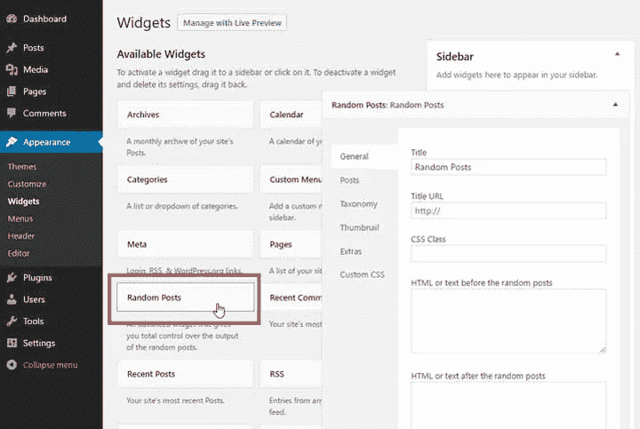
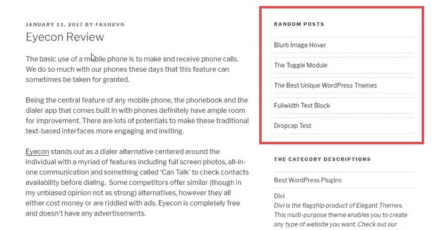

# 随机帖子指南

> 原文：<https://medium.com/visualmodo/wordpress-random-posts-guide-bdf20f6f119f?source=collection_archive---------0----------------------->

学习如何使用简单的方法在你的 WordPress 工具条中添加随机的文章，并且不需要本指南中要求的代码知识。

展示随机帖子可能是增加访客参与度的有效方法。你可以显示随机的帖子，让他们的访问时间更长，并以简单的方式帮助他们找到新的内容。

WordPress 没有任何显示随机帖子的内置功能。幸运的是，有一些变通办法可以在 WordPress 网站上显示随机的帖子。在今天的帖子中，我将分享两种方法来做到这一点


1.  显示带有插件的随机帖子
2.  手动显示随机帖子。

在我们深入研究这些方法之前，让我们花点时间讨论一下为什么应该显示随机帖子。

# 为什么显示随机帖子？

默认的 WordPress 设置会把你的最后一篇文章显示在第一个条目，依此类推。这就是所谓的逆向年表。WordPress 使用逆向年表来确保你的主页或博客页面总是显示最新的文章。

虽然这很好，但你也需要一种方式来突出你现有的帖子。做到这一点的一个方法是遵循一个可靠的内部链接策略。这将引导访问者到你的旧帖子，并帮助你获得更多的 SEO 好处。

利用现有帖子的另一个好方法是在侧边栏上显示随机的帖子。与内部链接相比，这将显示[文章](https://visualmodo.com/)的完整标题和其他元信息。这使得访问者更有可能对这些帖子感兴趣。

现在你知道了为什么显示随机帖子很重要，让我们看看如何做到这一点。

# #1.用插件显示随机帖子

有几个 WordPress 插件可以让你显示随机的帖子。在所有这些插件中，我特别喜欢[高级随机帖子插件](https://wordpress.org/plugins/advanced-random-posts-widget/)。该插件使得显示随机帖子变得非常简单。

正如你从名字中可以猜到的，这个插件将在你的网站上创建一个自定义的小部件。一旦你安装并激活了高级随机发布小工具，你会在**外观- >小工具**页面中找到这个小工具。



将小部件拖到您想要的位置。您会发现几个配置选项。这些使你能够定义标题，标题 URL，添加自定义 CSS 类或添加自定义 HTML 或文本之前或之后的随机职位。在“**文章**”部分，您可以选择要显示的文章数量、内容类型等等。

您可以在“**分类法**部分选择您想要的类别。也可以限制到特定的标签和分类法。其他可用选项包括显示缩略图、定义宽度、高度、缩略图对齐、显示摘录、日期等。还有一个单独的部分用于提供自定义 CSS。



# 手动显示随机帖子

在这个方法中，你必须添加一些代码到你的主题的 functions.php 文件中。你可以使用你的主机提供商提供的文件管理器，使用 FTP 客户端，或者通过 WordPress dashboard 来访问这个文件。

打开文件，并将以下代码添加到文件中

```
function wpdean_rand_posts() {
$args = array(
'post_type' => 'post',
'orderby'=> 'rand',
'posts_per_page' => 5,
);$the_query = new WP_Query( $args );
if ( $the_query->have_posts() ) {
$string .= '<ul>';while ( $the_query->have_posts() ) {
$the_query->the_post();
$string .= '<li><a href="'. get_permalink() .'">'. get_the_title() .'</a></li>';
}
$string .= '</ul>';
/* Restore original Post Data */
wp_reset_postdata();
} else {
$string .= 'no posts found';
}
return $string;
}add_shortcode('wpdean-random-posts','wpdean_rand_posts');
add_filter('widget_text', 'do_shortcode');
```

插入此代码会将以下短代码添加到您的主题中

```
[wpdean-random-posts]
```

您可以将这个短代码放在任何文本小部件中，并在任何启用了小部件的位置上显示五个随机帖子。如果你想显示更多或更少的文章，只需改变代码中' **posts_per_page** 的值。

## 轮到你了

在侧边栏上显示随机文章会让你的旧帖子重现生机。既然你知道最好的方法，选择这些方法中的任何一种，展示你现有的帖子。让我知道哪种方法适合你的要求。