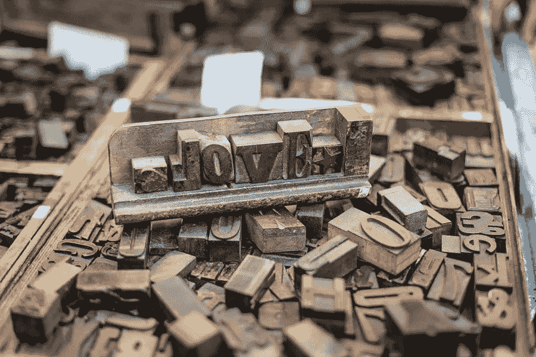

# WordPress 可重用模块指南

> 原文：<https://medium.com/visualmodo/wordpress-reusable-blocks-guide-b4d8d4fc2caa?source=collection_archive---------0----------------------->

在 WordPress 中创建一个可重用模块相对简单，在本指南中，我们将解释如何创建一个 WordPress 可重用模块以及使用它的最佳方式。在使用块编辑器编辑的任何帖子中。这在 WP 5.x 中是默认的，除非你使用的是经典编辑器插件。

所以，你可以做任何你想重复使用的积木。单击块的悬停设置中的三点下拉菜单，并选择添加到可重复使用的块。

# WordPress 可重用模块指南

WordPress 编辑器将提示你命名新的块，以便以后检索。最后，确保你给它起了一个令人难忘的名字，因为它将在你的网站上发挥作用。比如相关的文章或者博客文章的封面图片或者类似的描述。

如果在创建可重用块时出错。或者只是在创建它时犯了一个错误。您可以再次单击下拉设置，然后单击从可重用模块中删除。因此，此选项会从数据库中清除整个块，如果需要，可以重复上述过程将其重新添加到集合中。

此外，一旦块被保存，您可以简单地单击块本身来找到编辑按钮。对于本例中的段落块，该块为您提供了重命名它的选项。

然而，每个块的调整将是不同的。对于图像块，您可以获得额外的选项，如从媒体库中插入另一个文件或上传新文件，以及对齐或 [URL 链接](https://visualmodo.com/starting-a-podcast-for-free-with-anchor/)。

可重用图像选项:该过程适用于您创建的所有可重用块。但是请记住，以这种方式对可重用块所做的任何编辑都将应用于站点上该块的所有其他实例。所以如果你改变一个街区的图像，新的图像将会到处出现。

# WordPress 编辑器管理中的块

在使用可重用块一段时间后，您可能有一些不再使用的块或一些想要重命名的块。古腾堡编辑器可以让你轻松地从一个屏幕上管理你所有的可重复使用的块。

要管理您的块，请单击“添加块”按钮，然后找到“可重用”选项卡。您将看到一个管理可重用块页面的链接。管理可重用块链接。

最后，单击该链接会将您带到块管理页面。从这里，您可以编辑、删除、导出和导入您的块。

# 编辑/更新可重用块

将您的块添加到另一篇文章后，您还可以编辑您的可重用块。但是，请记住，更改可重用块将会更改它所在的所有位置。

此外，如果您想为一篇文章编辑一个可重用的块，您可以将它转换成一个常规的块。

为此，单击工具栏中的三点菜单，并选择“转换为常规块”选项。这将把可重用块转换成该帖子的常规块。

总之，您可以编辑这个块，而不会影响原始的可重用块和使用它的其他位置。