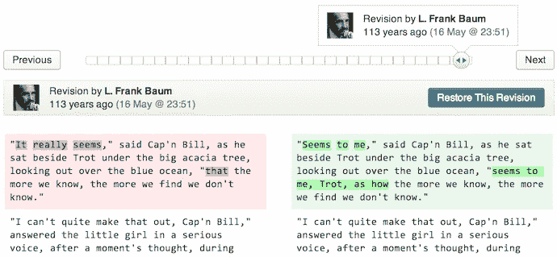
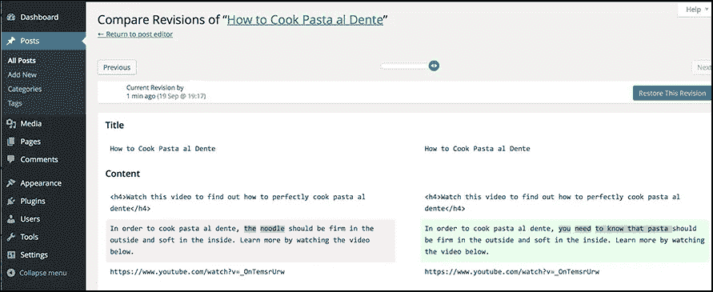

# WordPress 修订历史用法

> 原文：<https://medium.com/visualmodo/wordpress-revision-history-usage-3a052ee2cf55?source=collection_archive---------0----------------------->

WordPress revision 将保存你网站上每篇文章或每一页的最新版本，在这篇文章中，你可以看到如何利用这个非常有用的 WordPress 选项，以及它如何成为一个救星。

对于定期发布内容的人来说，WordPress 修订历史是一个方便的功能。作为一名作家，即使你是一名经验丰富的作家，在起草文章时也很容易犯错误。有时，你甚至可能删除了你的 WordPress 帖子的一部分，并希望你能把它找回来。然而，感谢 WordPress 的修订，你的修改不会永远丢失。

在这篇文章中，我们将解释 WordPress 修订历史功能的作用，你可以使用它的内容类型，并提供一些技巧来充分利用它。

# WordPress 修订历史

你知道 WordPress 会自动保存你对文章所做的所有修改吗？您可以随时撤销这些更改并返回到早期版本。这个特性叫做 [WordPress](https://visualmodo.com/) Revisions，从 WordPress 2.6 开始就有了。

多亏了这个功能，每当你点击**保存为草稿**按钮或者每次自动保存文章时，WordPress 都会将文章保存为修订版。自动保存功能每 60 秒进行一次特殊修订，在这种情况下，旧的自动保存将被新的自动保存修订替换。

值得一提的是，对于任何给定的帖子，每个用户只有一个自动保存功能，它不会覆盖已发布的[内容](https://visualmodo.com/)。当浏览器崩溃或突然断电时，自动保存功能尤其有用。在这种情况下，当你返回编辑文章时，WordPress 会显示一个警告，告诉你它有你文章的备份和恢复备份的链接。

# 如何使用你的 WordPress 修订历史

正如你从下面的截图中看到的，修订出现在文章编辑屏幕上的**发布**部分。您也可以通过点击**屏幕选项**并勾选**修订**旁边的框，在帖子编辑器下方显示修订。

当您点击**浏览**链接时，您将被带到修订屏幕。在这里，您可以通过拖动屏幕顶部的滑块来查看每个修订中所做的更改。您也可以使用**上一个**和**下一个**按钮，以及通过勾选上面的方框来比较任意两个版本。该窗口将显示添加的内容、保持不变的内容以及删除的内容。

就你能对文章修改做什么而言，只有两个选择:恢复一个修改或者让文章保持原样。如果你想恢复一个特定的版本，你需要做的就是点击**恢复这个版本**按钮。点击**返回帖子编辑器**将允许你返回你的帖子，而[不会对](https://visualmodo.com/)做任何修改。

# 内容类型和修订历史

你网站上的所有文章和页面都可以使用 WordPress 修订历史，也可以使用自定义文章类型，比如由 Jetpack 添加的作品集和评价。

如果你使用的主题有自己的一套自定义文章类型(如目录列表、员工、作品集、推荐或其他自定义文章类型)，除非主题作者添加了对修订的支持，否则默认情况下不会启用修订。在这种情况下，您可以使用以下代码行手动启用修订:

$supports = array('title '，' editor '，' revisions ')；

通常，你会在*functions.php*文件中找到定制文章类型的代码。将上面的代码行放在以 *register_post_type* 开头的代码行的正上方。

# 使用 WordPress 修订历史

现在你知道 WordPress 修订历史做了什么，让我们分享一些最大限度利用它的技巧。

# 启用或禁用修订

默认情况下，修订功能会在每次 WordPress 安装时自动启用。如果你在文章编辑器上没有看到修订选项，并且你已经对你的文章进行了修改，那么修订功能很可能在配置级别被禁用了。

您可以通过将以下代码行添加到您的*wp-config.php*文件中来手动启用它:

define( 'WP_POST_REVISIONS '，true)；

您也可以通过将上述值设置为 false 来完全禁用修订，如下所示:

define( 'WP_POST_REVISIONS '，false)；

# 限制全局可用修订的数量

如果出于某种原因，您想要限制每个帖子和页面的可用修订数量，您可以将以下代码行添加到您的*wp-config.php*文件中:

define('WP_POST_REVISIONS '，5)；

这将在自动保存版本的基础上创建每篇文章的最多五个修订。如果您的主机限制了数据库的大小，或者如果您发现自己并不经常使用修订版，这将非常有用。

# 逐帖控制修订

如果你不介意做一些自定义编码，你可以控制如何在每篇文章的基础上处理修改。为此，您需要使用 *wp_revisions_to_keep* 过滤器。

下面是代码的样子:

add _ filter(' WP _ revisions _ to _ keep '，' filter_function_name '，10，2)；
函数 filter_function_name( $num，$ post){
return $ num；
}

在这段代码中，您将传递代表您想要定位的帖子和要保留的修订数量的 *WP_Post* 对象。

# 使用插件管理修订

正如你可能已经猜到的，WordPress 中有相当多的插件可以帮助你管理修改。你可以使用下面的插件来帮助你整理你的文章的旧版本，并为自定义的文章类型启用它们。我们选择了具有 5 星评级的插件，包括持续支持，并具有改进官方插件库中 WordPress 版本控制的功能。

# 删除修订后优化数据库

[删除修订后优化数据库](https://wordpress.org/plugins/rvg-optimize-database/)插件允许你清除不必要的修订并优化你的数据库。一些主要功能包括:

*   删除帖子、页面和自定义帖子类型的修订
*   选择一些要保留的最近修订
*   删除垃圾帖子、页面和评论
*   删除垃圾评论和未使用的标签
*   删除“引用通告”和“引用通告”
*   优化数据库表
*   更多

该插件是多站点兼容的，你甚至可以设置它自动运行。

## WP 版本控制

[WP 版本控制](https://wordpress.org/plugins/wp-revisions-control/)是一个简单的插件，允许你控制 WordPress 为每个帖子或页面保留多少版本。一旦你启用了插件，访问**设置>写**来指定每个帖子类型要保留多少个版本。

# 更好的修订

更好的修订版是一个相对较新的插件，但它使修订版更进了一步。如果标题、内容或摘录被修改，WordPress 将只保存修改。如果您修改了文章作者或更改了文章的永久链接，它不会创建修订。这就是更好的修订插件派上用场的地方。

它向修订系统添加了以下字段:

*   作者
*   迟签日期
*   永久链接
*   发布状态
*   发布密码
*   评论状态
*   Ping 状态
*   发布/页面父级
*   菜单顺序

如果你运行多个作者的博客或者只是想对你的文章的修改有更多的控制，这个插件是很方便的。

# WP 修订版母版

WP 修订版大师与上面的插件有相似的功能，但是，它允许你添加或限制任何自定义帖子类型的修订数量。

其他功能包括:

*   禁用修订
*   限制整个网站、每种文章类型和每篇文章的文章版本
*   单个或批量垃圾修订
*   积极支持

该插件拥有 5 星评级和超过 900 个活跃安装。

# 结论

WordPress 修订历史是一个方便的功能，允许你通过恢复文章或页面的早期版本来恢复对文章和页面的修改。如果你不小心删除了文章的一部分，或者因为断电而失去了网络连接，你就不用从头开始写整篇文章了。有了我们的提示，你再也不用担心会丢失对帖子的更改。